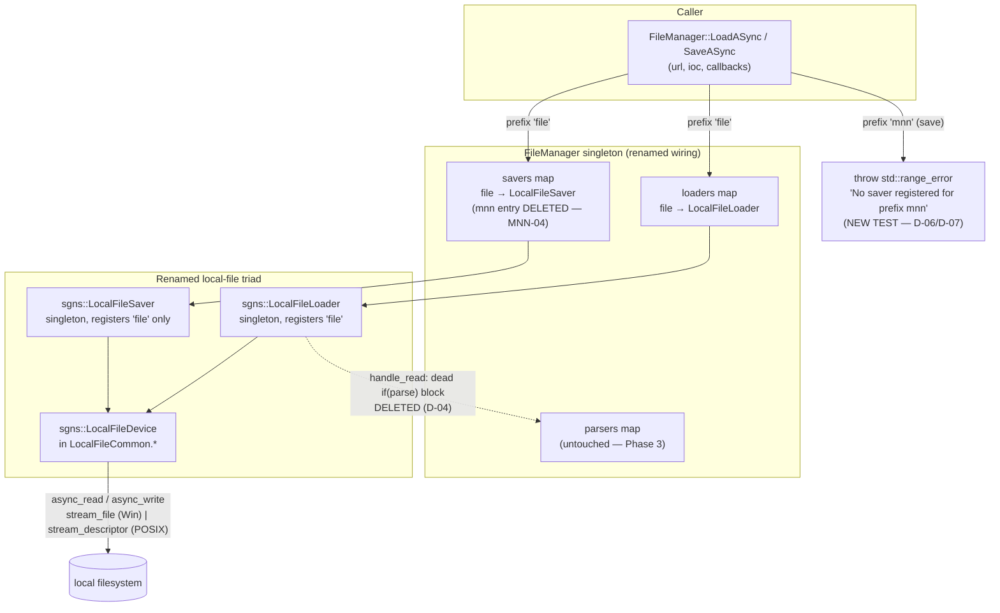

# Phase 1: LocalFile Rename & MNN Code Purge - Research

**Researched:** 2026-09-03
**Domain:** In-repo C++17 refactor — class/file rename, dead-code purge, doc-comment scrub, GTest suite rename, Windows (MSVC/VS2022) verification
**Confidence:** HIGH (every claim verified by direct codebase read/grep/build-artifact inspection this session; no new external dependencies introduced)

<user_constraints>
## User Constraints (from CONTEXT.md)

### Locked Decisions
- **D-01:** Rename the device class `FILEDevice` → `LocalFileDevice` in Phase 1 (not just the files). Full triad consistency: `LocalFileLoader` / `LocalFileSaver` / `LocalFileCommon` / `LocalFileDevice`. All construction sites (`std::make_shared<FILEDevice>` in the two renamed loader/saver .cpp files) update in-phase.
- **D-02:** The `LocalFileDevice` name carries into Phase 2's platform split — Phase 2 splits files only (`LocalFileCommon.win.*` / `LocalFileCommon.posix.*`), with the class keeping the `LocalFileDevice` name in both halves. No rename churn mixed into the split.
- **D-03:** While renaming, scrub ALL `FILECommon` string mentions for full consistency: doc banner comments (`/** Header file for the FILECommon */` → `LocalFileCommon`) and logger tags (`createLogger("FILECommon")` → `createLogger("LocalFileCommon")`).
- **D-04:** Delete the entire dead `if (parse)` body inside the `handle_read` lambda (`src/FileManager.cpp:74-79` — the `parsers.find("mnn")` lookup with its commented-out `ParseASync` call). It contains the only live `mnn` string in the library and blocks success criterion 5's zero-grep.
- **D-05:** Phase boundary confirmed: everything else parse-related stays untouched in Phase 1 — the `parse` bool parameter, `include/FileParser.hpp`, the `parsers` map, and `RegisterParser` all remain until Phase 3 removes them wholesale. Phase 1 deletes only the hardcoded `"mnn"` lookup block.
- **D-06:** The `mnn://` save rejection test lives in `filemanager_test` (not `localfile_saver_test`) — the dispatch/registry contract is FileManager's concern, and `filemanager_test` already owns `SaveASync_UnregisteredPrefixThrows` coverage. `localfile_saver_test` stays purely about file I/O behavior (sync save, async save, null-data error).
- **D-07:** The new test covers the **async path only** — a `SaveASync("mnn://...")` throwing `std::range_error` ("No saver registered for prefix mnn"), mirroring the existing `SaveASync_UnregisteredPrefixThrows` shape. It is the exact variant named in success criterion 1.

### Claude's Discretion
- Exact git-rename mechanics (single commit vs. staged rename-then-edit) — planner/executor choose.
- Test file header comment wording and fixture naming details inside the renamed tests.
- Order of edits within the phase (rename-first vs. delete-first), provided the phase ends green.

### Deferred Ideas (OUT OF SCOPE)
- Genericize-or-remove the remaining parse machinery (`parse` bool, `FileParser.hpp`, `parsers` map) — Phase 3 by design (D-05 boundary).
- Platform split of `LocalFileCommon` into `.win.*`/`.posix.*` pairs — Phase 2; the `LocalFileDevice` class name carries over unchanged (D-02).
- CMake MNN purge (`find_package(MNN)`, `${MNN_INCLUDE_DIR}`, `MNN_LIBS` glob in `example/CMakeLists.txt`) — Phase 4, per roadmap decision (library never links MNN; `MNNCommon.hpp` flows only through `MNNLoader.hpp` which this phase deletes).
- `.mnn` fixture replacement and example rewrite — Phase 4.
- Activating dormant SFTP/WS loaders — v2 backlog (REQUIREMENTS.md PROTO-01/02).
</user_constraints>

<phase_requirements>
## Phase Requirements

| ID | Description | Research Support |
|----|-------------|------------------|
| FILE-01 | `MNNLoader` → `LocalFileLoader` (`include/LocalFileLoader.hpp`, `src/LocalFileLoader.cpp`), still registering `file://` load prefix | Rename map + singleton/self-registration pattern (Code Examples 1); construction site at `src/MNNLoader.cpp:65` |
| FILE-02 | `MNNSaver` → `LocalFileSaver`, registering only `file://` save prefix | Dual registration at `src/MNNSaver.cpp:42-43`; the `"mnn"` line dies (MNN-04) |
| FILE-03 | `FileManager::InitializeSingletons()` initializes `LocalFileLoader`/`LocalFileSaver` (no MNN names anywhere) | Verified current body `src/FileManager.cpp:31-42`, incl. the commented `MNNParser` line that must also die |
| FILE-04 | `FILECommon` device layer → `LocalFileCommon` (files) + `FILEDevice` → `LocalFileDevice` (class, D-01) | Both `#ifndef _WIN32` branches in `include/FILECommon.hpp` + `src/FILECommon.cpp` carry the rename; logger tags per D-03 |
| MNN-02 | Delete `include/MNNCommon.hpp`, `include/MNNLoader.hpp`, `include/MNNSaver.hpp`, `src/MNNLoader.cpp`, `src/MNNSaver.cpp`, `test/base_mnn_test.hpp` | Include-chain audit: only `src/FileManager.cpp:3-4` and the two renamed .cpp files include the MNN headers; `example/MNNExample.cpp:9` include is commented out — no build break |
| MNN-04 | Remove `mnn://` save prefix registration; `file://` remains only local save prefix | `src/MNNSaver.cpp:43` is the single registration line to delete |
| MNN-05 | Scrub all MNN references in doc comments from headers and sources | Complete scrub inventory ( surviving-file hit list below — incl. the `QmNnoo` CID false-positive trap in `include/IPFSCommon.hpp:210`) |
| TEST-01 | `mnn_loader_test`/`mnn_saver_test` → `localfile_loader_test`/`localfile_saver_test`, same behaviors | Verified current test bodies; only fixture class names + header comments contain MNN; CMake `addtest()` blocks at `test/src/CMakeLists.txt:12-30` |
| TEST-02 | `filemanager_test` dispatch expectations updated to `LocalFileLoader`/`LocalFileSaver` | Four MNN-named tests + one comment at `test/src/filemanager_test.cpp:40,52,122,133`; plus the new `mnn://` rejection test (D-06/D-07) |
</phase_requirements>

## Summary

Phase 1 is a self-contained, mechanically-verifiable refactor of the AsyncIOManager library: rename the local-file triad (`MNNLoader`/`MNNSaver`/`FILECommon`+`FILEDevice` → `LocalFileLoader`/`LocalFileSaver`/`LocalFileCommon`+`LocalFileDevice`), delete all MNN code files, remove the `mnn://` save registration, scrub every `mnn` doc-comment mention from surviving files under `include/ src/ test/`, rename the two test suites, add one `mnn://` rejection test, and prove it all with a green Windows build + ctest. Everything is in-repo; no new libraries, no API redesign, no behavior change. The rename surface is fully enumerated below (8 file renames, 2 deletions, ~40 doc-comment lines across 12 surviving files).

The research surfaced **three verification traps** the planner must design around. First, success criterion 5 as literally written (`grep -ri mnn include/ src/ test/` returns no matches) is **unsatisfiable alongside criterion 1**: the `mnn://` rejection test itself must contain the literal string `"mnn"` in `test/`, and the deferred-to-Phase-4 binary fixtures `test/1.mnn`/`test/2.mnn` both match case-insensitively (verified: `test/1.mnn:7148` contains `MNN`, `test/2.mnn:16083` contains `mnN`). Second, `include/IPFSCommon.hpp:210` holds a *commented-out* libp2p bootstrap CID `QmNnooDu7bfjPFoTZYxMNLWUQJyrVwtbZg5gBMjTezGAJN` whose `mNn` substring matches `grep -ri mnn` — it is not an MNN reference at all but must be removed anyway for the grep to go quiet. Third, the only *proven* build path in this environment is the `build/Windows/` superbuild wrapper, whose test gate is the `TESTING` variable — **not** the root `CMakeLists.txt`'s `BUILD_TESTING` — so the verification command must be chosen deliberately (see Open Questions).

**Primary recommendation:** Plan the phase as four mechanical edit waves (library rename → CMake + FileManager wiring → test rename + new rejection test → doc scrub) followed by one verification wave (reconfigure wrapper Debug tree, build, ctest, scoped git-grep), and redefine criterion 5's check up front as `git grep -iI mnn -- include src test` with the *single expected* hit-file `test/src/filemanager_test.cpp` (the deliberate rejection test), excluding nothing else.

## Architectural Responsibility Map

| Capability | Primary Tier | Secondary Tier | Rationale |
|------------|-------------|----------------|-----------|
| URL-prefix registry & dispatch (`file`/`mnn` lookup, `mnn://` rejection) | `FileManager` (registry singleton, global ns) | — | Dispatch contract is FileManager's concern; the rejection test belongs in `filemanager_test` (D-06) |
| Sync/async local file loading | `sgns::LocalFileLoader` (strategy, singleton) | `LocalFileDevice` (Asio engine) | Loader parses nothing, constructs device, delegates (`LoadASync` → `make_shared<LocalFileDevice>` → `async_read`) |
| Sync/async local file saving | `sgns::LocalFileSaver` (strategy, singleton) | `LocalFileDevice` | Saver iterates ResultType paths, creates directories, delegates writes to device |
| Platform file I/O (stream_file vs stream_descriptor) | `LocalFileDevice` in `LocalFileCommon.*` | — | Both `#ifndef _WIN32` branches stay in ONE file this phase (split is Phase 2, D-02) |
| Singleton lifecycle | `SINGLETON_PTR` macro + `InitializeSingleton()` | `FileManager::InitializeSingletons()` | Idempotent lazy init; ctor self-registers into registry |
| Error categories | `OUTCOME_CPP_DEFINE_CATEGORY_3` in each .cpp | — | Category macro + enum must move with the renamed classes |
| Test harness | `FileManagerTestFixture` + `TempFile`/`TempDir` + `IOContextRunner`/`pollUntil` | `asiomgr_testutil` INTERFACE lib | Unchanged; only derived fixture class names rename |

## Standard Stack

No new packages. This phase uses only the repo's existing machinery — that is the point (a rename must not alter the stack).

### Core (existing, versioned by environment)
| Library | Version | Purpose | Why Standard |
|---------|---------|---------|--------------|
| CMake + VS 2022 generator | 3.29.2 (verified this session) | Build orchestration | Only proven configure path is the `build/Windows/` wrapper (existing Debug tree has built test binaries) |
| Boost.Asio (`stream_file`, `async_read`, `async_write`) | Boost 1.85.0 (per `build/CommonBuildParameters.cmake`) | Device-layer I/O — unchanged by rename | Pre-existing; Phase 1 touches zero transport logic |
| GTest + GMock | vcpkg CONFIG (existing) | Test framework via `addtest()` | `cmake/functions.cmake:10-33` is the only sanctioned registration path |
| libp2p outcome | in-repo dep | `ResultType` error plumbing | Error categories move with renamed classes |
| git rename detection | default similarity ≥50% | History preservation across renames | See Assumptions A1 |

### Supporting (repo-internal patterns consumed, not modified)
| Mechanism | Location | When to Use |
|-----------|----------|-------------|
| `SINGLETON_PTR( C )` | `include/ASIOSingleton.hpp:29-56` | In renamed class bodies; declare `C *C::_instance = nullptr;` in .cpp (existing files do NOT use `SINGLETON_PTR_INIT`) |
| `addtest( name sources... )` | `cmake/functions.cmake` | Renamed test targets; auto-wires gtest_main, xunit XML, `test_bin/` output |
| `FileManagerTestFixture` | `test/testutil/test_fixture.hpp` | Base for renamed `LocalFileLoaderTest`/`LocalFileSaverTest`; `SetUp()` calls `InitializeSingletons()` (idempotent) |
| `IOContextRunner` + `pollUntil` | `test/testutil/asio_helpers.hpp` | Every async test; 5s timeout idiom `ASSERT_TRUE(ok) << "Timed out..."` |

### Alternatives Considered
| Instead of | Could Use | Tradeoff |
|------------|-----------|----------|
| `git mv` + in-place edit | sed/scripted bulk rename | Scripting is more error-prone for ~9 files; the rename set is small enough for careful manual edits with compiler verification |
| Delete dead parse block only (D-04) | Also strip `parse` param now | **Forbidden** — D-05 locks the parse-parameter boundary to Phase 3 |

**Installation:** none — no package installs. (Package Legitimacy Audit therefore not applicable: no external packages added this phase.)

## Package Legitimacy Audit

Not applicable — Phase 1 installs zero external packages. All work is in-repo rename/delete/scrub. [VERIFIED: full file inventory reviewed; `src/CMakeLists.txt` link list unchanged except source-file names]

## Architecture Patterns

### System Architecture Diagram

Rename-only phase; data flow is unchanged. The diagram shows the dispatch path the phase must keep bit-identical, plus the two behavioral deltas (dead parse block deleted; `mnn` save registration removed):



### Recommended Project Structure (delta only)

```
include/
├── LocalFileLoader.hpp      # RENAMED from MNNLoader.hpp   (scrubbed)
├── LocalFileSaver.hpp       # RENAMED from MNNSaver.hpp    (scrubbed)
├── LocalFileCommon.hpp      # RENAMED from FILECommon.hpp  (class FILEDevice → LocalFileDevice, D-01/D-03)
└── (MNNCommon.hpp           # DELETED — MNN-02)
src/
├── LocalFileLoader.cpp      # RENAMED from MNNLoader.cpp
├── LocalFileSaver.cpp       # RENAMED from MNNSaver.cpp    ('mnn' registration line deleted — MNN-04)
├── LocalFileCommon.cpp      # RENAMED from FILECommon.cpp
├── FileManager.cpp          # includes + InitializeSingletons renamed; dead parse block deleted (D-04)
└── CMakeLists.txt           # 3 source-list entries renamed (MNN find_package stays — Phase 4)
test/
├── (base_mnn_test.hpp       # DELETED — MNN-02; verified unreferenced)
└── src/
    ├── localfile_loader_test.cpp  # RENAMED from mnn_loader_test.cpp
    ├── localfile_saver_test.cpp   # RENAMED from mnn_saver_test.cpp
    ├── filemanager_test.cpp       # 4 test names + 1 comment renamed; + SaveASync mnn:// rejection test
    └── CMakeLists.txt             # 2 addtest blocks renamed; line-196 comment reworded
```

### Complete Rename Map (State of the Art for this phase)

| Old | New | Kind | Touchpoints |
|-----|-----|------|-------------|
| `MNNLoader` (class, `sgns`) | `LocalFileLoader` | class rename | header decl, `SINGLETON_PTR` arg, `_instance` def, `InitializeSingleton`, ctor, `OUTCOME_CPP_DEFINE_CATEGORY_3( sgns, ... )` + both `case sgns::...::Error::` labels, logger tag `"MNNLoader"` → `"LocalFileLoader"`, `FileManager.cpp:32` |
| `MNNSaver` (class, `sgns`) | `LocalFileSaver` | class rename | same set at `src/MNNSaver.cpp:16-43`, logger tag, `FileManager.cpp:39` |
| `FILEDevice` (class, `sgns`, both platform branches) | `LocalFileDevice` | class rename (D-01) | `include/FILECommon.hpp:30,39,41,59,68,77,79,96`, `src/FILECommon.cpp:11,16,40,45`, `make_shared<FILEDevice>` ×2 (`MNNLoader.cpp:65`, `MNNSaver.cpp:96`) |
| `FILECommon.hpp` / `.cpp` | `LocalFileCommon.hpp` / `.cpp` | file rename | `src/CMakeLists.txt:2`, `#include "FILECommon.hpp"` ×2, banner comments, logger tag `"FILECommon"` → `"LocalFileCommon"` (D-03) |
| `RegisterSaver( "mnn", this )` | *(deleted)* | registration removal | `src/MNNSaver.cpp:43` — MNN-04 |
| dead `if (parse)` block | *(deleted)* | dead-code removal | `src/FileManager.cpp:~72-77` incl. `parsers.find("mnn")` — D-04 |
| `//sgns::MNNParser::InitializeSingleton();` | *(deleted)* | commented-line scrub | `src/FileManager.cpp:33` — contains `mnn`, must die for zero-grep |
| `mnn_loader_test` / `mnn_saver_test` | `localfile_loader_test` / `localfile_saver_test` | target+file rename | `test/src/CMakeLists.txt:12-30` (addtest + target_link_libraries ×2 each) |
| `MNNLoaderTest` / `MNNSaverTest` fixtures | `LocalFileLoaderTest` / `LocalFileSaverTest` | fixture rename | test class decls + all `TEST_F` first args |
| `LoadFile_FilePrefixDispatchesToMNNLoader` etc. | `...ToLocalFileLoader` / `...ToLocalFileSaver` | test-name rename | `filemanager_test.cpp:40,52,122` + comment `:133` |
| `test/src/CMakeLists.txt:196` comment mentioning `example/MNNExample.cpp` | reworded (e.g. "the example app") | comment scrub | textual `MNN` inside `test/` scope |
| `include/MNNCommon.hpp`, `test/base_mnn_test.hpp` | *(deleted)* | file deletion | MNN-02; verified zero live includers |

### Pattern 1: The rename transaction (per file pair)
**What:** `git mv old new`, then edit identifiers/comments in place; MSVC catches any missed symbol.
**When to use:** all 8 renames.
**Example:**
```cpp
// BEFORE — src/MNNLoader.cpp:10-36  [VERIFIED: codebase read this session]
OUTCOME_CPP_DEFINE_CATEGORY_3( sgns, MNNLoader::Error, e )
{ /* case sgns::MNNLoader::Error::READ_ERROR: ... */ }
namespace sgns {
    MNNLoader *MNNLoader::_instance = nullptr;
    void MNNLoader::InitializeSingleton() { if ( _instance == nullptr ) { _instance = new MNNLoader(); } }
    MNNLoader::MNNLoader() { FileManager::GetInstance().RegisterLoader( "file", this ); }

// AFTER — src/LocalFileLoader.cpp (same structure, new names; registration prefix unchanged)
OUTCOME_CPP_DEFINE_CATEGORY_3( sgns, LocalFileLoader::Error, e )
{ /* case sgns::LocalFileLoader::Error::READ_ERROR: ... */ }
namespace sgns {
    LocalFileLoader *LocalFileLoader::_instance = nullptr;
    void LocalFileLoader::InitializeSingleton() { if ( _instance == nullptr ) { _instance = new LocalFileLoader(); } }
    LocalFileLoader::LocalFileLoader() { FileManager::GetInstance().RegisterLoader( "file", this ); }
```

### Pattern 2: The new rejection test (D-06/D-07)
**What:** Mirror `SaveASync_UnregisteredPrefixThrows` (`test/src/filemanager_test.cpp:83-98`) with the `mnn` prefix.
**Example:**
```cpp
// Source shape: test/src/filemanager_test.cpp:83-98 (verified) — only URL prefix changes
TEST_F( FileManagerIntegrationTest, SaveASync_MnnPrefixThrows )   // name intentionally contains "Mnn"
{
    IOContextRunner runner;
    auto            data = makeSingleFileResult( "test.bin", "content" );

    EXPECT_THROW(
        {
            FileManager::GetInstance().SaveASync(
                "mnn://some/path", data, runner.ioc(), []( FileManager::ResultType ) {} );
        },
        std::range_error );   // message: "No saver registered for prefix mnn" (src/FileManager.cpp:127)
}
```
Note: `SaveASync` throws **synchronously** (prefix lookup precedes any async work — `src/FileManager.cpp:118-127`), so `EXPECT_THROW` around the call is correct; no polling needed.

### Pattern 3: Surviving-file doc scrub (MNN-05)
**What:** Reword doc comments in 12 files that are NOT renamed/deleted. Verified hit list (file:line — all `[VERIFIED: grep this session]`):
- `include/FileLoader.hpp:25,35,41` — `(for MNN)` ×2; example URL `ipfs://testme.mnn` → e.g. `ipfs://testfile.bin`
- `include/FileManager.hpp:67,90,94,101` — `(for MNN)` ×2; `".mnn", ".jpg"` → `".bin", ".jpg"`; `"mnn", "file"` → `"https", "file"`
- `include/HTTPCommon.hpp:53,64`; `include/SFTPCommon.hpp:39,64`; `include/WSCommon.hpp:51,62` — `(for MNN)` / `(for MNN currently)`
- `include/HTTPLoader.hpp:33,40-42,48`; `include/IPFSLoader.hpp:56,63-65,72`; `include/SFTPLoader.hpp:29,36-38,45`; `include/WSLoader.hpp:16,35,42-44,51` — "Load Data on the MNN file" / "MNN file part" / "Interpreter of MNN file" / "parsing the information in an MNN model file"
- `include/IPFSCommon.hpp:66,112,137` — `(for MNN...)` ×3
- **`include/IPFSCommon.hpp:210`** — commented bootstrap CID `QmNnooDu7...` matches `grep -ri mnn` via `mNn`; delete the commented line (or the whole dead bootstrap list) — it is already commented out, zero behavior risk
- `src/FileManager.cpp:3-4,32,33,39,74` — includes, singleton calls, commented `MNNParser` line, `parsers.find("mnn")`
- `test/src/CMakeLists.txt:196` — comment referencing `example/MNNExample.cpp`

Suggested wording: `@param parse - Whether to parse file upon completion` (drop the parenthetical; the parameter itself lives until Phase 3); "Load Data on the MNN file" → "Load data from the file".

### Anti-Patterns to Avoid
- **"Fixing" adjacent code while renaming:** e.g. the global `using namespace std;` in `include/FileSaver.hpp`, the dead `std::ofstream file(...)` at `src/MNNSaver.cpp:85`, the `error.value() == 2` EOF idiom, the `data.value()->second.data() == nullptr` MSVC null-check. All are pre-existing, out of scope, and load-bearing for the tests. Copy them verbatim into renamed files.
- **Touching `find_package(MNN)` / `${MNN_INCLUDE_DIR}`:** root `CMakeLists.txt:36-37` and `build/CommonBuildParameters.cmake:276-279` stay until Phase 4 (roadmap decision). After Phase 1 nothing *includes* MNN headers, so the build is unaffected.
- **Renaming test *behaviors*:** TEST-01 requires the same coverage set (sync load, async load, nonexistent-file error, sync save, null-data error, async save, multi-file+subdirs). Only names/files change.
- **Splitting `LocalFileCommon` now:** the `#ifndef _WIN32` dual-class structure stays in one header/one cpp this phase (D-02 reserves the split for Phase 2).

## Don't Hand-Roll

| Problem | Don't Build | Use Instead | Why |
|---------|-------------|-------------|-----|
| Test registration/output | Custom CMake test blocks | `addtest()` (`cmake/functions.cmake`) | Only sanctioned path; wires gtest_main, xunit XML, `test_bin/`, ctest |
| Singleton plumbing | New singleton machinery | `SINGLETON_PTR` + `_instance = nullptr` + `InitializeSingleton()` (existing per-file pattern) | Registry contract expects this exact shape; `InitializeSingletons()` is idempotent |
| Async test harness | New threads/conditions | `IOContextRunner` + `pollUntil` | Proven against the 5s-timeout idiom across 6 existing async tests |
| Error-category strings | Rewriting messages | Copy `OUTCOME_CPP_DEFINE_CATEGORY_3` blocks verbatim, swap qualified names | Messages are asserted nowhere, but keeping them identical minimizes diff noise |
| Rename history | Copy+delete | `git mv` (or plain mv — git detects ≥50% similarity) | Blame/review continuity; see Assumptions A1 |

**Key insight:** this phase's risk is *omission*, not complexity. The compiler and the scoped grep catch nearly every miss; the plan should lean on those two oracles rather than inventing new tooling.

## Runtime State Inventory

> Rename phase — all five categories explicitly checked.

| Category | Items Found | Action Required |
|----------|-------------|------------------|
| Stored data | **None** — no databases/key-value stores in this library; payloads are transient `shared_ptr` buffers. Git history retains old paths (intended). | None |
| Live service config | **None** — `test/websocketserver/` (Node) is a manual dev aid, unwired to CMake and unaffected by class renames; no external services consume these names at runtime. | None |
| OS-registered state | **None** — no tasks/services/daemons; verified no installer or service code in repo. | None |
| Secrets/env vars | **None** — no env var or secret references any MNN/FILECommon symbol; only CMake *cache* vars (`MNN_INCLUDE_DIR` in `build/CommonBuildParameters.cmake:276-279`) which are Phase-4 scope by design. | None |
| Build artifacts | `build/Windows/Debug/` — stale generated `.vcxproj`s reference `MNNLoader.cpp`; stale exes `mnn_loader_test.exe`, `mnn_saver_test.exe` in `test_bin/Debug/`; `CMakeCache.txt` has `TESTING=ON`, `ASYNC_IO_MANAGER_NETWORK_TESTS=ON`. **All untracked** (git tracks only the 6 wrapper `.cmake`/`CMakeLists.txt` files under `build/` — verified via `git ls-files build/`). | Reconfigure regenerates projects; stale `mnn_*.exe` are harmless (ctest binds to regenerated targets) — optionally delete `test_bin/Debug/mnn_*.exe` for a clean `ctest -N` |

**The canonical question answered:** after the repo edits, the only runtime systems holding old names are the untracked build tree (fixed by reconfigure) and IDE IntelliSense caches (self-healing). No data migration needed anywhere.

## Common Pitfalls

### Pitfall 1: Success criterion 5 is unsatisfiable as literally written
**What goes wrong:** `grep -ri mnn include/ src/ test/` cannot return zero because (a) the required `mnn://` rejection test (criterion 1, D-06/D-07) puts the literal string `mnn` into `test/src/filemanager_test.cpp`, and (b) the Phase-4-deferred binaries `test/1.mnn`, `test/2.mnn` both contain matching bytes (`test/1.mnn:7148 'MNN'`, `test/2.mnn:16083 'mnN'` — verified this session) and have matching filenames.
**Why it happens:** criterion 5 was written against MNN-05's *intent* (doc comments) without accounting for the deliberate test string or binary fixtures.
**How to avoid:** Define the verification command precisely in the plan: `git grep -iI mnn -- include src test` (`-I` skips binary content) and require hits **only** in `test/src/filemanager_test.cpp` (the rejection test + its naming), i.e. zero hits with `git grep -iI mnn -- include src test ':(exclude)test/src/filemanager_test.cpp'`. Confirm with the user in plan review (see Open Questions Q1).
**Warning signs:** an executor reports "grep clean" after deleting the rejection test, or silently renaming it to avoid the string — both violate criterion 1/D-06.

### Pitfall 2: The `QmNnoo` bootstrap CID false positive
**What goes wrong:** `include/IPFSCommon.hpp:210` — a *commented-out* libp2p bootstrap address `QmNnooDu7bfjPFoTZYxMNLWUQJyrVwtbZg5gBMjTezGAJN` — matches `grep -ri mnn` (substring `mNn`). It is not an MNN reference; it's a base58 CID. No other line in the bootstrap list matches (checked character-by-character).
**Why it happens:** case-insensitive substring grep over base58 text.
**How to avoid:** delete the commented line (or the whole dead bootstrap comment block, lines 209-216) — zero behavior risk since already commented. Include it in the MNN-05 scrub list explicitly so it isn't missed as "not really MNN".
**Warning signs:** grep still shows one `include/IPFSCommon.hpp` hit after all doc comments are reworded.

### Pitfall 3: Wrong build gate — `TESTING` vs `BUILD_TESTING`
**What goes wrong:** The proven build tree (`build/Windows/Debug`) was configured from the **wrapper** (`build/Windows/CMakeLists.txt` → `CommonBuildParameters.cmake`), whose test gate is `if (TESTING)` (`build/CommonBuildParameters.cmake:319-323`) — cache confirms `TESTING:BOOL=ON` and contains **no** `BUILD_TESTING` entry. The root `CMakeLists.txt:47-51` gate (`BUILD_TESTING`) is never evaluated on that path because the wrapper `add_subdirectory`s `src/` and `test/` directly, bypassing the root listfile. Passing `-DBUILD_TESTING=ON` to a wrapper configure silently does nothing (and passing **both** gates double-adds `test/` → CMake duplicate-add error).
**Why it happens:** two parallel build topologies (root vs superbuild wrapper) with differently named options.
**How to avoid:** Pick one topology per verification run: wrapper → `-DTESTING=ON` (proven; existing test binaries were produced this way); root → `-DBUILD_TESTING=ON` (matches criterion 4's letter, but no root-path configure has been demonstrated in this environment — needs `CMAKE_PREFIX_PATH` to the sibling thirdparty build outputs; MNN's config exists at `W:\gnus\GeniusNetwork\thirdparty\MNN\.build\MNNConfig.cmake`, others assumed present, see A2).
**Warning signs:** configure "succeeds" but `test_bin/` produces no new `localfile_*_test.exe`; or CMake errors on duplicate `add_subdirectory(test)`.

### Pitfall 4: Rename incompleteness in boilerplate
**What goes wrong:** Missed symbols compile fine in some spots but break others — the classic four: (1) `OUTCOME_CPP_DEFINE_CATEGORY_3( sgns, MNNLoader::Error, e )` macro name + both `case sgns::MNNLoader::Error::` labels; (2) the static `MNNLoader *MNNLoader::_instance = nullptr;` definition; (3) logger tag strings `"MNNLoader"`/`"MNNSaver"`/`"FILECommon"` (D-03 — string-level, invisible to the compiler); (4) the commented line `//sgns::MNNParser::InitializeSingleton();` at `src/FileManager.cpp:33` (comment-only, invisible to compiler, but grep-visible).
**Why it happens:** boilerplate lives outside the class body; comments evade type-checking.
**How to avoid:** the plan's per-file checklists; compiler for (1)/(2), scoped grep for (3)/(4).
**Warning signs:** link errors mentioning `MNNLoader::Error` category; grep hits on logger tags after "full" scrub.

### Pitfall 5: `initializeSingletons` ordering / double-registration
**What goes wrong:** reordering or re-adding registrations while renaming. `InitializeSingleton()` is idempotent (`_instance == nullptr` guard) and `FileManagerTestFixture::SetUp()` calls `InitializeSingletons()` before *every* test — safe by construction. But `LocalFileSaver`'s ctor must now register **only** `"file"`; leaving `"mnn"` makes criterion 1's rejection test fail (prefix resolves instead of throwing).
**How to avoid:** exact final body for `InitializeSingletons()`: `LocalFileLoader`, `HTTPLoader`, `IPFSLoader`, `IPFSSaver`, `LocalFileSaver`, `SFTPSaver` active (SFTP/WS commented lines unchanged); saver ctor single `RegisterSaver( "file", this )`.
**Warning signs:** rejection test fails with a successful save instead of `std::range_error`.

### Pitfall 6: Test rename collateral in CMake
**What goes wrong:** renaming the .cpp files but not the `addtest()` target names (or vice versa), or missing the paired `target_link_libraries(<target> ...)` blocks — `test/src/CMakeLists.txt:12-30` has two blocks each (`addtest` + link list). Also `:196` comment mentions `MNNExample.cpp` and sits inside the grep scope.
**How to avoid:** treat each test as a 3-part rename: file, `addtest(name …)` + its `target_link_libraries(name …)`, and in-file fixture/`TEST_F` names.
**Warning signs:** CMake "Cannot find source file: mnn_loader_test.cpp"; stale `mnn_*` ctest entries.

## Code Examples

Verified patterns from this session's codebase reads (no external sources needed — no new APIs introduced):

### Rename of `InitializeSingletons` (FILE-03 + D-04 + scrub of commented MNNParser line)
```cpp
// AFTER — src/FileManager.cpp (derived from verified current body, lines 3-4, 31-42)
#include "LocalFileLoader.hpp"   // was "MNNLoader.hpp"
#include "LocalFileSaver.hpp"    // was "MNNSaver.hpp"

void FileManager::InitializeSingletons()
{
    sgns::LocalFileLoader::InitializeSingleton();     // was sgns::MNNLoader
    //sgns::MNNParser::InitializeSingleton();         // DELETED (commented, contains mnn)
    //sgns::SFTPLoader::InitializeSingleton();        // stays (not MNN)
    sgns::HTTPLoader::InitializeSingleton();
    //sgns::WSLoader::InitializeSingleton();          // stays
    sgns::IPFSLoader::InitializeSingleton();
    sgns::IPFSSaver::InitializeSingleton();
    sgns::LocalFileSaver::InitializeSingleton();      // was sgns::MNNSaver
    sgns::SFTPSaver::InitializeSingleton();
}
```

### Dead parse block deletion (D-04) — handle_read lambda, before → after
```cpp
// BEFORE (src/FileManager.cpp:~71-78, verified)
if ( buffers )
{
    //Parse Data
    if ( parse )
    {
        auto parserIter = parsers.find( "mnn" );
        auto parser     = dynamic_cast<FileParser *>( parserIter->second );
        //shared_ptr<void> data = parser->ParseASync(buffer);
    }
    //Save data or otherwise decrement counter of operations
    if ( save ) { ... }

// AFTER — entire if(parse) block + its comment deleted; `parse` param becomes
// unused in the lambda signature (harmless: existing code already ships unused
// params, e.g. AsyncHandler at src/FileManager.cpp:26 — compiles today).
if ( buffers )
{
    //Save data or otherwise decrement counter of operations
    if ( save ) { ... }
```

### Device construction sites (D-01)
```cpp
// src/LocalFileLoader.cpp — was MNNLoader.cpp:65
auto fileDevice = std::make_shared<LocalFileDevice>( ioc, filename, 0 );   // 0 = read
// src/LocalFileSaver.cpp  — was MNNSaver.cpp:96
auto fileDevice = std::make_shared<LocalFileDevice>( ioc, directoryWithFile, 1 );  // 1 = write
// plus: #include "LocalFileCommon.hpp" (was "FILECommon.hpp") in both
```

### Verification commands (PowerShell, this environment)
```powershell
# Configure (wrapper path — PROVEN topology; fresh dir keeps old tree untouched)
cmake -S build/Windows -B build/Windows/Debug -DTESTING=ON
# Build (VS multi-config)
cmake --build build/Windows/Debug --config Debug
# Full suite
ctest --test-dir build/Windows/Debug -C Debug --output-on-failure
# Single renamed suite
build/Windows/Debug/test_bin/Debug/localfile_loader_test.exe
# Criterion-5 grep (see Pitfall 1 for the exact contract)
git grep -iI mnn -- include src test ":(exclude)test/src/filemanager_test.cpp"   # expect EMPTY
git grep -iI mnn -- include src test                                             # expect ONLY filemanager_test.cpp hits
```
[VERIFIED: cmake/ctest 3.29.2 present; wrapper cache `TESTING=ON` produced existing `test_bin/Debug/*.exe`; `-I` and pathspec-exclude are standard git-grep flags — ASSUMED available in repo's git version, low risk]

## State of the Art

Not applicable in the ecosystem sense — no external technology adoption this phase. The within-repo "old → new" transformation is fully specified in the **Complete Rename Map** table above (Architecture Patterns section); that table is the authoritative old/new reference for the planner and executor.

**Deprecated/outdated (in-repo, addressed now):** MNN naming across the local-file layer; dead parse block; `"mnn"` saver registration; `test/base_mnn_test.hpp` (dead since the `FileManagerTestFixture` migration).
**Deprecated (in-repo, NOT this phase):** `parse` bool + `FileParser.hpp` (Phase 3); `#ifdef` platform split (Phase 2); CMake MNN purge + `.mnn` fixtures + example (Phase 4).

## Assumptions Log

| # | Claim | Section | Risk if Wrong |
|---|-------|---------|---------------|
| A1 | `git mv`/move+edit preserves rename detection (git default ≥50% similarity) so history/blame survive | Don't Hand-Roll, Runtime State | Cosmetic only — wrong means slightly noisier log; zero functional risk |
| A2 | A root-path configure (`cmake -S . -DBUILD_TESTING=ON`) can resolve all CONFIG packages via `CMAKE_PREFIX_PATH` pointing at the sibling thirdparty build outputs (only MNN's config location verified: `thirdparty/MNN/.build/MNNConfig.cmake`) | Pitfall 3, Open Questions Q2 | Root-path verification unavailable → fall back to wrapper `TESTING=ON` path (proven); criterion 4 wording adjusted accordingly |
| A3 | `git grep -I` reliably skips the binary `.mnn` fixtures in this repo's git version | Code Examples (verification) | Grep shows binary-file lines → verifier adds `--include` filters or checks hit-file list manually; cosmetic |

No other assumptions: every code-level claim above was read or executed against the workspace this session.

## Open Questions

1. **Criterion 5's exact verification contract (decision needed at plan review)**
   - What we know: literal `grep -ri mnn include/ src/ test/` can never be empty while the `mnn://` rejection test exists (criterion 1) and `test/1.mnn`/`test/2.mnn` remain (MNN-03 → Phase 4).
   - What's unclear: which precise command the boss/user will accept as "criterion 5 passes".
   - Recommendation: adopt `git grep -iI mnn -- include src test ":(exclude)test/src/filemanager_test.cpp"` → must be empty; document the two *intentional* residual `mnn` mentions (rejection test strings; binary fixtures) in the phase completion notes. Planner should surface this in the plan header so it's approved before execution.
2. **Build topology for criterion 4: wrapper `TESTING=ON` vs root `BUILD_TESTING=ON`**
   - What we know: wrapper path is proven end-to-end in this environment (existing green tree); root path matches the criterion's letter but has never been configured here.
   - What's unclear: whether a root-path configure resolves all ~20 CONFIG packages with a reasonable `CMAKE_PREFIX_PATH`.
   - Recommendation: primary = wrapper path (`-DTESTING=ON`, fresh Debug reconfigure), noting in VERIFICATION that `BUILD_TESTING=ON`'s *intent* (tests enabled, ctest green) is thereby satisfied; optional stretch = one root-path scratch configure attempt; if it fails fast, record A2 as closed-negative and move on. Budget: ≤15 min.

## Environment Availability

| Dependency | Required By | Available | Version | Fallback |
|------------|------------|-----------|---------|----------|
| CMake | configure/build | ✓ | 3.29.2 | — |
| CTest | test runner | ✓ | 3.29.2 | direct `.exe` invocation from `test_bin/Debug/` |
| VS 2022 generator + MSVC | compile (`/MT` static CRT via wrapper) | ✓ | VS 17 2022 (per existing cache) | — |
| Thirdparty CONFIG packages (libp2p, ipfs-*, spdlog, Boost 1.85, libssh2, …) | wrapper build | ✓ | prebuilt tree consumed by existing Debug build | — |
| MNN config | root-path configure only (until Phase 4) | ✓ | `thirdparty/MNN/.build/MNNConfig.cmake` | wrapper sets `MNN_INCLUDE_DIR` to sibling source tree |
| GTest | test targets | ✓ | vcpkg CONFIG (used by existing tree) | — |
| Node.js + ws | WS dev server only | ✗ (node_modules absent) | — | not needed — no WS tests in Phase 1 |
| sshd/openssl | network tests only | untested | — | not needed — verify with file-based tests only (`ASYNC_IO_MANAGER_NETWORK_TESTS` OFF) |

**Missing dependencies with no fallback:** none.
**Missing dependencies with fallback:** Node.js (unused this phase); network-test prerequisites (excluded from this phase's verification).

## Security Domain

Rename-only phase; no new inputs, outputs, protocols, auth, or crypto. Threat surface is unchanged by design.

### Applicable ASVS Categories

| ASVS Category | Applies | Standard Control |
|---------------|---------|-----------------|
| V2 Authentication | no | none introduced |
| V3 Session Management | no | none introduced |
| V4 Access Control | no | none introduced |
| V5 Input Validation | no (unchanged) | existing `FileManager` prefix validation via registry lookup (`std::range_error` on unknown/removed prefix) — behavior preserved; the `mnn://` rejection *tightens* it |
| V6 Cryptography | no | none introduced |
| V12 File Handling | incidental | local file paths flow through unchanged code paths; no new path handling, so no new traversal surface — pre-existing behavior only |

### Known Threat Patterns for this change set

| Pattern | STRIDE | Standard Mitigation |
|---------|--------|---------------------|
| Error-message information disclosure | Information Disclosure | Exception strings unchanged from existing code (`"No saver registered for prefix " + prefix`) — no new data exposed |
| Stale registration bypass | Tampering | MNN-04 *removes* a registration; rejection test (D-07) locks it out — net security posture slightly improves |

## Sources

### Primary (HIGH confidence)
- Direct codebase reads this session: `src/FileManager.cpp` (full), `src/MNNLoader.cpp` (full), `src/MNNSaver.cpp` (full), `src/FILECommon.cpp` (full), `include/MNNLoader.hpp`, `include/MNNSaver.hpp`, `include/MNNCommon.hpp`, `include/FILECommon.hpp`, `include/FileLoader.hpp`, `include/FileManager.hpp`, `include/ASIOSingleton.hpp`, `include/IPFSCommon.hpp:205-216`, `test/src/{mnn_loader_test,mnn_saver_test,filemanager_test}.cpp`, `test/testutil/test_fixture.hpp`, `test/src/CMakeLists.txt`, `test/CMakeLists.txt`, `test/testutil/CMakeLists.txt`, `src/CMakeLists.txt`, root `CMakeLists.txt`, `build/Windows/CMakeLists.txt`, `build/CommonBuildParameters.cmake:270-330`
- Executed greps (case-insensitive `mnn`) over `include/`, `src/`, `test/` — full hit inventory reproduced above; binary fixture byte-search via PowerShell
- Build-tree inspection: `git ls-files build/` (6 wrapper files only), `build/Windows/Debug/CMakeCache.txt` (`TESTING=ON`, `ASYNC_IO_MANAGER_NETWORK_TESTS=ON`, VS 17 2022, no `BUILD_TESTING` key), `test_bin/Debug/` exe inventory, `thirdparty/MNN/.build/MNNConfig.cmake` existence
- Project planning docs: `.planning/phases/01-.../01-CONTEXT.md`, `.planning/REQUIREMENTS.md`, `.planning/STATE.md`, `.planning/ROADMAP.md` (phase block), `.planning/config.json` (`nyquist_validation: false` → Validation Architecture section omitted), `.planning/codebase/TESTING.md`, `.planning/codebase/CONVENTIONS.md`

### Secondary (MEDIUM confidence)
- None required — no external libraries introduced.

### Tertiary (LOW confidence)
- None.

## Metadata

**Confidence breakdown:**
- Standard stack: HIGH — nothing new added; existing build/test machinery verified in-environment
- Architecture: HIGH — all touchpoints read directly; rename map is exhaustive against this session's greps
- Pitfalls: HIGH — all three verification traps (grep contract, QmNnoo CID, TESTING gate) empirically confirmed, not hypothesized

**Research date:** 2026-09-03
**Valid until:** 2026-10-03 (stable — in-repo refactor; only drift risk is concurrent edits to the enumerated files)
