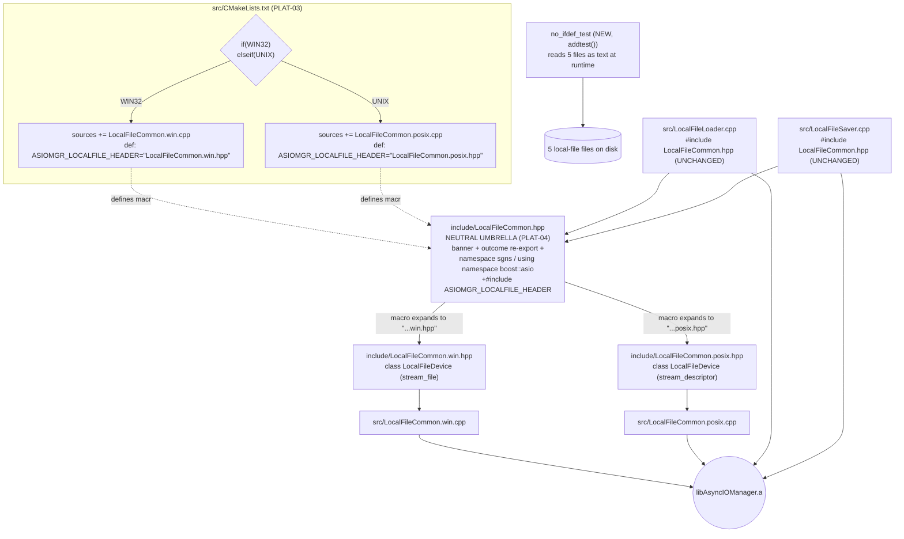

# Phase 2: LocalFileCommon Platform Split - Research

**Researched:** 2026-09-03
**Domain:** C++17/Boost.Asio platform-split refactor (CMake source selection, macro-expanded include dispatch, POSIX/Windows async file I/O)
**Confidence:** HIGH

<user_constraints>
## User Constraints (from CONTEXT.md)

### Locked Decisions
- **D-08:** Umbrella header + CMake-injected compile definition. `include/LocalFileCommon.hpp` remains the single include for callers (`LocalFileLoader.cpp`, `LocalFileSaver.cpp` — zero include-line changes). CMake passes the platform header name; the umbrella includes it. No `#ifdef` anywhere; no include-path tricks.
- **D-09:** File layout: platform headers in `include/` (`LocalFileCommon.win.hpp`, `LocalFileCommon.posix.hpp`), platform sources in `src/` (`LocalFileCommon.win.cpp`, `LocalFileCommon.posix.cpp`) — matching the repo's existing include/ vs src/ split and the root `install include/*.h*` glob.
- **D-10:** Macro shape: CMake defines the FULL header token via `target_compile_definitions`, e.g. `ASIOMGR_LOCALFILE_HEADER="LocalFileCommon.win.hpp"` (PRIVATE on the `AsyncIOManager` target; test targets that include `LocalFileCommon.hpp` need it too). Umbrella body is `#include ASIOMGR_LOCALFILE_HEADER`. One knob, no string-pasting macros.
- **D-11:** Fidelity level: Windows half is a pure mechanical move (behavior byte-identical). POSIX half is moved AND its obvious latent bugs are fixed in-phase (D-12, D-13). No unification rewrite — the halves stay on their current transports (POSIX: `posix::stream_descriptor` + `::open`; Windows: `boost::asio::stream_file`).
- **D-12:** POSIX write mode becomes `O_WRONLY | O_CREAT | O_TRUNC` so overwrite semantics match the Windows `stream_file::create` path (saver overwrites existing files identically on both platforms).
- **D-13:** POSIX destructor uses a single close path: `file_.close(ec_)` only. Drop the extra `::close(fd_)` — `stream_descriptor::close()` already closes the underlying descriptor; the second close is a latent EBADF/double-close.
- **D-14:** Logger tags: both halves keep `createLogger("LocalFileCommon")` — identical tag to today, no log-filtering change for consumers.
- **D-15:** `include/LocalFileCommon.hpp` = shared declarations (doc banner, `namespace sgns` with its `using namespace boost::asio`, the `outcome` re-export block) + the `#include ASIOMGR_LOCALFILE_HEADER` selector line. It remains the single public include and is the file that satisfies PLAT-04 (platform-neutral, no `#ifdef _WIN32`).
- **D-16:** Each platform header fully declares its own `LocalFileDevice` — including its platform-specific `getFile()` return type (`posix::stream_descriptor&` vs `stream_file&`) and private members. Self-contained halves; no split-across-files class declaration.
- **D-17:** Enforcement = phase-end grep gate (same style as Phase 1's zero-mnn gate) PLUS a permanent ctest (e.g. `no_ifdef_test`) that scans the local-file sources at test runtime and fails on `#ifdef`, `#ifndef _WIN32`, or `#if defined(_WIN32)`. The permanent guard protects future phases and contributors from regressing the boss requirement. Note: `#pragma once` and a header's own-name include guard are NOT violations — only platform branching is.
- **D-18:** Scan scope = exactly the five local-file files: `include/LocalFileCommon.hpp`, `include/LocalFileCommon.win.hpp`, `include/LocalFileCommon.posix.hpp`, `src/LocalFileCommon.win.cpp`, `src/LocalFileCommon.posix.cpp`. Whole-library `#ifdef` cleanup is out of phase scope (other devices still branch; untouched).

### Claude's Discretion
- Exact CMake block placement/syntax in `src/CMakeLists.txt` (variable-per-platform vs `if(WIN32) list(APPEND ...)` inline) as long as selection is `if(WIN32)/elseif(UNIX)` and the definition reaches every target that compiles `LocalFileCommon.hpp`.
- Whether `LocalFileCommon.cpp` is deleted outright or reduced to a comment stub pointing at the platform files (deletion preferred if nothing shared remains to compile).
- The `no_ifdef_test` implementation details (registered via `addtest()`, file paths resolved relative to source dir via `target_compile_definitions` path defines — mirroring `TEST_CERT_DIR` pattern).
- POSIX `::open` mode argument (`0666`) and any umask notes — kept as today unless structurally wrong.

### Deferred Ideas (OUT OF SCOPE)
- Whole-library `#ifdef` cleanup (IPFS/HTTP/WS/SFTP device headers still contain platform or feature branching) — future hardening work, explicitly out of scope (D-18).
- Unifying both platforms on `boost::asio::stream_file` (which supports POSIX since Boost 1.70) — rejected for this phase (D-11); could be revisited if the POSIX half proves problematic on real Linux CI.
- Linux CI to actually compile/execute the POSIX half — PROJECT.md Out of Scope for this milestone; structural verification only.
- Parse-parameter removal touching the same loader/saver call sites — Phase 3 by design.
</user_constraints>

<phase_requirements>
## Phase Requirements

| ID | Description | Research Support |
|----|-------------|------------------|
| PLAT-01 | Windows source+header pair (`LocalFileCommon.win.cpp/.hpp`), zero `#ifdef` | Live read of `include/LocalFileCommon.hpp` lines 67-110 (Windows `#else` branch) and `src/LocalFileCommon.cpp` lines 38-63 — exact mechanical-move source; MSVC macro-include mechanics verified |
| PLAT-02 | POSIX source+header pair (`LocalFileCommon.posix.cpp/.hpp`), zero `#ifdef`, structurally valid | Live read of `include/LocalFileCommon.hpp` lines 6-64 (POSIX `#ifndef _WIN32` branch) and `src/LocalFileCommon.cpp` lines 9-36; Boost 1.85 `file_base.hpp`/`basic_descriptor.hpp` semantics verified from the actual thirdparty tree; optional WSL g++ syntax-check avenue documented |
| PLAT-03 | `src/CMakeLists.txt` selects the pair via `if(WIN32)/elseif(UNIX)` — no other mechanism | Current `add_library` source list verified (line 2: `LocalFileCommon.cpp`); selection block shape + definition quoting verified |
| PLAT-04 | Shared declarations in a platform-neutral header, no `#ifdef _WIN32` | Umbrella contents enumerated from live header (banner, outcome re-export, `namespace sgns` + `using namespace boost::asio`); selector-line placement analyzed |
</phase_requirements>

## Summary

Phase 2 is a mechanical file split of an already-dual-branch file pair, with the design fully locked by CONTEXT.md (D-08..D-18). Every mechanic the plan depends on was verified against the live codebase this session: the exact current contents of both platform halves, the three (and only three) files that include the umbrella header — all of them library-private sources, so a PRIVATE `target_compile_definitions` on `AsyncIOManager` suffices for every in-repo compile — the `addtest()` path-define pattern for the new `no_ifdef_test`, the Phase-1-proven Windows build/ctest commands (`build/Windows/Debug` wrapper tree, VS 17 2022 generator, `TESTING=ON` cache), and the root + wrapper install globs (`*.h*`) that automatically distribute the new platform headers (D-09 assumption holds).

Boost semantics backing the two POSIX fixes were verified against the actual Boost 1.85 headers this project compiles with (not just online docs): `basic_descriptor.hpp` documents that `close(ec)` closes the underlying descriptor "even if the function indicates an error" — confirming D-13's double-close diagnosis; and `win_iocp_file_service.ipp` maps `create` (without `exclusive`) to `OPEN_ALWAYS`, which does **not** truncate — an important nuance for D-12 (see Pitfall 3: the current truncate-on-overwrite behavior on Windows actually comes from the stray `std::ofstream` in `LocalFileSaver.cpp:94`, so adding `O_TRUNC` on POSIX makes the *device layer* self-sufficient rather than matching an actually-truncating Windows device).

Two findings deserve planner attention beyond the happy path: (1) the macro-expanded include `#include ASIOMGR_LOCALFILE_HEADER` is standard C++ and clean under MSVC's default (traditional) preprocessor — no `/Zc:preprocessor` interaction exists since the flag is nowhere set in this project — but the CMake definition **must** embed literal quotes around the header name or the expansion is not a valid header-token sequence; (2) because the umbrella header is a *public installed* header while `ASIOMGR_LOCALFILE_HEADER` is PRIVATE, an installed-package consumer cannot compile the umbrella without defining the macro themselves — acceptable for this milestone (Windows-only install, SuperGenius consumes via the built tree), but it should be recorded as a known limitation, with PUBLIC-on-target as the future fix if export consumers appear.

**Primary recommendation:** Plan the phase as: (1) write the two platform header+source pairs as verbatim moves (POSIX + O_TRUNC and single-close fix per D-12/D-13), (2) reduce `LocalFileCommon.hpp` to the neutral umbrella per D-15 and delete `LocalFileCommon.cpp`, (3) add the `if(WIN32)/elseif(UNIX)` selection + PRIVATE quoted compile definition to `src/CMakeLists.txt`, (4) add `no_ifdef_test` via `addtest()` with `LOCALFILE_*_DIR` path defines reading the five files at runtime, then (5) reconfigure/build/ctest on the proven `build/Windows/Debug` wrapper tree plus the phase-end grep gate.

## Architectural Responsibility Map

| Capability | Primary Tier | Secondary Tier | Rationale |
|------------|-------------|----------------|-----------|
| Platform selection (which .cpp compiles) | Build system (`src/CMakeLists.txt` `if(WIN32)/elseif(UNIX)`) | — | Boss requirement: selection mechanism lives in CMake only, never in source |
| Platform dispatch (which header the umbrella pulls) | Build system (compile definition) | Umbrella header (`#include ASIOMGR_LOCALFILE_HEADER`) | Single knob per D-10; no preprocessor logic in code |
| Shared neutral declarations | Public header (`include/LocalFileCommon.hpp`) | — | PLAT-04 owner; single public include per D-08/D-15 |
| File I/O state machine | Device layer (`LocalFileDevice` per platform) | Loader/Saver (construction + async_read/async_write) | Existing layering, unchanged by the split |
| Zero-#ifdef enforcement | Test layer (`no_ifdef_test` ctest) | Phase-end grep gate | Permanent regression guard (D-17) + one-shot plan verification |
| Windows green-suite verification | Build tree (`build/Windows/Debug` wrapper) | ctest | Only available CI-equivalent in this environment |

## Standard Stack

No new libraries, packages, or external tools are introduced by this phase. The stack is the existing one, restated for the planner with verified versions:

### Core
| Library | Version | Purpose | Why Standard |
|---------|---------|---------|--------------|
| Boost.Asio | 1.85.0 (thirdparty tree `boost/build/include/boost-1_85`) | `posix::stream_descriptor` (POSIX half), `stream_file` (Windows half), `async_read`/`async_write` | Already the project's transport; D-11 forbids switching transports |
| CMake | 3.29.2 (installed; wrapper still declares `cmake_minimum_required(3.5.1)` harmlessly) | Platform source selection + compile definition + `addtest()` | Existing build system; PLAT-03 requires CMake as the only selection mechanism |
| GTest | existing thirdparty GTest via `GTest::gtest_main`/`gmock_main` | `no_ifdef_test` runtime file scan | `addtest()` is the only sanctioned test registration path |

### Supporting
| Library | Version | Purpose | When to Use |
|---------|---------|---------|-------------|
| libp2p outcome | existing | `outcome` re-export block carried into the neutral umbrella | D-15 umbrella contents |
| spdlog via `sgns::asiomgr::createLogger` | existing | Identical logger tag `"LocalFileCommon"` in both halves | D-14 |

### Alternatives Considered
| Instead of | Could Use | Tradeoff |
|------------|-----------|----------|
| Umbrella + macro (D-08/D-10) | Per-platform include directory prepended to include path | Rejected in discussion — "include-dir trick", worse IDE/debuggability |
| Umbrella + macro | Subfolder `include/LocalFileCommon/` layout | Rejected — changes install glob layout |
| `stream_descriptor` + `::open` (POSIX) | `boost::asio::stream_file` on both platforms | Deferred (D-11) — unification rewrite out of scope; revisit only if POSIX half proves problematic on real Linux CI |

**Installation:** none — no packages added, removed, or updated by this phase.

## Package Legitimacy Audit

Not applicable — this phase installs zero external packages (code/config-only refactor within the existing dependency set). No slopcheck gate required.

## Architecture Patterns

### System Architecture Diagram

Post-split compile-time data flow (how the platform class reaches each consumer):



Runtime behavior is unchanged: `LocalFileLoader`/`LocalFileSaver` construct `std::make_shared<LocalFileDevice>` and drive `async_read`/`async_write` over `getFile()` — identical call sites, just resolving to the platform class.

### Recommended Project Structure (delta only)

```text
include/
├── LocalFileCommon.hpp          # BECOMES the neutral umbrella (D-15): banner, outcome re-export,
│                                #   namespace sgns + using namespace boost::asio,
│                                #   then #include ASIOMGR_LOCALFILE_HEADER
├── LocalFileCommon.win.hpp      # NEW — Windows LocalFileDevice (moved verbatim from #else branch)
├── LocalFileCommon.posix.hpp    # NEW — POSIX LocalFileDevice (moved + D-12/D-13 fixes)
src/
├── LocalFileCommon.cpp          # DELETED (discretion: deletion preferred — nothing shared remains)
├── LocalFileCommon.win.cpp      # NEW — Windows Open() (moved verbatim)
├── LocalFileCommon.posix.cpp    # NEW — POSIX Open() (moved + O_TRUNC + single-close)
├── LocalFileLoader.cpp          # UNCHANGED (include line + make_shared<LocalFileDevice>)
├── LocalFileSaver.cpp           # UNCHANGED
└── CMakeLists.txt               # source-list entry replaced by if(WIN32)/elseif(UNIX) selection
                                   # + target_compile_definitions(... PRIVATE ASIOMGR_LOCALFILE_HEADER="...")
test/src/
├── no_ifdef_test.cpp            # NEW — zero-#ifdef guard (D-17/D-18), addtest()-registered
└── CMakeLists.txt               # NEW addtest block + LOCALFILE_* path defines (TEST_CERT_DIR pattern)
```

### Pattern 1: The neutral umbrella (D-08/D-15)
**What:** Umbrella keeps every platform-independent declaration, then selects the platform header via a CMake-provided macro — no `#ifdef` anywhere.
**When to use:** exactly this header.
**Example (target shape, derived from the verified current file):**
```cpp
// Source: derived from include/LocalFileCommon.hpp (verified live this session)
/**
 * Header file for the LocalFileCommon
 */
#pragma once
#include <iostream>
#include <memory>
#include "boost/asio.hpp"
#include <asiomgr-logger.hpp>
#include <libp2p/outcome/outcome.hpp>

namespace outcome
{
    using libp2p::outcome::failure;
    using libp2p::outcome::result;
    using libp2p::outcome::success;
}

namespace sgns
{
    using namespace boost::asio;
} // platform header below RE-OPENS namespace sgns itself

// Platform selection is injected by CMake (src/CMakeLists.txt):
//   WIN32 -> ASIOMGR_LOCALFILE_HEADER="LocalFileCommon.win.hpp"
//   UNIX  -> ASIOMGR_LOCALFILE_HEADER="LocalFileCommon.posix.hpp"
#include ASIOMGR_LOCALFILE_HEADER
```
Notes verified this session:
- The selector line goes **outside** any namespace; each platform header re-opens `namespace sgns` itself (matches how the current file's class blocks are written).
- `#pragma once` is sufficient (that is the current guard style; not an `#ifdef` violation per D-17).
- Optional `#error` guard when `ASIOMGR_LOCALFILE_HEADER` is undefined is acceptable (not platform branching) — planner's call per CONTEXT specifics. An `#ifndef`/`#ifdef` test for the *macro itself* would be an `#ifdef` in the scan scope — use `#if !defined(ASIOMGR_LOCALFILE_HEADER)` only if the scan regex is kept to the D-17 pattern (`#ifdef`, `#ifndef _WIN32`, `#if defined(_WIN32)` — note `#if !defined(...)` does not match any of those three, but the simplest safe route is omitting the guard or using `#if !defined(...)`).

### Pattern 2: CMake selection + quoted compile definition (D-10/PLAT-03)
**What:** Replace the fixed `LocalFileCommon.cpp` source entry with platform selection; define the full header token with embedded quotes.
**When to use:** `src/CMakeLists.txt`.
**Example:**
```cmake
# Source: derived from src/CMakeLists.txt (verified live: LocalFileCommon.cpp is entry #1 of add_library)
# Platform selection for the local-file device layer (PLAT-03): CMake is the ONLY mechanism.
if(WIN32)
    set(ASIOMGR_LOCALFILE_SOURCE LocalFileCommon.win.cpp)
    set(ASIOMGR_LOCALFILE_HEADER_NAME "LocalFileCommon.win.hpp")
elseif(UNIX)
    set(ASIOMGR_LOCALFILE_SOURCE LocalFileCommon.posix.cpp)
    set(ASIOMGR_LOCALFILE_HEADER_NAME "LocalFileCommon.posix.hpp")
endif()

add_library(AsyncIOManager STATIC
    ${ASIOMGR_LOCALFILE_SOURCE}
    FileManager.cpp
    # ... rest unchanged
)

# Full header token WITH literal quotes — the umbrella's #include ASIOMGR_LOCALFILE_HEADER
# expands to #include "LocalFileCommon.win.hpp". PRIVATE is sufficient: the only TUs that
# include the umbrella are library sources (verified by grep — see Pattern 4 note).
target_compile_definitions(AsyncIOManager PRIVATE
    ASIOMGR_LOCALFILE_HEADER="${ASIOMGR_LOCALFILE_HEADER_NAME}"
)
```
Verified mechanics:
- Quoted form `ASIOMGR_LOCALFILE_HEADER="LocalFileCommon.win.hpp"` inside `target_compile_definitions` is the established repo convention (`test/src/CMakeLists.txt:83-85` does `TEST_CERT_DIR="${TEST_CERT_DIR}"` and compiles clean on MSVC today). CMake escapes the embedded quotes correctly on the MSVC command line; no manual `\"` escaping.
- `#include MACRO_NAME` (macro-expanded include) is standard C++ ([cpp.include]/4 — "the directive is processed by replacing the sequence..."). MSVC's default traditional preprocessor handles it; `/Zc:preprocessor` is **not set anywhere** in this project (grep over `build/CompilationFlags.cmake`, `cmake/compile_option_by_platform/Windows.cmake` scope, wrapper lists — no `Zc:` flags at all), so there is no conforming-preprocessor interaction to worry about. No C5054 relevance (that warning concerns deprecated operator`,`).
- Include resolution: the umbrella lives in `include/`; a quoted `#include "LocalFileCommon.win.hpp"` searches the *including file's directory first* — the platform headers sit in the same `include/` dir, so they are found with zero include-path changes. `src/LocalFileCommon.win.cpp` includes the umbrella `"LocalFileCommon.hpp"`; that resolves via the existing `include_directories(../include)` in `src/CMakeLists.txt`.

### Pattern 3: POSIX latent-bug fixes (D-12/D-13) — verified semantics
**What:** Two changes while moving the POSIX half.
**Verified against the Boost 1.85 tree this project actually uses** (`W:/gnus/GeniusNetwork/thirdparty/build/Windows/Debug/boost/build/include/boost-1_85`):

1. **D-13 (double close).** `boost/asio/posix/basic_descriptor.hpp` (lines ~328-347) documents `close()`/`close(ec)` as: *"This function is used to close the descriptor... Note that, even if the function indicates an error, the underlying descriptor is closed."* The service calls `descriptor_ops::close` on the native handle. Therefore the current destructor body `file_.close( ec_ ); close( fd_ );` closes the fd twice — the second `::close(fd_)` is a guaranteed EBADF on a still-open-as-far-as-the-kernel-cares descriptor number and a latent fd-reuse hazard. **Fix:** destructor becomes only `file_.close( ec_ );`. The `fd_` member stays (still used in `Open()`'s `::open`/`assign`/error path); only the destructor's extra close dies.
2. **D-12 (O_TRUNC).** `boost/asio/file_base.hpp` (POSIX branch, lines ~78-86) maps flags directly: `write_only = O_WRONLY`, `create = O_CREAT`, `truncate = O_TRUNC`. Current POSIX ctor: `flags_( writemode == 0 ? O_RDONLY : O_WRONLY | O_CREAT )` → becomes `O_WRONLY | O_CREAT | O_TRUNC`. POSIX `open(2)` without `O_TRUNC` does not truncate an existing file. `O_TRUNC` requires `<fcntl.h>` — already included by the POSIX half's include block (`#include <fcntl.h>` at current line 6, moving into `LocalFileCommon.posix.hpp`).
   - **Windows-side nuance (verified):** `boost/asio/detail/impl/win_iocp_file_service.ipp` lines 76-88 map `create` (without `exclusive`) to `OPEN_ALWAYS` — which does **not** truncate. So today's Windows *device* does not truncate either; the observable overwrite-truncate in `SaveASync` currently comes from the stray `std::ofstream file( directoryWithFile, std::ios::binary )` at `src/LocalFileSaver.cpp:94` (ofstream truncates by default on both platforms). D-12 is still correct and locked — it makes the POSIX *device* semantics self-sufficient — but the planner should NOT "improve" the Windows half by adding `truncate` (D-11 forbids Windows changes) and should NOT remove the stray ofstream (pre-existing, load-bearing for current behavior; Phase 1 already flagged it do-not-touch).

### Pattern 4: `no_ifdef_test` (D-17/D-18)
**What:** Permanent ctest that reads the five local-file files as text at runtime and fails on platform branching.
**When to use:** new `test/src/no_ifdef_test.cpp` + CMake block.
**Example:**
```cmake
# Source: mirrors TEST_CERT_DIR pattern (test/src/CMakeLists.txt:83-85, verified)
addtest(no_ifdef_test
    no_ifdef_test.cpp
)
# CMake variables carry forward slashes even on Windows — safe for std::ifstream.
# CMAKE_CURRENT_SOURCE_DIR here = <repo>/test/src  →  repo root = ../..
target_compile_definitions(no_ifdef_test PRIVATE
    LOCALFILE_INCLUDE_DIR="${CMAKE_CURRENT_SOURCE_DIR}/../../include"
    LOCALFILE_SRC_DIR="${CMAKE_CURRENT_SOURCE_DIR}/../../src"
)
target_link_libraries(no_ifdef_test
    spdlog::spdlog
    protobuf::libprotobuf
)
```
```cpp
// test/src/no_ifdef_test.cpp — sketch (implementation details at planner's discretion)
#include <gtest/gtest.h>
#include <fstream>
#include <sstream>
#include <string>
#include <vector>

// D-17 violation patterns: platform branching only.
// #pragma once / own-name include guards are NOT violations.
static bool containsIfdefViolation( const std::string &path )
{
    std::ifstream ifs( path );
    if ( !ifs.is_open() ) { ADD_FAILURE() << "cannot open " << path; return true; }
    std::string line;
    while ( std::getline( ifs, line ) )
    {
        // strip leading whitespace, then match the three D-17 patterns
        //   #ifdef <anything>
        //   #ifndef _WIN32
        //   #if defined(_WIN32)
        // (own-name guards like #ifndef LOCALFILECOMMON_WIN_HPP do NOT match "#ifndef _WIN32")
        ...
    }
    return false;
}

TEST( NoIfdefTest, LocalFileLayerHasNoPlatformBranching )
{
    const std::vector<std::string> files = {
        std::string( LOCALFILE_INCLUDE_DIR ) + "/LocalFileCommon.hpp",
        std::string( LOCALFILE_INCLUDE_DIR ) + "/LocalFileCommon.win.hpp",
        std::string( LOCALFILE_INCLUDE_DIR ) + "/LocalFileCommon.posix.hpp",
        std::string( LOCALFILE_SRC_DIR ) + "/LocalFileCommon.win.cpp",
        std::string( LOCALFILE_SRC_DIR ) + "/LocalFileCommon.posix.cpp",
    };
    for ( const auto &f : files ) EXPECT_FALSE( containsIfdefViolation( f ) ) << f;
}
```
Verified mechanics:
- `addtest()` (`cmake/functions.cmake:6-33`) links `GTest::gtest_main` (so a bare `TEST` without main works), emits xunit XML, registers with ctest, and puts the binary in `${CMAKE_BINARY_DIR}/test_bin`. `no_ifdef_test` needs **no** link to `AsyncIOManager` (it only reads text files) — linking just `spdlog::spdlog protobuf::libprotobuf` mirrors the file-based test block style; even those links are optional since nothing from the library is referenced. Simplest legal form: bare `addtest(no_ifdef_test no_ifdef_test.cpp)`.
- Runtime file access works from `test_bin/Debug/` because paths are absolute (compile-time-injected source-dir paths), same as `TEST_CERT_DIR` usage at `test/src/http_loader_test.cpp:45-46`.
- The phase-end grep gate (one-shot, complements the ctest): `git grep -nE '#[ \t]*(ifdef|ifndef[ \t]+_WIN32|if[ \t]+defined\([ \t]*_WIN32[ \t]*\))' -- 'include/LocalFileCommon*.hpp' 'src/LocalFileCommon*.cpp'` → must return empty.

### Anti-Patterns to Avoid
- **Include-path tricks instead of the macro:** rejected alternative; D-08 explicitly excludes it.
- **Splitting the class declaration across neutral + platform headers:** D-16 requires each platform header to fully declare `LocalFileDevice` (including `getFile()` return type and private members). The neutral umbrella carries NO part of the class.
- **"Improving" the Windows half:** adding `stream_file::truncate`, changing `read_only`/`write_only|create` mapping, removing the stray ofstream — all forbidden by D-11 (pure mechanical move).
- **Leaving `LocalFileCommon.cpp` in the build:** after the split nothing shared remains to compile; keep it out of the source list (delete preferred, per discretion).
- **Defining the macro unquoted** (`ASIOMGR_LOCALFILE_HEADER=LocalFileCommon.win.hpp`): the umbrella's `#include` then sees an invalid header token sequence — hard compile error on every TU (loud failure, but confusing). Always embed the quotes.
- **Making the definition PUBLIC "for safety":** unnecessary in-repo (verified next section) and exports a Windows-specific header name into `AsyncIOManagerTargets.cmake` — wrong for any non-Windows consumer of the installed package. Keep PRIVATE (D-10); see Open Question Q1 for the installed-consumer caveat.

## Who Compiles the Umbrella (PRIVATE suffices — verified)

`git grep "LocalFileCommon.hpp"` across all `*.cpp/*.hpp/*.h` returns exactly **3 includers**, all library sources compiled inside the `AsyncIOManager` target:

| File | Line | Compiled in target |
|------|------|--------------------|
| `src/LocalFileCommon.cpp` | 4 | `AsyncIOManager` (file is deleted by this phase; its successors `LocalFileCommon.win.cpp`/`.posix.cpp` include the umbrella instead) |
| `src/LocalFileLoader.cpp` | 8 | `AsyncIOManager` |
| `src/LocalFileSaver.cpp` | 14 | `AsyncIOManager` |

No test TU includes it: every test includes only `FileManager.hpp` (+ testutil headers) — verified across all 8 `test/src/*.cpp` include lists; `test/testutil/test_fixture.hpp` includes `FileManager.hpp`; `FileManager.hpp` itself does **not** include `LocalFileCommon.hpp`. The example (`example/MNNExample.cpp:7`) includes only `FileManager.hpp`. Therefore `PRIVATE` on `AsyncIOManager` covers 100% of in-repo compilation — D-10's conditional ("test targets that include it need it too") resolves to: none do.

## Don't Hand-Roll

| Problem | Don't Build | Use Instead | Why |
|---------|-------------|-------------|-----|
| Test registration/output | Custom CMake test blocks | `addtest()` (`cmake/functions.cmake:6-33`) | Only sanctioned path; wires gtest_main, xunit XML, `test_bin/`, ctest |
| Runtime file location in tests | Hardcoded relative paths / cwd assumptions | `target_compile_definitions(... PRIVATE DIR="${CMAKE_CURRENT_SOURCE_DIR}/...")` | Proven `TEST_CERT_DIR` pattern; CMake normalizes to forward slashes on Windows |
| Platform dispatch in code | `#ifdef _WIN32` / tag-dispatch templates | CMake compile definition + macro include | Boss requirement: zero platform branching in the layer (PLAT-01/02) |
| Windows verification | New build trees / root-path configure experiments | Existing `build/Windows/Debug` wrapper tree reconfigure | Proven in Phase 1; cache holds `THIRDPARTY_DIR`, `TESTING=ON`, VS 17 2022 generator |
| Zero-#ifdef enforcement | Git hooks / CI scripts | Permanent ctest (`no_ifdef_test`) + phase-end grep gate | ctest runs everywhere the suite runs; no new infra (D-17) |

**Key insight:** every mechanism this phase needs already exists in the repo in proven form (selection → CMake `if()`, dispatch → quoted compile definition, test registration → `addtest()`, path injection → `TEST_CERT_DIR` pattern, verification → wrapper build + ctest). The phase introduces no new machinery — it recombines existing patterns.

## Runtime State Inventory

> File-split/refactor phase — all five categories explicitly checked.

| Category | Items Found | Action Required |
|----------|-------------|------------------|
| Stored data | **None** — no databases/datastores; payloads are transient `shared_ptr` buffers (verified: no storage code in local-file layer). | None |
| Live service config | **None** — `test/websocketserver/` (Node) unwired to CMake and untouched by this phase; no external service references `LocalFileCommon` internals. | None |
| OS-registered state | **None** — no tasks/services/installer code in repo. | None |
| Secrets/env vars | **None** — no env var or secret references `LocalFileDevice`/`ASIOMGR_LOCALFILE_HEADER`. | None |
| Build artifacts | `build/Windows/Debug/` — generated `.vcxproj`s reference `LocalFileCommon.cpp`; stale `LocalFileCommon.cpp.obj` under `src/`; `CMakeCache.txt` holds `TESTING:BOOL=ON`. All untracked. | Reconfigure (`cmake -S build/Windows -B build/Windows/Debug`) regenerates projects and drops the old source from the build; stale `.obj` is inert (not linked once source list regenerated) |

**The canonical question answered:** after the repo edits, the only runtime system holding old state is the untracked build tree — healed by reconfigure. No data migration needed anywhere.

## Environment Availability

| Dependency | Required By | Available | Version | Fallback |
|------------|------------|-----------|---------|----------|
| CMake | build/reconfigure | ✓ | 3.29.2 | — |
| VS 2022 generator + MSVC | Windows build (criterion 5) | ✓ | VS 17 2022 (per cache `CMAKE_GENERATOR`) | — |
| ctest | test suite run | ✓ | ships with CMake 3.29.2 | direct `.exe` invocation from `test_bin/Debug/` |
| Existing configured tree `build/Windows/Debug` | wrapper build gate | ✓ | cache: `TESTING=ON`, `THIRDPARTY_DIR=W:\gnus\GeniusNetwork\thirdparty` | fresh configure passing both vars |
| WSL Ubuntu-22 + g++ 11.4.0 | *optional* POSIX syntax check | ✓ (distro present, stopped; `/mnt/w` mounts the repo drive) | g++ 11.4.0, cmake 3.22.1 | paper-verification only (PROJECT.md baseline) |
| Boost/libp2p/spdlog/fmt headers reachable from WSL | optional POSIX syntax check | ✓ header-complete (verified `boost-1_85/boost/asio.hpp`, `spdlog/spdlog.h`, `libp2p/outcome/outcome.hpp`, `fmt/core.h` in the thirdparty tree) | Boost 1.85.0 | skip the optional check |

**Missing dependencies with no fallback:** none — all hard requirements are met.

**Missing dependencies with fallback:** none.

**Optional stretch (not required by any criterion):** because the thirdparty header tree is header-only-complete and platform-independent text, `wsl -d Ubuntu-22 -- g++ -fsyntax-only -std=c++17 -DASIOMGR_LOCALFILE_HEADER='"LocalFileCommon.posix.hpp"' -I<wrepo>/include -I<boost-1_85 parent> -I<spdlog include> -I<libp2p include> -I<fmt include> <repo>/src/LocalFileCommon.posix.cpp` is feasible and would upgrade PLAT-02 from "compile-correct on paper" to "syntax-checked with a real POSIX compiler" — Linux `g++` activates the real `BOOST_ASIO_HAS_POSIX_STREAM_DESCRIPTOR` branch of the shared Boost headers. This stays optional: PROJECT.md's Out of Scope (no Linux CI) is satisfied by structural verification alone; a successful check is bonus evidence, a failed check WOULD be a real finding to fix. Paths via `/mnt/w/gnus/...` (drive mounted, verified). [VERIFIED: probe commands this session]

## Common Pitfalls

### Pitfall 1: Unquoted or wrongly-quoted compile definition
**What goes wrong:** `ASIOMGR_LOCALFILE_HEADER=LocalFileCommon.win.hpp` (no quotes) makes `#include ASIOMGR_LOCALFILE_HEADER` expand to an invalid token sequence — every TU fails. Over-escaped `\"` in CMake produces a literal backslash in the macro on some generators.
**Why it happens:** compile-definition quoting is the one non-obvious mechanic in D-10.
**How to avoid:** write exactly `ASIOMGR_LOCALFILE_HEADER="${ASIOMGR_LOCALFILE_HEADER_NAME}"` (quotes literal inside the CMake string, no backslashes) — the same form as the proven `TEST_CERT_DIR="${TEST_CERT_DIR}"` at `test/src/CMakeLists.txt:83-85`, which compiles clean on this exact MSVC/toolchain today.
**Warning signs:** mass compile errors pointing at the umbrella's selector line; `/showIncludes` style diagnostics naming a bogus header token.

### Pitfall 2: Wrong build gate — `TESTING` vs `BUILD_TESTING` (carried from Phase 1, still true)
**What goes wrong:** the proven tree `build/Windows/Debug` was configured from the **wrapper** (`CMAKE_HOME_DIRECTORY=W:/.../build/Windows`, verified in cache), whose test gate is `if (TESTING)` (`build/CommonBuildParameters.cmake:321-323`; also `option(TESTING "Build tests" ON)` in `CommonCompilerOptions.CMake:100`). Passing `-DBUILD_TESTING=ON` to a wrapper configure does nothing; passing both double-adds `test/` → CMake duplicate-add error.
**Why it happens:** two build topologies (root `BUILD_TESTING` at `CMakeLists.txt:47-51` vs wrapper `TESTING`) with differently named options.
**How to avoid:** use the wrapper: `cmake -S build/Windows -B build/Windows/Debug` (cache already holds `TESTING=ON` and `THIRDPARTY_DIR`), then `cmake --build build/Windows/Debug --config Debug`, then `ctest --test-dir build/Windows/Debug -C Debug --output-on-failure` — the exact Phase-1-proven sequence.
**Warning signs:** configure succeeds but `no_ifdef_test` never appears in `ctest -N`; CMake error on duplicate `add_subdirectory(test)`.

### Pitfall 3: Misreading D-12 as "Windows already truncates"
**What goes wrong:** an implementer "aligns" the Windows half by adding `stream_file::truncate` to match the new POSIX `O_TRUNC`, believing the Windows path truncates today.
**Why it happens:** Boost 1.85 `win_iocp_file_service.ipp` maps `create`→`OPEN_ALWAYS` (no truncate — verified lines 76-88); the *observable* truncate in `SaveASync` comes from the stray `std::ofstream` at `src/LocalFileSaver.cpp:94`, not the device.
**How to avoid:** Windows half is a verbatim move (D-11); the stray ofstream stays untouched. D-12 changes only the POSIX flags expression.
**Warning signs:** any diff hunk in `LocalFileCommon.win.*` beyond file relocation, or in `LocalFileSaver.cpp` at all.

### Pitfall 4: `no_ifdef_test` false positives from include guards
**What goes wrong:** a naive `#ifndef` scan flags the platform headers' own-name guards (`#ifndef LOCALFILECOMMON_WIN_HPP`) or the test file's own gtest include usage expectations.
**Why it happens:** D-17 bans *platform branching*, not the preprocessor.
**How to avoid:** match exactly the three D-17 patterns — `#ifdef <any>`, `#ifndef _WIN32`, `#if defined(_WIN32)` — after stripping leading whitespace; use `#pragma once` in the new headers (current style) so own-name guards don't even arise.
**Warning signs:** `no_ifdef_test` failing on freshly-created, branch-free files.

### Pitfall 5: Deleting `LocalFileCommon.cpp` but leaving it referenced
**What goes wrong:** CMake "Cannot find source file: LocalFileCommon.cpp" after `git rm`.
**Why it happens:** the source list is edited in the same phase but the old entry is easy to miss.
**How to avoid:** the `if(WIN32)/elseif(UNIX)` block *replaces* the `LocalFileCommon.cpp` entry (the selection variable takes its place in `add_library`); verify with `ctest -N` + full build.
**Warning signs:** configure-time fatal error naming the deleted file.

### Pitfall 6: Stale build-tree state after the split
**What goes wrong:** `LocalFileCommon.cpp.obj` lingers; IDE IntelliSense still shows the old dual-branch header briefly.
**Why it happens:** wrapper tree is untracked and regenerated only on reconfigure.
**How to avoid:** reconfigure (not just build) after the source-list change; rely on the full ctest run as the gate.
**Warning signs:** build "succeeds" without compiling any `LocalFileCommon.win.cpp` (check build log for the new TU).

### Pitfall 7: `using namespace boost::asio` duplication between umbrella and platform headers
**What goes wrong:** the umbrella keeps `namespace sgns { using namespace boost::asio; }` (D-15) while a platform header *also* re-declares it — harmless (re-opening + redundant using is legal) — but if the umbrella is stripped of it, unqualified `async_write`/`post`/`streambuf` uses inside the platform `.cpp` files (`namespace sgns { using namespace boost::asio; }` is repeated in `src/LocalFileCommon.cpp` today, verified line 7) break.
**Why it happens:** the using-directive exists in BOTH the header's `sgns` block and the cpp's `sgns` block today.
**How to avoid:** each platform `.cpp` keeps its own `namespace sgns { using namespace boost::asio; }` (as the current cpp does); the umbrella keeps its block per D-15. Both can coexist verbatim.
**Warning signs:** compile errors on unqualified asio names in the moved code.

## Code Examples

All examples verified against live sources this session (no external code introduced).

### Current `include/LocalFileCommon.hpp` — exact line-level facts (the split source of record)
```
Line  1-3:   /** Header file for the LocalFileCommon */ + #pragma once
Line  5:     #ifndef _WIN32            ← platform branch #1
Line  6:     #include <fcntl.h>        ← POSIX-only include
Line  7:     #include "boost/asio/posix/stream_descriptor.hpp"  ← POSIX-only include
Line  8:     #endif                    ← closes branch #1
Line  9-14:  platform-neutral includes: <iostream>, <memory>, "boost/asio.hpp",
             <asiomgr-logger.hpp>, <libp2p/outcome/outcome.hpp>
Line 16-21:  namespace outcome { using libp2p::outcome::failure/result/success; }  ← the re-export block (D-15)
Line 23-26:  namespace sgns { using namespace boost::asio;  ← neutral, stays in umbrella
Line 27:     #ifndef _WIN32            ← platform branch #2 (POSIX class)
Line 30-64:  POSIX LocalFileDevice: enable_shared_from_this base; ctor(ioc, filename, writemode);
             ~LocalFileDevice() { file_.close(ec_); close(fd_); }   ← D-13 target (extra close)
             Open(); getFile() -> boost::asio::posix::stream_descriptor&
             members: m_logger("LocalFileCommon"), file_, ec_, filename_, flags_, fd_ = -1
Line 65:     #else                     ← platform branch #3 (Windows class)
Line 68-110: Windows LocalFileDevice: same shape; ~LocalFileDevice() { file_.close(); }
             getFile() -> boost::asio::stream_file&; members: m_logger, file_, ec_, filename_, flags_
             (NO fd_ member on Windows)
Line 111:    #endif
Line 112/113: } (namespace sgns; note: no closing comment today)
```

### Current `src/LocalFileCommon.cpp` — exact facts
```
Line 4:      #include "LocalFileCommon.hpp"
Line 7:      namespace sgns { using namespace boost::asio;   ← keep in both platform .cpp files
Line 10:     #ifndef _WIN32
Lines 11-13: POSIX ctor: file_(*ioc), filename_(filename),
             flags_( writemode == 0 ? O_RDONLY : O_WRONLY | O_CREAT )   ← D-12 target (add | O_TRUNC)
Lines 16-36: POSIX Open(): fd_ = ::open(filename_.c_str(), flags_, 0666);
             errno→ec_ error path (m_logger->error, string concat — keep as-is per D-11 fidelity);
             file_.assign(fd_, ec_) with ::close(fd_) error cleanup; debug log; return ec_
Line 37:     #else
Lines 40-42: Windows ctor: file_(*ioc), filename_(filename), flags_( writemode )  ← stores raw writemode!
Lines 45-62: Windows Open(): mode = flags_==0 ? read_only : write_only; if flags_==1 mode |= create;
             file_.open(filename_, mode, ec_); error path; debug log; return ec_
Line 63:     #endif
Line 65:     } (namespace sgns)
```
Note for the planner: the two halves use `flags_` differently (POSIX: POSIX open flags; Windows: raw 0/1 writemode translated inside `Open()`). The split preserves this asymmetry verbatim — do not unify (D-11).

### Windows verification commands (Phase-1-proven, wrapper tree)
```powershell
# Reconfigure (cache keeps TESTING=ON + THIRDPARTY_DIR)
cmake -S build/Windows -B build/Windows/Debug
# Build all (or target the file-based suites + new test explicitly)
cmake --build build/Windows/Debug --config Debug
# Registration check: no_ifdef_test present, no LocalFileCommon.cpp-era stragglers
ctest --test-dir build/Windows/Debug -C Debug -N
# Full suite gate (network tests may GTEST_SKIP per Phase-1 contingency; skips OK, failures not)
ctest --test-dir build/Windows/Debug -C Debug --output-on-failure
# Phase-end zero-#ifdef grep gate (D-17 one-shot)
git grep -nE '#[ \t]*(ifdef|ifndef[ \t]+_WIN32|if[ \t]+defined\([ \t]*_WIN32[ \t]*\))' -- 'include/LocalFileCommon*.hpp' 'src/LocalFileCommon*.cpp'
# → must output nothing (exit code 1 from git grep = no matches = PASS)
```

## State of the Art

| Old Approach | Current Approach | When Changed | Impact |
|--------------|------------------|--------------|--------|
| `#ifdef _WIN32` dual-class header in the local-file layer | CMake-selected platform file pairs + macro-dispatched umbrella | This phase (boss requirement) | Zero platform branching in the layer; selection is build-system-only |
| POSIX `O_WRONLY \| O_CREAT` | `\| O_TRUNC` (D-12) | This phase | Overwrite semantics become device-intrinsic on POSIX |
| POSIX destructor double-close | Single `file_.close(ec_)` (D-13) | This phase | Removes latent EBADF/fd-reuse hazard |

**Deprecated/outdated:** none applicable — no dependency versions change in this phase.

## Assumptions Log

| # | Claim | Section | Risk if Wrong |
|---|-------|---------|---------------|
| A1 | Install globs pick up the new headers: root `install(DIRECTORY include/ ... PATTERN "*.h*")` and wrapper `install_hfile(${PROJECT_ROOT}/include)` (same `*.h*` pattern, `cmake/functions.cmake:123-130`) both match `LocalFileCommon.win.hpp`/`.posix.hpp` — pattern read verified, actual install run not exercised this session | Patterns/Integration | Low: glob syntax is unambiguous; an install smoke-test in VERIFICATION closes it |
| A2 | MSVC traditional preprocessor accepts `#include MACRO` where MACRO expands to `"name.hpp"` — standard behavior, and `/Zc:preprocessor` is not set anywhere in this project's flag sets (grep-verified absent) | Pattern 2 | Low: this is long-standing MSVC behavior; the first compile proves it immediately and loudly |
| A3 | WSL `g++ -fsyntax-only` stretch check would work with the Windows-built thirdparty *header* trees (headers are platform-independent source text; the POSIX branches activate under Linux g++) | Environment Availability | None (optional evidence only; PROJECT.md satisfied without it) |
| A4 | Wrapper `elseif(UNIX)` branch is structurally correct on paper (cannot be configured on this machine) — `WIN32`/`UNIX` are the standard CMake platform variables and the wrapper's own `CMAKE_SYSTEM_NAME MATCHES "Windows"` guard (`build/Windows/CMakeLists.txt:7-10`) means the UNIX branch is only reachable from `build/Linux/CMakeLists.txt` | Pattern 2 | Low-medium: pure-structure claim, explicitly allowed by PROJECT.md (POSIX structurally correct only); the Linux wrapper listfile should be eyeballed during execution for any `LocalFileCommon.cpp` literals (grep shows none today) |

**All other claims were verified this session** against live repo files, the local Boost 1.85 source tree, or boost.org 1.85 documentation.

## Open Questions

1. **Installed-package consumers of the umbrella header**
   - What we know: the umbrella is installed (`*.h*` glob), but `ASIOMGR_LOCALFILE_HEADER` is PRIVATE (D-10), so it is not exported in `AsyncIOManagerTargets.cmake`; a downstream `find_package(AsyncIOManager)` consumer including `LocalFileCommon.hpp` would get `#include ASIOMGR_LOCALFILE_HEADER` with no definition → compile error (macro expands to nothing → invalid include).
   - What's unclear: whether SuperGenius (the sole known consumer) includes `LocalFileCommon.hpp` directly or only `FileManager.hpp`/loader headers (out of this repo's visibility).
   - Recommendation: proceed with PRIVATE per D-10 (locked); record the caveat in the phase SUMMARY as a known limitation with the one-line consumer remedy (`target_compile_definitions(consumer PRIVATE ASIOMGR_LOCALFILE_HEADER="LocalFileCommon.win.hpp")`), and note PUBLIC-on-target as the future fix if a real export consumer appears. Do not change the locked decision.
2. **`#error` guard in the umbrella when the macro is undefined**
   - What we know: CONTEXT specifics allow it (optional); a plain `#ifdef ASIOMGR_LOCALFILE_HEADER`-style guard would itself be an `#ifdef` inside the scanned file.
   - What's unclear: none, mechanically — `#if !defined( ASIOMGR_LOCALFILE_HEADER )` + `#error` does not match any D-17 pattern.
   - Recommendation: planner's choice; if added, use `#if !defined(...)` (not `#ifndef`) so the `no_ifdef_test` patterns stay clean and future-strict.

## Sources

### Primary (HIGH confidence)
- Live codebase reads this session: `include/LocalFileCommon.hpp` (113 lines, both branches), `src/LocalFileCommon.cpp` (65 lines), `src/LocalFileLoader.cpp`, `src/LocalFileSaver.cpp`, `src/CMakeLists.txt`, root `CMakeLists.txt`, `cmake/functions.cmake`, `cmake/install.cmake`, `test/src/CMakeLists.txt`, `test/testutil/CMakeLists.txt`, all 8 `test/src/*.cpp` include lists, `build/Windows/CMakeLists.txt`, `build/CommonBuildParameters.cmake`, `build/CommonCompilerOptions.CMake`, `build/Windows/Debug/CMakeCache.txt` (generator, TESTING, THIRDPARTY_DIR)
- Local Boost 1.85 source (the exact tree this project compiles against): `boost/asio/file_base.hpp` (flag↔O_ mapping), `boost/asio/posix/basic_descriptor.hpp` (close semantics), `boost/asio/detail/impl/win_iocp_file_service.ipp` (create→OPEN_ALWAYS), `boost/asio/detail/impl/io_uring_file_service.ipp` (POSIX open path), `boost/asio/posix/basic_stream_descriptor.hpp` (include + guard structure)
- Phase 1 artifacts: `.planning/phases/01-*/01-01-PLAN.md`, `01-02-PLAN.md`, `01-RESEARCH.md` (build/ctest commands, wrapper-gate pitfall provenance)
- Environment probes this session: cmake 3.29.2; WSL Ubuntu-22 (g++ 11.4.0, cmake 3.22.1, `/mnt/w` mounted); thirdparty header-tree completeness checks

### Secondary (MEDIUM confidence)
- boost.org 1.85 documentation: `basic_stream_file` reference (member/flags list), `basic_file::create`/`truncate`, POSIX stream-descriptor overview (`BOOST_ASIO_HAS_POSIX_STREAM_DESCRIPTOR`) — consistent with the local source reads

### Tertiary (LOW confidence)
- None — no claim in this document rests on an unverified single web source

## Metadata

**Confidence breakdown:**
- Standard stack: HIGH — no new stack; all existing, verified in-tree
- Architecture: HIGH — every mechanic (includes, CMake, install globs, test registration, build commands) verified against live files this session
- Pitfalls: HIGH — derived from verified line-level facts + local Boost source; the two POSIX fixes backed by authoritative local headers
- POSIX on-paper validity: MEDIUM by design (no Linux CI — PROJECT.md Out of Scope); optional WSL syntax-check documented as an upgrade path

**Research date:** 2026-09-03
**Valid until:** 2026-10-03 (stable internal refactor; re-verify only if Phase 3/4 land first)
