# Phase 3: Parser Layer Removal - Research

**Researched:** 2026-09-04
**Domain:** C++17 public-API signature refactor (dead abstraction removal) in a Boost.Asio callback-based library
**Confidence:** HIGH (every claim verified against live sources in this session; no external libraries involved)

<user_constraints>
## User Constraints (from CONTEXT.md)

### Locked Decisions

- **D-19:** New test in `filemanager_test` (not a new target, not `localfile_loader_test`) exercising the full `FileManager::LoadASync` auto-save wrapper on the **file:// chain only**: load a `TempFile` via `file://` with `save=true`, `savetype="file"` → `LocalFileSaver` writes the loaded buffers to disk. No ipfs:// variant.
  - **Mechanics:** RAII swap of `std::filesystem::current_path()` into a `TempDir` (restore in destructor), because `FileManager::LoadASync` hardcodes an empty target filename and `LocalFileSaver` then generates a random UUID directory **in the process CWD**. Do NOT change the hardcoded `""` — PARSE-04 forbids behavior change.
  - **Latch discipline:** `finalcall` fires at load completion, BEFORE the save completes — poll the filesystem for the UUID subdir, never just the callback flag.
  - **Assert depth:** existence AND content — read back the written file and `EXPECT_EQ` its bytes against source content. No outstanding-operations counter assertion required.
- **D-20:** While editing the auto-save wrapper, fix the latent UB: `savers.find(savetype)` dereferenced unchecked. On miss → log via `m_logger` + `DecrementOutstandingOperations(ioc)` + deliver `outcome::failure` to `finalcall` — never throw across the async boundary.
- **D-21:** No dedicated new test for the D-20 guard.
- **D-22:** Example: one-line edit only — drop the `parse` argument from the single `LoadASync(...)` call in `example/MNNExample.cpp`. No deeper example work.
- **D-23:** Phase-end grep gate over `include/`, `src/`, `test/` for: `bool parse`, `parse_`, `FileParser`, `ParseData`, `RegisterParser`, `parsers[`, `parsers.find`.
- **D-24:** Gate = narrow grep + Windows build green + full ctest green. NO permanent runtime parse test.

### Claude's Discretion
- Doc-comment scrub mechanics (`@param parse` lines die with their parameters).
- Whether `FileManager::LoadFile` keeps a default argument or drops to `(url)`.
- Order of edits and commit slicing, provided the phase ends green.
- Exact error value in the D-20 failure delivery.
- D-19 poll helper shape (reuse `pollUntil` with filesystem predicate vs. bespoke loop).

### Deferred Ideas (OUT OF SCOPE)
- ipfs:// auto-save chain variant (v2 hardening candidate)
- Permanent runtime parse-gate test (`no_parse_test`) — rejected (D-24)
- Deeper example modernization, root `MNNExample.cpp` deletion, `.mnn` fixtures — Phase 4
- Activating dormant `SFTPLoader`/`WSLoader` (v2 PROTO-01/02)
- Removing the `save` bool — explicitly kept per PROJECT.md
</user_constraints>

<phase_requirements>
## Phase Requirements

| ID | Description | Research Support |
|----|-------------|------------------|
| PARSE-01 | Delete `include/FileParser.hpp`; remove `RegisterParser`, `ParseData`, `parsers` map from `FileManager` | Verified: only `FileManager.hpp:13` includes `FileParser.hpp`; zero `FileParser` implementers exist (no `RegisterParser` callers); deletion is self-contained and independently compilable |
| PARSE-02 | Remove `parse` bool from `FileLoader::LoadASync`, `FileManager::LoadASync`, `CompletionCallback`, all loader/device APIs, and all call sites | Full live touchpoint inventory below: 12 headers, 11 sources, 5 test files, 1 example line; verified against post-Phase-1/2 file names and line numbers |
| PARSE-03 | `save` bool stays; auto-save-after-load flow keeps working | Auto-save chain traced live (`FileManager.cpp` handle_read → `LocalFileSaver::SaveASync` UUID-in-CWD behavior confirmed); D-19 test design validated against harness capabilities |
| PARSE-04 | No behavioral change beyond signature cleanup | `LoadFile` callers all pass 1 arg already (default-param drop is behavior-neutral); D-20 adds an error path where UB existed — consistent with Phase 2 D-12/D-13 precedent |
</phase_requirements>

## Summary

Phase 3 is a pure internal refactor of a private C++17 library: delete a dead abstraction (`FileParser` + registry + parse plumbing) and strip one bool from a callback-based async API. No external packages, no new dependencies, no documentation lookups needed — every fact required for planning is verifiable in-repo, and this research verified all of it against live sources (Phases 1–2 landed renames, so the CONTEXT.md anchors were re-anchored: all confirmed current except where noted). The parser layer is confirmed 100% dead: `FileParser.hpp` has zero implementers, `RegisterParser` has zero callers, and `ParseData` is called only from the sync `LoadFile` branch being deleted.

The edit is a compile-cascade big-bang: the `CompletionCallback` alias (9 declarations) and the `FileLoader::LoadASync` pure virtual (5 implementers) are type-coupled across every TU including tests and the built example, so PARSE-02 cannot land partially-compiling. Only PARSE-01 (+ D-20) is independently compilable and could form an earlier green commit. Two discoveries materially refine the plan: **(1)** the D-23 grep patterns as literally specified produce ~28 false positives (`bool parse` matches `bool parseHTTPUrl` in `URLStringUtil.*`; `parse_` matches httplib's `parse_request_line` family ~22×) — the gate needs word-boundary tightening or file exclusions, detailed below; **(2)** `src/SFTPCommon.cpp` and `src/SFTPLoader.cpp` are **absent from `src/CMakeLists.txt` `add_library`** and from every test target — their parse edits (including `SFTPCommon.hpp`, included by nothing compiled) are verified by the grep gate only, never by the MSVC compiler.

**Primary recommendation:** Plan as two commit-sized waves — Wave A: PARSE-01 parser deletion + `LoadFile` param drop + D-20 UB guard (compiles and tests green standalone); Wave B: the atomic `parse`-bool strip across all 12 headers + 11 sources + 5 test files + 1 example line + the D-19 auto-save test. Use the tightened D-23 gate patterns from this research (word-boundary forms) so the phase-end grep runs clean without manual whitelisting.

## Architectural Responsibility Map

| Capability | Primary Tier | Secondary Tier | Rationale |
|------------|-------------|----------------|-----------|
| Parser registry removal (PARSE-01) | `FileManager` (registry singleton) | — | The `parsers` map, `RegisterParser`, `ParseData` all live in `FileManager.hpp/.cpp`; the interface file `FileParser.hpp` has no other includer |
| Callback signature change (PARSE-02) | `FileLoader` base interface | All 5 loader singletons + 4 device classes | The `CompletionCallback` alias + `LoadASync` pure virtual in `FileLoader.hpp` type-couple every implementer; each loader header re-declares its own alias (must change in lockstep) |
| Device-layer param threading | `*Common` device classes | Loader constructors that build devices | HTTP/WS/SFTP devices store `parse_` members; IPFS threads `parse` as a function parameter through 4 methods and ~6 lambda capture lists |
| Auto-save flow preservation (PARSE-03) | `FileManager::LoadASync` handle_read wrapper | `LocalFileSaver::SaveASync` | The wrapper orchestrates save-after-load; saver's empty-filename → UUID-dir-in-CWD behavior is the on-disk contract the D-19 test asserts |
| Regression coverage | `filemanager_test` (always built) | network-gated tests (compile-only for parse arity) | D-19 lands in `filemanager_test`; `ipfs_device_test` lambdas need arity fixes but run only under the network gate (enabled in this environment: 9 tests) |
| Dead-code gate (D-23) | Phase-end verification | — | Grep gate + compile breakage is the guard (D-24); no runtime test |

## Standard Stack

### Core
| Library | Version | Purpose | Why Standard |
|---------|---------|---------|--------------|
| (none new) | — | — | Phase adds zero dependencies; existing: C++17, Boost.Asio/uuid/lexical_cast, libp2p outcome, GTest |

### Supporting
| Library | Version | Purpose | When to Use |
|---------|---------|---------|-------------|
| `std::filesystem` | C++17 | D-19: CWD swap, UUID-dir poll, file read-back | Already used by `TempFile`/`TempDir` and `LocalFileSaver` |
| `libp2p::outcome` | in-tree | D-20 failure delivery (`outcome::failure(...)`) | Universal error type; accepts `std::error_code` |

### Alternatives Considered
| Instead of | Could Use | Tradeoff |
|------------|-----------|----------|
| Tightened D-23 regexes | File-set exclusions (`:!include/httplib.h` etc.) | Exclusions hide future legit hits in excluded files; word-boundary patterns (`bool\s+parse\b`, `\bparse_\b`) kill both false-positive families with no exclusions — recommended |

**Installation:** None — no packages. **Package Legitimacy Audit:** not applicable (no external packages installed this phase).

## Verified Live Touchpoint Inventory

> All line numbers re-verified against the working tree 2026-09-04 (post-Phase-1/2). [VERIFIED: codebase grep + read_file]

### include/ — 12 files

| File | Lines | What changes |
|------|-------|--------------|
| `FileParser.hpp` | whole file | **DELETE** (16 lines; only includer is `FileManager.hpp:13`) |
| `FileManager.hpp` | 13, 50, 71, 92, 109, 133, 139 (+docs ~67, 104–106, 131) | Drop `#include "FileParser.hpp"`, `parsers` map, `RegisterParser` decl, `ParseData` decl; `CompletionCallback` loses `bool parse`; `LoadASync` loses param; `LoadFile` drops `bool parse = false` entirely |
| `FileLoader.hpp` | 29, 49 (+docs) | Base `CompletionCallback` + `LoadASync` pure virtual — the type-coupling root |
| `HTTPLoader.hpp` | 37, 56 | Own callback alias + override decl |
| `LocalFileLoader.hpp` | 37, 57 | Same |
| `IPFSLoader.hpp` | 60, 80 | Same |
| `SFTPLoader.hpp` | 33, 53 | Same — **compiled** (included by `src/FileManager.cpp:8`) |
| `WSLoader.hpp` | 39, 59 | Same |
| `HTTPCommon.hpp` | 57, 67, 112 | Callback alias; `HTTPDevice` ctor `(..., bool parse, bool save)` → `(..., bool save)`; delete `parse_` member |
| `IPFSCommon.hpp` | 70, 121, 128, 146, 178 (+4 doc blocks) | Callback alias; `parse` param in `StartFindingPeers`, `StartFindingPeersWithRetry`, `RequestBlockMain`, `convertUnixFSContentToResult` (no `parse_` member — parameter threading only) |
| `SFTPCommon.hpp` | 45, 74, 207 | Callback alias (**different buffers type**: raw `shared_ptr<pair<...>>`, not `ResultType` — inconsistency noted, mechanics unchanged); `SFTPDevice` ctor parse is 8th arg; delete `parse_` member — **NOT COMPILED on Windows** (see Discovery 2) |
| `WSCommon.hpp` | 55, 65, 98 | Callback alias; `WSDevice` ctor; delete `parse_` member |

### src/ — 11 files

| File | Lines | What changes |
|------|-------|--------------|
| `FileManager.cpp` | 18–21, 43, 65, **71–73 (D-20 UB)**, ~96, 142, 161, 167–178 | Delete `RegisterParser`, `ParseData` impls, `if (parse)` block; `handle_read` lambda loses param; `loader->LoadASync(filePath, parse, save, ...)` → `(..., save, ...)`; add savers.find end() guard |
| `HTTPCommon.cpp` | 74, 79, 100, 108, 116, 223, 250, 255, 263 | Ctor init; 6 failure sites `(..., false, false)` → `(..., false)`; success echo `self->parse_, self->save_` → `self->save_` |
| `HTTPLoader.cpp` | 43, 57, ~64 | Override sig; failure site; `HTTPDevice(host, path, port, parse, save)` → drop parse |
| `IPFSCommon.cpp` | 106, 134, 144, 178, 189, ~206, 217, 236, 251, ~257, 294, 301 | 4 method defs; capture lists at 134 (FindProviders), ~206 (dhtretry `async_wait`), ~257 (RequestContent), 294/301 (posts) — remove `parse` from each `[...]` and each call |
| `IPFSLoader.cpp` | 95, 121, 138, 152, 159, 163, 184, 198, 215 | Override sig; 5 failure sites; three `[=]` posts passing `parse` to device methods (implicit capture dies with the argument) |
| `LocalFileLoader.cpp` | 58, 72, 88, 94, 99 | Override sig; `async_read` lambda capture list drops `parse`; success `handle_read(ioc, finaldata, parse, save)` → `(..., save)`; 2 failure sites |
| `SFTPCommon.cpp` | 17, 27, 87, 137, 209, 252, 304, 364, 400, 494 | Ctor; `parse_ =` init; ~10 `handle_read` sites incl. echo at 400 — **NOT COMPILED** |
| `SFTPLoader.cpp` | 39, 60–68 | Override sig; `SFTPDevice(..., parse, save)` arg-list edit — **NOT COMPILED** |
| `WSCommon.cpp` | 28, 33, 51, 58, 65, 108, 115, 161, 167, 180 | Ctor; init; 7 failure sites; echo at 161 |
| `WSLoader.cpp` | 48, 62, ~68 | Override sig; failure site; `WSDevice(..., parse, save)` |
| `URLStringUtil.cpp` | — | **NO EDITS** (false-positive only — see Discovery 1) |

### test/ + example/ — 6 files

| File | Lines | What changes |
|------|-------|--------------|
| `localfile_loader_test.cpp` | 55–63, 90 | Two `LoadASync(url, false, false, ...)` → `(url, false, ...)` (first has per-arg comments `// parse`, `// save`) |
| `http_loader_test.cpp` | 186, 222, 247 | Three call sites |
| `ipfs_loader_test.cpp` | 148, 219, 292, 320 | Four call sites |
| `ipfs_device_test.cpp` | 78–83, 85, 112–119, 123, 176–183, 184 | **Call sites AND callback lambdas**: `(ioc, ResultType, bool, bool)` → 3 params; `StartFindingPeers[WithRetry](ioc, cid, name, 0, false, false, cb)` → drop one `false` |
| `filemanager_test.cpp` | 126–129 | One call site; **D-19 test lands here** |
| `example/MNNExample.cpp` | 267–275 | Drop the `false, // don't parse` argument line (D-22) — target is built (`example/CMakeLists.txt:3`), so MSVC verifies it |

**`FileManager::LoadFile` callers need ZERO changes** — all five live call sites (`filemanager_test.cpp:27,45,74`, `localfile_loader_test.cpp:25,38`) already pass only the URL. [VERIFIED: codebase grep]

**Saver side untouched** — `FileSaver.hpp`, `LocalFileSaver.hpp/.cpp`, `IPFSSaver.hpp/.cpp`, `SFTPSaver.hpp/.cpp` carry no parse concept (handle_write callbacks are `(ioc)`-only). [VERIFIED: codebase grep]

## Architecture Patterns

### System Architecture Diagram

```mermaid
flowchart TD
    subgraph "Parse-bool data flow TODAY (all red = removed this phase)"
        APP[Caller / Test / Example] -->|"LoadASync(url, parse, save, ioc, finalcall, savetype)"| FM[FileManager::LoadASync]
        FM -->|"loader->LoadASync(path, parse, save, ioc, handle_read)"| L[Loader singleton<br/>LocalFile/HTTP/IPFS/SFTP/WS]
        L -->|"ctor: parse, save OR param-threading"| D[Device<br/>LocalFile/HTTP/WS/SFTP: parse_ member<br/>IPFS: parse parameter]
        D -->|"handle_read(ioc, buffers, parse, save)"| FMW[FileManager handle_read wrapper<br/>auto-save orchestrator + D-20 guard]
        FMW -->|"save=true: savers&#91;savetype&#93;->SaveASync(ioc, handle_write, '', buffers, suffix)"| S[LocalFileSaver / IPFSSaver / SFTPSaver]
        S -->|"handle_write(ioc) -> Decrement -> ioc drains"| FMW
        FMW -->|"finalcall(buffers) — fires BEFORE save completes"| APP
    end
    subgraph "PARSE-01 deletions"
        P1[FileParser.hpp] -.->|deleted| FM
        P2[RegisterParser / parsers map / ParseData] -.->|deleted| FM
        P3[LoadFile url, parse&#40; if&#40;parse&#41; ParseData &#41;] -.->|branch deleted| FM
    end
```



After the phase: every red edge/label loses exactly the `parse` component; the save-driven branch and outstanding-operations accounting are byte-for-byte behaviorally identical (PARSE-03/04), except the D-20 guard converts a UB deref into a logged failure delivery.

### Pattern 1: Two-tier callback contract
**What:** `CompletionCallback = (ioc, ResultType, parse, save)` at device/loader tier; `FinalCallback = (ResultType)` at application tier. Phase drops one param from tier 1 only.
**When to use:** Every edit must keep the tiers straight — 24+ failure sites currently pass literal `false, false` tails (become `false`); success/echo sites pass `parse, save` or `self->parse_, self->save_` (become `save` / `self->save_`). [VERIFIED: codebase grep, 38 handle_read call sites enumerated]

### Pattern 2: Errors posted, never thrown
**What:** `boost::asio::post(*ioc, [handle_read, ioc]() { handle_read(ioc, outcome::failure(...), false, false); });`
**When to use:** D-20's guard mirrors this exactly: `m_logger->error(...)` → `DecrementOutstandingOperations(ioc)` → `finalcall(outcome::failure(...))` → **`return`** (the wrapper's trailing `finalcall(buffers)` must not double-fire).

### Pattern 3: Outstanding-operations ledger
`IncrementOutstandingOperations()` at dispatch; exactly one decrement per completion path. D-20's guard adds a decrement+return before the save dispatch — the only new completion path in the phase.

### Anti-Patterns to Avoid
- **Editing `URLStringUtil.*` or `httplib.h`** — their `parse*` identifiers are legit survivors (Discovery 1).
- **Fixing the `SFTPCommon.hpp` buffers-type inconsistency** (raw `shared_ptr` vs `ResultType`) — out of scope; PARSE-04 forbids drive-by changes.
- **Changing the hardcoded `""` target in the auto-save call** — empty means "saver decides location"; essential for the ipfs CID flow (D-19 explicit).
- **Treating `finalcall` as save-completion** — it fires when the save is merely initiated (D-19 latch discipline; verified live: `finalcall(buffers)` executes immediately after `SaveASync` dispatch inside `handle_read`).

## Don't Hand-Roll

| Problem | Don't Build | Use Instead | Why |
|---------|-------------|-------------|-----|
| D-20 failure value | New `FileManager::Error` enum + `OUTCOME_CPP_DEFINE_CATEGORY_3` | `std::error_code` via `std::make_error_code(std::errc::...)` (e.g. `operation_not_supported` / `no_such_file_or_directory`) into `outcome::failure` | libp2p outcome accepts it directly; full category machinery for one site is scope creep; discretion explicitly granted (D-20 area) |
| D-19 polling | Custom sleep loop | Existing `pollUntil(pred, timeout)` from `asio_helpers.hpp` with a filesystem predicate | Already proven in 10+ tests; takes any callable |
| D-19 CWD hygiene | Ad-hoc `SetCurrentDirectory`/`chdir` calls | RAII guard swapping `std::filesystem::current_path()` in ctor, restoring in dtor | gtest runs serially in-process; RAII survives ASSERT failures |

**Key insight:** Every helper this phase needs already exists in-tree (`TempFile`, `TempDir`, `IOContextRunner`, `pollUntil`, `FileManagerTestFixture`). The only genuinely new code is the D-19 test body and the D-20 guard block.

## Discovery 1 (CRITICAL — amends D-23 mechanics): grep gate false positives

The D-23 pattern list, run literally over `include/ src/ test/`, produces **~28 false positives** that CONTEXT.md's "avoids them by construction" claim did not anticipate:

| Pattern | False-positive source | Count | Why it matches |
|---------|----------------------|-------|----------------|
| `bool parse` | `include/URLStringUtil.h:13-15`, `src/URLStringUtil.cpp:38,85,198` — `extern bool parseHTTPUrl(...)`, `parseSFTPUrl`, `parseIPFSUrl` | 6 | Substring: "bool parse**HTTPUrl**" contains "bool parse" (no word boundary) |
| `parse_` | `include/httplib.h` — `parse_request_line`, `parse_query_text`, `parse_multipart_boundary`, `parse_range_header`, `parse_disposition_params`, `parse_www_authenticate`, `parse_header` | ~22 | Substring prefix: "parse**_request_line**" contains "parse_" |

**Recommended fix (keeps the D-23 decision, fixes the mechanics):** add word boundaries —

```
bool\s+parse\b    \bparse_\b    FileParser    ParseData    RegisterParser    parsers\[    parsers\.find
```

Verification against all known survivors: `bool parse\b` does NOT match `bool parseHTTPUrl` (H follows "parse", no boundary) nor `bool parse_request_line` (_ is a word char); `\bparse_\b` does NOT match `parse_request_line` (r follows the underscore) but DOES match every real use (`parse_ =`, `self->parse_,`, `parse_ )`). [VERIFIED: regex semantics applied to enumerated live lines]

**Alternative:** keep original patterns, exclude `include/httplib.h`, `include/URLStringUtil.h`, `src/URLStringUtil.cpp` from the file set — works, but hides future legit hits in those files; word boundaries are strictly better.

**One residual gap either way:** doc lines (`@param parse - Whether to parse...`) match none of the patterns — a missed doc scrub passes the gate silently. The executor's checklist (or an optional extra gate pattern `param parse`) covers it; ~15 doc blocks exist across the 8 headers.

## Discovery 2 (CRITICAL): SFTP sources are not compiled — grep-only verification

`src/CMakeLists.txt` `add_library(AsyncIOManager ...)` contains `SFTPSaver.cpp` but **NOT `SFTPCommon.cpp` or `SFTPLoader.cpp`**, and no test target compiles them. Consequence matrix:

| File | Compile-verified on Windows? | Verification mode |
|------|------------------------------|-------------------|
| `include/SFTPLoader.hpp` | **YES** — included by `src/FileManager.cpp:8` | MSVC |
| `src/SFTPLoader.cpp` | NO | D-23 grep + careful manual edit |
| `include/SFTPCommon.hpp` | **NO** — included only by the two dead .cpps (verified: no compiled TU reaches it) | D-23 grep + manual edit |
| `src/SFTPCommon.cpp` | NO | D-23 grep + manual edit |

**Planner implications:** (a) an MSVC-green build does NOT prove the SFTP edits compile — the D-23 grep gate is the *only* automated check for 3 of the 4 SFTP files, which is exactly why the gate must run with correct patterns (Discovery 1); (b) the executor should mechanically mirror the HTTP/WS device edits (same ctor/member/echo shape) into SFTP rather than improvising; (c) do not "fix" this by adding the files to `add_library` — they are dormant by design (v2 PROTO-01 activates them); adding them changes the build surface. [VERIFIED: read_file of `src/CMakeLists.txt` + include-graph grep]

## Discovery 3: commit-slicing opportunity (executor discretion area)

PARSE-01 + D-20 + `LoadFile` param drop are **independently compilable and green**: deleting `FileParser.hpp`/`RegisterParser`/`ParseData`/`parsers`/`if (parse)` and the sync `LoadFile` param (all callers already 1-arg — verified) touches nothing the async signatures depend on. The PARSE-02 async strip is the atomic big-bang (base virtual + 9 callback aliases couple every loader, device, test, and the example). Suggested slicing: **Commit 1** = PARSE-01 + D-20 guard (+ D-19 test can ride here or in Commit 2); **Commit 2** = PARSE-02 strip + test/example arity fixes. Each ends build+test green, shrinking the un-compilable window to one wave. Alternatively a single commit — both honor the phase contract.

## Common Pitfalls

### Pitfall 1: The double-finalcall in the D-20 guard
**What goes wrong:** Guard delivers `finalcall(outcome::failure(...))` then falls through to the wrapper's unconditional trailing `finalcall(buffers)` — application callback fires twice.
**How to avoid:** `return` immediately after the failure delivery.
**Warning signs:** D-19-style tests seeing spurious second callbacks.

### Pitfall 2: Missed decrement on the D-20 path
**What goes wrong:** Guard returns without `DecrementOutstandingOperations(ioc)` → counter never reaches 0 → `ioc->stop()` never fires → callers polling on completion hang.
**How to avoid:** decrement before delivering failure (established pattern; see `SaveASync`'s try/catch decrement-rethrow at `FileManager.cpp:155-163`).

### Pitfall 3: Callback arity misses in tests
**What goes wrong:** `ipfs_device_test.cpp` declares lambdas with explicit 4-param signatures (`(ioc, ResultType, bool, bool)` at lines 78–83, 112–119, 176+) — these are type-checked against `IPFSDevice::CompletionCallback` and MUST lose one `bool`, or the network-gated build breaks (network tests ARE enabled in this environment — 9 tests registered per Phase 2 verification).
**How to avoid:** enumerate both call sites AND lambda definitions (inventory above lists both).

### Pitfall 4: IPFS `[=]` implicit captures
**What goes wrong:** `src/IPFSLoader.cpp:159,163,215` capture `[=]` and pass `parse` positionally; `src/IPFSCommon.cpp:134,~206,~257` capture `parse` explicitly in `[...]` lists. Missing one leaves either a compile error (good) or — in the uncompiled SFTP files — a silent grep-gate hit (bad).
**How to avoid:** the D-23 gate (`\bparse_\b` catches members; `bool\s+parse\b` catches signatures; but positional `parse` args in captures are only caught by `FileParser`-family patterns if named — **run an additional plain `git grep -n 'parse' -- src/IPFSCommon.cpp src/IPFSLoader.cpp src/SFTPCommon.cpp src/SFTPLoader.cpp` eyeball check** on exactly these 4 files, since identifiers named exactly `parse` in capture lists/call args are invisible to the tightened gate).

### Pitfall 5: D-19 CWD pollution
**What goes wrong:** `LocalFileSaver::SaveASync` with empty filename creates `<uuid>/` **relative to process CWD** (`src/LocalFileSaver.cpp:69-71` verified). Test runs without the RAII chdir scatter UUID dirs into the repo/build dir.
**How to avoid:** swap `current_path()` into `TempDir` first; source `TempFile` is referenced by absolute URL (`"file://" + tf.pathString()`), unaffected by CWD.

### Pitfall 6: D-19 polling on the wrong signal
**What goes wrong:** `finalcall` fires before the write lands (verified live) — asserting on the callback flag alone races.
**How to avoid:** `pollUntil` with predicate = "TempDir contains a subdir matching UUID pattern (36 chars, 4 dashes) which contains a file named `tf.path().filename()`"; then read back bytes and `EXPECT_EQ` content.

### Pitfall 7: stale anchors
**What goes wrong:** CONTEXT.md cites `src/LocalFileLoader.cpp:58-95` and per-loader lines from the live discussion — they matched today, but any pre-work commit shifts them.
**How to avoid:** executors re-grep rather than navigating by line numbers; this inventory's grep patterns (`bool\s+parse\b`, `\bparse_\b`, `handle_read\( ioc`) relocate every site in seconds.

## Code Examples

### D-20 guard (shape — mirrors `FileManager.cpp` error paths)
```cpp
// Source: pattern synthesized from src/FileManager.cpp:100-104 (range_error throw),
// src/FileManager.cpp:155-163 (decrement-before-fail), src/HTTPCommon.cpp:100 (posted failure)
if ( save )
{
    auto handle_write = [this]( std::shared_ptr<boost::asio::io_context> ioc )
    { DecrementOutstandingOperations( ioc ); };
    auto saverIter = savers.find( savetype );
    if ( saverIter == savers.end() )
    {
        m_logger->error( "No saver registered for savetype {}", savetype );
        DecrementOutstandingOperations( ioc );
        finalcall( outcome::failure( std::make_error_code( std::errc::operation_not_supported ) ) );
        return;
    }
    auto saver = saverIter->second;
    saver->SaveASync( ioc, handle_write, "", buffers, suffix );
}
```

### D-19 test (shape — harness primitives verified live)
```cpp
// Source: test/testutil/temp_file.hpp (TempFile/TempDir), asio_helpers.hpp (IOContextRunner/pollUntil),
// src/LocalFileSaver.cpp:69-99 (UUID-dir write path)
TEST_F( FileManagerIntegrationTest, LoadASync_SaveTrueAutoSavesLoadedDataToDisk )
{
    const std::string expected = "auto-save chain content";
    TempFile        tf( expected );   // absolute path under temp_directory_path
    TempDir         dir;              // becomes the process CWD for this test
    IOContextRunner runner;

    std::error_code ec;
    const auto      oldCwd = std::filesystem::current_path( ec );
    std::filesystem::current_path( dir.path(), ec );
    // ... restore current_path(oldCwd) via RAII or before every return ...

    FileManager::GetInstance().LoadASync(
        "file://" + tf.pathString(),
        /*save=*/true, runner.ioc(),
        []( FileManager::ResultType ) {},
        "file" );

    const auto basename = tf.path().filename().string();
    bool ok = pollUntil(
        [&]()
        {
            for ( auto &e : std::filesystem::directory_iterator( dir.path() ) )
            {
                auto name = e.path().filename().string();
                if ( name.size() == 36 && std::count( name.begin(), name.end(), '-' ) == 4
                     && std::filesystem::exists( e.path() / basename ) )
                {
                    return true;
                }
            }
            return false;
        },
        std::chrono::seconds( 10 ) );
    ASSERT_TRUE( ok ) << "auto-save UUID directory never appeared";

    // depth: content equality (locate the UUID dir again, read back bytes, EXPECT_EQ expected)
}
```
*(Shape only — CWD-restore RAII and the read-back block left to the executor per discretion; gtest serial execution makes the CWD swap safe.)*

### Post-strip canonical signature
```cpp
// FileLoader.hpp after PARSE-02
using CompletionCallback =
    std::function<void( std::shared_ptr<boost::asio::io_context> ioc, ResultType buffers, bool save )>;
virtual std::shared_ptr<void> LoadASync( std::string                              filename,
                                         bool                                     save,
                                         std::shared_ptr<boost::asio::io_context> ioc,
                                         CompletionCallback                       callback ) = 0;
```

## Runtime State Inventory

> Refactor phase (API signature removal) — all five categories answered explicitly.

| Category | Items Found | Action Required |
|----------|-------------|------------------|
| Stored data | None — library has no persistent datastore; registries are in-process maps built at `InitializeSingletons()` time | None |
| Live service config | None — no external services read these signatures at runtime | None |
| OS-registered state | None | None |
| Secrets/env vars | None — no config keys reference `parse`/`FileParser` (verified: no .env/config files; constructor-injected config only) | None |
| Build artifacts / installed packages | `build/Windows/Debug/` contains stale generated `.vcxproj`/`CMakeCache` (committed historically); root CMakeLists **installs** headers — `FileParser.hpp` currently ships in `install/*.h*` via `include/*.h*` glob | Rebuild regenerates project files automatically; **installed-package consumers see `FileParser.hpp` vanish from the next install** — expected breaking change (PROJECT.md: no shims; SuperGenius adapts). Downstream consumers referencing `RegisterParser`/`ParseData`/parse-arity will fail to compile against the new package — by design |

## Common Questions the Planner Will Ask

- **Does any test call `FileManager::LoadFile` with an explicit parse arg?** No — all five call sites are 1-arg (verified). Param drop is caller-neutral.
- **Does anything implement `FileParser`?** No — zero implementers, zero `RegisterParser` callers. The layer is 100% dead code.
- **Are network tests part of the gate?** Yes in this environment — Phase 2 verification recorded 9 tests registered (network gate ON in `build/Windows/Debug`), 9/9 green at ~76s. All 5 test-file arity edits are therefore compile-verified, not hypothetical.
- **Build/test commands (from Phase 2 verification evidence):** build dir `build/Windows/Debug`; `ctest --test-dir build/Windows/Debug -C Debug [--output-on-failure]`; rebuild via `cmake --build build/Windows/Debug --config Debug`. Full suite ≈ 76s; single test (e.g. `-R filemanager_test`) seconds.
- **Where does D-19's test fixture come from?** `FileManagerIntegrationTest` fixture in `test/testutil/test_fixture.hpp` — already the base of `filemanager_test.cpp`; `TempFile`/`TempDir`/`IOContextRunner`/`pollUntil` all in `test/testutil/`.

## State of the Art

Not applicable — no external ecosystem movement (private refactor, zero new dependencies). The relevant "state" is the repo's own convention drift: this phase *removes* one of the last remaining pre-refactor API warts; after Phase 3 the public surface is parse-free and Phase 4 (MNN purge/example) + Phase 5 (full-suite/BUILD-02 gates) close the milestone.

## Assumptions Log

| # | Claim | Section | Risk if Wrong |
|---|-------|---------|---------------|
| A1 | `std::error_code` (via `std::errc`) is acceptable as the D-20 failure payload against `ResultType = libp2p outcome::result<...>` | Code Examples / D-20 | LOW — libp2p outcome documents `std::error_code` support; if the in-tree version rejects it, fall back to any existing per-class `Error` enum value or `boost::system::error_code`; discretion explicitly granted |
| A2 | Word-boundary grep semantics behave identically in the executor's chosen tool (git bash grep / ripgrep / PowerShell Select-String) | Discovery 1 | LOW — `\b` is portable across grep/ripgrep; Select-String uses .NET regex where `\b` also works; verify once when the gate first runs |
| A3 | Network-test gate remains ON in `build/Windows/Debug` for this phase's verification runs | Discovery 2 / Questions | LOW — Phase 2 verification recorded all 9 tests live (2026-09-03); if someone reconfigures with the gate OFF, the 3 network test-file edits become compile-unverified and only D-19/filemanager/no_ifdef/localfile tests run — the grep gate still covers the source tree |

No other assumptions — all structural claims carry direct tool verification from this session.

## Open Questions (RESOLVED)

> **RESOLVED 2026-09-04:** Question 1 is adopted — resolved by 03-02 Task 2 step (2), which adds the `@param parse` doc-grep to the phase-end gate (safe tightening, zero legit survivors).

1. **Should the D-23 gate add a doc-scrub pattern (`param parse`)?**
   - What we know: ~15 `@param parse` doc lines exist; none match the current pattern list; a missed scrub is invisible to the gate.
   - Recommendation: executor checklist item (free); adding `param parse` to the gate is a safe optional tightening (zero legit survivors) — planner's call, within D-23's spirit.

## Environment Availability

| Dependency | Required By | Available | Version | Fallback |
|------------|------------|-----------|---------|----------|
| CMake ≥ 3.20 + MSVC toolchain | Build | ✓ (existing configured tree) | per `build/Windows/Debug/CMakeCache.txt` | — |
| `build/Windows/Debug` configured tree | Incremental build + ctest | ✓ (9 tests registered, Phase 2 verified 2026-09-03) | — | reconfigure via `build/Windows/CMakeLists.txt` wrapper |
| GTest | All tests | ✓ (BUILD_TESTING path active) | CONFIG package | — |
| Network test gate (`ASYNC_IO_MANAGER_NETWORK_TESTS`) | Compile-verification of HTTP/IPFS test edits | ✓ ON (9 tests) | — | grep gate still covers sources |
| Node.js + ws (test/websocketserver) | Nothing in this phase | ✓ (untouched) | — | — |

**Missing dependencies with no fallback:** none. **Missing with fallback:** none.

## Security Domain

`security_enforcement` absent from `.planning/config.json` → treated as enabled; assessed below.

| ASVS Category | Applies | Standard Control |
|---------------|---------|------------------|
| V2 Authentication | no | No auth surface (library-internal refactor) |
| V3 Session Management | no | — |
| V4 Access Control | no | — |
| V5 Input Validation | no change | URL parsing (`URLStringUtil`) untouched; no new inputs |
| V6 Cryptography | no | — |
| V8 Data Protection | no | — |
| V10 Communications | no | Transports untouched |

**Net security effect:** mildly positive — D-20 converts an unchecked-map-dereference (UB / potential crash on attacker-influenced `savetype` string) into a logged, delivered error. No new threat surfaces; no STRIDE-relevant changes beyond that robustness fix.

## Sources

### Primary (HIGH confidence)
- Live codebase reads (this session): `src/FileManager.cpp`, `include/FileManager.hpp`, `include/FileLoader.hpp`, `include/FileParser.hpp`, `include/IPFSCommon.hpp`, `src/IPFSCommon.cpp`, `src/IPFSLoader.cpp`, `src/LocalFileLoader.cpp`, `src/LocalFileSaver.cpp`, `src/HTTPLoader.cpp`, `src/SFTPLoader.cpp`, `src/WSLoader.cpp`, `include/SFTPLoader.hpp`, `include/SFTPCommon.hpp`, `src/CMakeLists.txt`, `test/src/CMakeLists.txt`, `test/testutil/*`, `test/src/*`, `example/MNNExample.cpp`
- Workspace-wide greps: `bool\s+parse|parse_|FileParser|ParseData|RegisterParser|parsers[|parsers.find` over `include/`, `src/`, `test/`, `example/`; include-graph grep for `FileParser`/`SFTPCommon`/`SFTPLoader`
- `.planning/phases/02-localfilecommon-platform-split/02-VERIFICATION.md` — build/ctest commands, 9-test inventory, network-gate status

### Secondary (MEDIUM)
- `.planning/phases/03-parser-layer-removal/03-CONTEXT.md` — decisions D-19..D-24 (input, not evidence)
- `.planning/REQUIREMENTS.md`, `.planning/STATE.md`, `.planning/config.json` — scope/config

## Metadata

**Confidence breakdown:**
- Touchpoint inventory: HIGH — every line number re-verified by grep + read this session
- D-23 false-positive finding: HIGH — patterns tested against enumerated live lines
- SFTP-not-compiled finding: HIGH — `add_library` list read directly; include-graph grep confirms no compiled TU reaches `SFTPCommon.hpp`
- D-19 test design: HIGH — harness primitives and saver behavior read live; test body itself untested until execution (by definition)

**Research date:** 2026-09-04
**Valid until:** 2026-10-04 (stable — internal refactor; anchors valid unless pre-work commits land)
