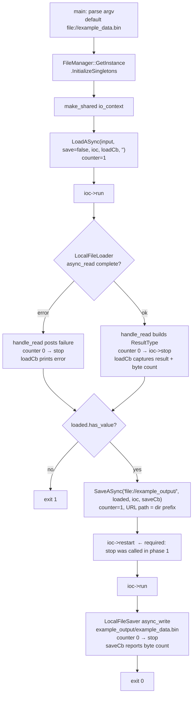

# Phase 4: Build Purge & Generic Example - Research

**Researched:** 2026-09-04
**Domain:** CMake build-system purge (MNN removal) + minimal Boost.Asio example app
**Confidence:** HIGH (every claim verified live against the working tree this session)

<user_constraints>
## User Constraints (from CONTEXT.md)

### Locked Decisions
- **D-25:** The generic example is **minimal, `file://`-only** (~50-80 lines): `FileManager::GetInstance().InitializeSingletons()` → `LoadASync(file://...)` → `SaveASync(file://...)` → run the io_context. **No libp2p, no bitswap, no soralog** — none of it is needed for `file://`. The old `example/MNNExample.cpp` (291 lines, ~250 of which are libp2p/bitswap/soralog scaffolding for the ipfs:// demo) is deleted outright, not slimmed. No MNN inference code or library references anywhere (MNN-06).
- **D-26:** Example wiring stays **as-is**: `example/CMakeLists.txt` gets its own `add_executable(FileExample ...)` but the root `CMakeLists.txt` does NOT gain `add_subdirectory(example)` — the example remains super-build-only (built via `BUILD_EXAMPLES` in super-build mode), exactly how `MNNExample` was wired. Zero impact on the standard Windows configure/build/test verification loop.
- **D-27:** The example demonstrates a **load → save roundtrip**: take an input path argument (default `file://example_data.bin`), load it via `LoadASync`, then save the loaded buffers to a second path (e.g. `file://example_output.bin`) via `SaveASync`, reporting byte counts in the completion callbacks. It does NOT demo the `save=true` auto-save-after-load flow (D-19 chain) — that stays covered by `filemanager_test`.
- **D-28:** The example's default input is a **committed ~1KB binary**: `example/example_data.bin`, opaque varied bytes, produced once with a trivial command and committed (no generator script, no CMake-time generation). The example runs out-of-the-box with zero arguments.
- **D-29:** `test/1.mnn` (1.1MB) and `test/2.mnn` (3.8MB) are deleted. Replaced by small committed `.bin` fixtures (~1KB, pre-made bytes committed directly).
- **D-30:** Fixture locations — **both directories**: `example/example_data.bin` and `test/fixture.bin`.
- **D-31:** The MNN block in `build/CommonBuildParameters.cmake` (lines 274-278) is **purged in this phase**, alongside the CMakeLists purge.
- **D-32:** `filemanager_test.cpp:124` `SaveASync_MnnPrefixThrows` is **neutralized in this phase**: the URL `"mnn://some/path"` becomes a neutral unregistered prefix (e.g. `"foo://some/path"`) and the test name drops the MNN reference. The test is kept (not deleted).

### Claude's Discretion
- Exact example source structure (single `main` vs. small helper functions), console output wording, and error-reporting style in callbacks — provided both `LoadASync` and `SaveASync` are demonstrated and completion paths report success/failure.
- The `.bin` fixtures' exact byte content (~1KB varied opaque bytes; anything non-uniform is fine) and the exact generation command used once to produce them.
- Whether `example/CMakeLists.txt` keeps `add_dependencies`/link shape verbatim beyond the rename `MNNExample` → `FileExample` and the `MNN_LIBS` glob removal.
- The neutral prefix chosen for D-32 (`foo://`, `unknown://`, etc.) and the renamed test's exact name, provided it carries no `mnn` substring.
- Order of edits (CMake-first vs. example-first) and commit slicing, provided the phase ends green.
- Whether `example/README.md`-style usage notes are added (none exist today; optional).

### Deferred Ideas (OUT OF SCOPE)
- ipfs:// example coverage — returns as a dedicated v2 example if wanted, not by re-fattening `FileExample`.
- Root-build wiring for the example (`add_subdirectory(example)` behind `BUILD_EXAMPLES` option) — rejected (D-26).
- Repo-wide zero-mnn grep gate, clean-tree end-to-end build, TEST-03/04/BUILD-02 — Phase 5 by design.
- README updates describing the new example — optional at executor's discretion; not a phase criterion.

*Copied from `.planning/phases/04-build-purge-generic-example/04-CONTEXT.md`. Research below adds live-verified detail and flags where reality diverges from the CONTEXT's assumptions (see Discoveries D1-D3).*
</user_constraints>

<phase_requirements>
## Phase Requirements

| ID | Description | Research Support |
|----|-------------|------------------|
| MNN-01 | `find_package(MNN)` and all MNN include/link references removed from CMake | Live-state table §"Verified Live State": root `CMakeLists.txt:34-35`, `example/CMakeLists.txt:2` (+ target name), `build/CommonBuildParameters.cmake:275-278`; **plus two sites CONTEXT missed**: `build/Windows/CMakeLists.txt:85` (live `SET(TESTAPP MNNExample)` — mandatory rename, Discovery D1) and `cmake/common.cmake:11,19,30` (dead MNN glob/link, Discovery D2). `src/CMakeLists.txt` verified: zero MNN references today. |
| MNN-03 | `.mnn` assets replaced by generic binary fixtures | `test/1.mnn` + `test/2.mnn` referenced by **zero** test sources (grep-verified across `test/src/*.cpp`); only the two example .cpp files bake in `file://../test/1.mnn` and both are deleted/replaced. PowerShell fixture recipes in §Code Examples. |
| MNN-06 | Example contains no MNN inference code or library references | New `FileExample.cpp` (~60 lines, includes only `FileManager.hpp` + std headers — pattern in §Code Examples); old `example/MNNExample.cpp` deleted wholesale per D-25. |
| BUILD-01 | `MNNExample` replaced by generic `FileExample` demonstrating `file://` load+save | Post-Phase-3 API signatures quoted §"Public API"; example structure + the critical two-phase `run()/restart()` io_context pattern (Discovery D4) + saver path-prefix semantics (Discovery D3) in §Architecture Patterns. |
</phase_requirements>

## Summary

This phase is almost entirely mechanical deletion plus one small new file. The CMake purge surface is fully mapped: root `CMakeLists.txt` (2 lines), `example/CMakeLists.txt` (glob + rename, 4 lines), `build/CommonBuildParameters.cmake` (MNN block, lines ~273-278), and — discovered live, missing from CONTEXT's touchpoint list — `build/Windows/CMakeLists.txt:85` carries a **live** `SET(TESTAPP MNNExample)` feeding `install(TARGETS ${TESTAPP} ...)`, which **breaks the wrapper configure** the moment the example target is renamed unless it is renamed in the same edit (Discovery D1, mandatory). `cmake/common.cmake` is a dead 31-line legacy helper holding three more MNN references (Discovery D2, recommended pre-clear).

The new `FileExample` compiles against the stable post-Phase-3 API (`LoadASync(url, save, ioc, finalcall, savetype)` / `SaveASync(url, data, ioc, finalcall, save_location)`). Two runtime semantics dominate the example's design: (1) `LocalFileSaver::SaveASync` treats the URL path as a **directory prefix** and appends each entry's basename (`filename + data->first[i]`), so the save URL must end with `/` — the CONTEXT's illustrative `file://example_output.bin` literal would concatenate into `example_output.binexample_data.bin`; recommended save URL is `file://example_output/` producing `example_output/example_data.bin` (Discovery D3, decision-compatible refinement of D-27). (2) `FileManager::DecrementOutstandingOperations` calls `ioc->stop()` the instant the counter hits zero — which happens **before** `finalcall` runs on a load — so chaining `SaveASync` inside the load's final callback abandons the write handler; the example must use the deterministic **two-phase `ioc->run()` → `ioc->restart()` → `ioc->run()`** pattern (Discovery D4).

**Primary recommendation:** Plan as one CMake-purge wave (root + example + CommonBuildParameters + Windows wrapper TESTAPP + optional `cmake/common.cmake` cleanup) and one example/fixture wave (new `FileExample.cpp` + `FileExample.exe` rename + two `.bin` fixtures + `.mnn` deletion + D-32 test neutralization + root `MNNExample.cpp` deletion), closed by the proven verification loop: reconfigure `build/Windows/Debug` wrapper → build (must compile `FileExample`, no `MNNExample`) → recursive CMake grep gate → full ctest (9 tests green).

## Discoveries (live-verified, beyond CONTEXT)

### D1 — `build/Windows/CMakeLists.txt:85` has a LIVE `MNNExample` reference (MANDATORY edit, missing from CONTEXT touchpoints)

`[VERIFIED: working tree read]` `build/Windows/CMakeLists.txt` lines 85-87:

```cmake
SET(TESTAPP MNNExample )

install(TARGETS ${TESTAPP} DESTINATION "${BUILD_FILELOADER_DIR}/bin")
```

- `install(TARGETS ${TESTAPP} ...)` runs **after** `include(../CommonBuildParameters.cmake)` (which `add_subdirectory`s `example/` at its line 327), so it references the example target built there.
- Renaming the target to `FileExample` without touching this line makes CMake error at generate time (`install TARGETS given target "MNNExample" which does not exist`) — **the wrapper configure is this phase's verification path**, so this is a hard blocker, not cosmetics.
- Fix: `SET(TESTAPP FileExample )` (keep the odd trailing space or not — discretion).
- Also: `build/Linux/CMakeLists.txt:54` and `build/OSX/CMakeLists.txt:70` carry **commented** `#SET(TESTAPP MNNExample )` lines. They don't break anything, but they contain the literal string `MNNExample` inside `CMakeLists.txt` files — scrub them in the same edit so the stronger recursive grep gate (§Pitfalls P1) passes and Phase 5 inherits nothing.
- This fits squarely under D-26's "exactly how `MNNExample` was wired" — the rename keeps the wiring; only the target name changes.

### D2 — `cmake/common.cmake` is a dead legacy helper holding three more MNN references

`[VERIFIED: working tree read + include-audit]` `cmake/common.cmake` (31 lines) defines `add_fileloader_library()` / `add_fileloader_executable()` which contain `FILE(GLOB MNN_LIBS "${MNN_LIBRARY_DIR}/*")` (line 11), `target_link_libraries(${FileLoader_LIB} ${MNN_LIBS})` (line 19), and `target_link_libraries(${executable_name} ${FileLoader_LIB} ${MNN_LIBS})` (line 30). Repo-wide grep confirms **zero** `include(...common.cmake)` and **zero** callers of either function — the file is dead.

- It is *not* covered by the roadmap's literal gate (`grep -ri mnn CMakeLists.txt */CMakeLists.txt` — `cmake/` has no `CMakeLists.txt`, and this is a `.cmake` file), and Phase 5's gate names `include/ src/ test/ example/ CMakeLists.txt` — so it would technically survive.
- But PROJECT.md's locked constraint says "MNN must no longer appear in **any** `find_package`/link/include", and this file has a live-looking link reference. Recommend **deleting the file outright** (simplest; it is 31 dead lines) or, minimally, scrubbing the three MNN lines. Present to planner as recommended pre-clear consistent with D-31's rationale ("purging now keeps 'MNN becomes consumers' concern' true everywhere").

### D3 — `LocalFileSaver` save-URL semantics: the path is a PREFIX, not a filename

`[VERIFIED: src/LocalFileSaver.cpp:60-115 read]` In `LocalFileSaver::SaveASync`:

```cpp
if ( filename.empty() )
{
    filename = boost::lexical_cast<string>( ( boost::uuids::random_generator() )() ) + "/";
}
...
const std::string &directoryWithFile = filename + data.value()->first[i];  // ← prefix + entry basename
```

- A non-empty URL path is concatenated with each entry's **basename** from the loaded `ResultType`. `LocalFileLoader` puts `p.filename().string()` into `first[i]` (`src/LocalFileLoader.cpp:80-82`).
- Consequence for the example: save URL **must be a directory ending in `/`**. The proven pattern is exactly what `filemanager_test.cpp:174-177` does: `SaveASync("file://" + dir + "/", data, ...)` → writes `dir/<original-basename>`.
- The CONTEXT's "Specifics" bullet suggesting `file://example_output.bin` as the save target was written before this was verified — taken literally it produces `example_output.binexample_data.bin` in CWD (no `/`, no directory). **Recommended adaptation (keeps D-27's intent: "a distinct literal the user can inspect"): save URL `file://example_output/` → roundtrip artifact `example_output/example_data.bin`.** Alternatively the example can rebuild the `ResultType` with a chosen entry name before saving — but that adds code for no gain; the directory form is the API's native idiom.
- Empty-path save (`file://` alone, or the auto-save chain with empty savetype path) lands in a UUID directory relative to process CWD — this is the behavior D-27 explicitly declined to demo.

### D4 — The example CANNOT chain SaveASync inside the load's final callback; use two run() phases

`[VERIFIED: src/FileManager.cpp:47-83, 211-233 read]` Control flow on a `LoadASync(url, save=false, ...)`:

1. `FileManager::LoadASync` → `IncrementOutstandingOperations()` (counter = 1) → loader starts.
2. Load completes → `handle_read` lambda runs on the io thread → not saving → `DecrementOutstandingOperations(ioc)` → counter hits 0 → **`ioc->stop()` is called HERE**.
3. Only then does `finalcall(buffers)` run (last statement of `handle_read`).

If the example calls `SaveASync` inside that `finalcall` (the naive "chained roundtrip"), the counter goes 0→1 and the async write is *initiated*, but the io_context is already stopped — `run()` returns as soon as the current handler completes and the write-completion handler is abandoned (asio `stop()` abandons outstanding work). The write may never complete before `main` exits. This is not theoretical hair-splitting; it is the direct reading of `DecrementOutstandingOperations` and the reason the D-19 auto-save chain passes `save=true` (the decrement is deferred into the write completion, so no zero-crossing occurs mid-chain).

**Deterministic pattern for the example (single-threaded, no work guard, no races):**

```cpp
auto ioc = std::make_shared<boost::asio::io_context>();

// Phase 1: LOAD — capture the result
FileManager::ResultType loaded;
FileManager::GetInstance().LoadASync( inputUrl, false, ioc,
    [&]( FileManager::ResultType result ) { loaded = result; }, "" );
ioc->run();                                    // returns after load drains (stop())

if ( !loaded.has_value() ) { /* report loaded.error().message(); exit 1 */ }

// Phase 2: SAVE — restart clears the stopped flag
FileManager::ResultType saved;
FileManager::GetInstance().SaveASync( saveUrl, loaded, ioc,
    [&]( FileManager::ResultType result ) { saved = result; } );
ioc->restart();                                // required before a second run()
ioc->run();                                    // returns after save drains (stop())
```

`io_context::restart()` is the documented asio API for exactly this ("must be called prior to any second or later set of invocations of run()"; legal here because the first `run()` fully returned). Both public APIs are demonstrated (D-27), byte counts print in the callbacks, and the process exits only when both operations verifiably drained. `[CITED: asio io_context::restart() documentation]` — still recommend the plan includes a one-shot manual smoke run of the exe (§Verification) to prove it end-to-end.

## Architectural Responsibility Map

| Capability | Primary Tier | Secondary Tier | Rationale |
|------------|-------------|----------------|-----------|
| MNN CMake purge (MNN-01) | Build layer (root + example CMakeLists, `CommonBuildParameters.cmake`, Windows wrapper) | — | Pure build-system deletions; no source code involved (`src/CMakeLists.txt` already clean — verified) |
| Example app (BUILD-01/MNN-06) | Application layer (`example/FileExample.cpp` + `example/CMakeLists.txt`) | Super-build wrapper (`build/Windows/CMakeLists.txt` TESTAPP install) | Example is super-build-only per D-26; wrapper owns target install wiring |
| Fixture replacement (MNN-03) | Test assets (`test/fixture.bin`) + example assets (`example/example_data.bin`) | — | Committed binaries; no generator scripts, no CMake-time generation (D-28) |
| Test neutralization (D-32) | Test layer (`test/src/filemanager_test.cpp:124-133`) | — | Prefix-string + test-name swap in place; dispatch contract unchanged |
| `file://` runtime semantics | Library (already shipped Phases 1-3) | Example as consumer | The example only *consumes* `FileManager`; zero library edits this phase |

## Verified Live State (every file the phase touches)

`[VERIFIED: all read from the working tree 2026-09-04]`

| File : lines | Current content (verbatim or summarized) | Phase action |
|---|---|---|
| `CMakeLists.txt:34-35` | `find_package(MNN CONFIG REQUIRED)` / `include_directories(${MNN_INCLUDE_DIR})` (exactly 2 MNN lines in the whole file — grep-verified) | Delete both lines (MNN-01) |
| `src/CMakeLists.txt` | **Zero MNN references today** (grep-verified) — roadmap criterion 1 mentions it defensively; nothing to do | No edit |
| `example/CMakeLists.txt` (whole file, 6 lines) | `#add_subdirectory(application)` / `FILE(GLOB MNN_LIBS "${MNN_LIBRARY_DIR}/*")` / `add_executable(MNNExample MNNExample.cpp)` / `add_dependencies(MNNExample AsyncIOManager)` / `target_link_libraries(MNNExample PRIVATE AsyncIOManager spdlog::spdlog protobuf::libprotobuf)` / `include_directories(../include)` | Delete glob (it is **already dead weight** — `MNN_LIBS` is globbed but never appears on any link line); rename target+source; **keep** `include_directories(../include)` (see Pitfall P4) |
| `build/CommonBuildParameters.cmake:~273-278` | Separator comment + `# Set config of MNN` + 4 active lines (grep: 275 `set(MNN_INCLUDE_DIR ...)`, 276 `set(MNN_LIBRARY_DIR ...)`, 277 `include_directories(${MNN_INCLUDE_DIR})`, 278 `set(MNN_INCLUDE_DIR "${CMAKE_CURRENT_SOURCE_DIR}/../MNN/include")`) | Delete whole block incl. its comment header (D-31); pure `set`/`include_directories` deletion — trivially syntactically valid for all three wrappers that include this file |
| `build/Windows/CMakeLists.txt:85-87` | **LIVE** `SET(TESTAPP MNNExample )` + `install(TARGETS ${TESTAPP} DESTINATION "${BUILD_FILELOADER_DIR}/bin")` | **Mandatory** rename to `FileExample` (Discovery D1) |
| `build/Linux/CMakeLists.txt:54` / `build/OSX/CMakeLists.txt:70` | `#SET(TESTAPP MNNExample )` (commented, both) | Scrub the comment (D1) |
| `cmake/common.cmake:11,19,30` | Dead helper functions with `MNN_LIBS` glob + 2 link lines; zero includers/callers repo-wide | Recommended: delete file (or scrub 3 lines) — Discovery D2 |
| `example/MNNExample.cpp` (291 lines) | libp2p/bitswap/soralog scaffolding + the post-Phase-3 `LoadASync(file_names[i], true, ioc, lambda, "ipfs")` at ~267-275 | Delete; replaced by new minimal `FileExample.cpp` (D-25) |
| `MNNExample.cpp` (repo root, 117 lines) | Legacy copy; **line 5 `#include "MNNLoader.hpp"` references a header Phase 1 already deleted** — doubly dead; built by nothing (no `add_executable` anywhere references it) | Delete (roadmap criterion 2) |
| `test/1.mnn` (1.1MB), `test/2.mnn` (3.8MB) | Binary MNN models; **referenced by zero test sources** (grep-verified across `test/src/*.cpp` — tests use `TempFile("arbitrary string content")`; only the two example .cpp files bake in `file://../test/1.mnn`, both deleted this phase) | Delete (D-29); add `test/fixture.bin` (D-30) |
| `test/src/filemanager_test.cpp:124-133` | `SaveASync_MnnPrefixThrows` — `EXPECT_THROW` on `"mnn://some/path"` with `std::range_error`; fixture + shape identical to adjacent `SaveASync_UnregisteredPrefixThrows` (line ~106) | Neutralize: `"foo://some/path"` (or similar) + rename test, keep `EXPECT_THROW`/`std::range_error` (D-32) |
| `test/src/CMakeLists.txt` | Zero `.mnn`/mnn references (grep-verified; only a benign `# IPFS tests` comment) | No edit |

**Also verified:** `README.md:83-97` contains an old build transcript + `$ ./MNNExample 1.mnn` usage line — **out of every gate's scope** (docs; Phase 5's gate covers `include/ src/ test/ example/ CMakeLists.txt`); optional discretionary cleanup only.

## Public API the new FileExample compiles against (post-Phase-3, quoted exact)

`[VERIFIED: include/FileManager.hpp, include/FileLoader.hpp, include/FileSaver.hpp read live]`

```cpp
// include/FileManager.hpp — the only header the example needs
class FileManager
{
    SINGLETON_REF( FileManager );                    // → FileManager::GetInstance()

public:
    static void InitializeSingletons();

    using ResultType =
        outcome::result<std::shared_ptr<std::pair<std::vector<std::string>, std::vector<std::vector<char>>>>>;
    //                                            ^ paths/basenames ^     ^ byte buffers ^

    using CompletionCallback =
        std::function<void( std::shared_ptr<boost::asio::io_context> ioc, ResultType buffers, bool save )>;

    using FinalCallback = std::function<void( ResultType buffers )>;

    shared_ptr<void> LoadASync( const std::string                       &url,
                                bool                                     save,
                                std::shared_ptr<boost::asio::io_context> ioc,
                                FinalCallback                            finalcall,
                                std::string                              savetype );

    void SaveASync( const std::string                       &url,
                    ResultType                               data,
                    std::shared_ptr<boost::asio::io_context> ioc,
                    FinalCallback                            finalcall,
                    std::shared_ptr<std::string>             save_location = nullptr );
};
```

Usage notes for the example:
- Load: `LoadASync("file://example_data.bin", false, ioc, loadCb, "")` — `save=false` per D-27 (the auto-save chain is deliberately not demoed); `savetype=""` is then irrelevant.
- Save: `SaveASync("file://example_output/", loaded, ioc, saveCb)` — `save_location` defaults to `nullptr` (omit it).
- Success check in callbacks: `result.has_value()`; failure: `result.error().message()` — errors arrive in the callback, never as exceptions across the async boundary (exceptions only on *dispatch* for unknown prefixes, `std::range_error` — which is what D-32's test covers).
- Byte counts: on load success, `result.value()->second[0].size()`; entry name: `result.value()->first[0]`.
- `InitializeSingletons()` (verified `src/FileManager.cpp:24-35`) constructs `LocalFileLoader`, `HTTPLoader`, `IPFSLoader`, `IPFSSaver`, `LocalFileSaver`, `SFTPSaver`. **No bitswap is required at construction** — proven by the existing `filemanager_test` fixture which calls `InitializeSingletons()` bare and runs `file://` roundtrips green on Windows.

## How BUILD_EXAMPLES consumes example/ (super-build wiring the rename must keep consistent)

`[VERIFIED: build/CommonCompilerOptions.CMake:88, build/CommonBuildParameters.cmake:293,326-327, build/Windows/CMakeLists.txt:75-87, CMakeCache read]`

```text
build/Windows/CMakeLists.txt (wrapper, CMAKE_SOURCE_DIR = build/Windows)
  └─ include(../CommonCompilerOptions.CMake)   # option(BUILD_EXAMPLES "Build examples" ON)
  └─ include(../CommonBuildParameters.cmake)   # line 326: if (BUILD_EXAMPLES)
  │                                              line 327:   add_subdirectory(${PROJECT_ROOT}/example
  │                                                          ${CMAKE_BINARY_DIR}/example)
  │                                            # PROJECT_ROOT = repo root (derived in CommonCompilerOptions:4-5)
  └─ SET(TESTAPP MNNExample )                  # line 85  ← MUST become FileExample (D1)
  └─ install(TARGETS ${TESTAPP} ...)           # line 87  — runs AFTER the subdirectory add: target exists
```

- `BUILD_EXAMPLES` is **ON by default** (`CommonCompilerOptions.CMake:88`) and the live cache (`build/Windows/Debug/CMakeCache.txt`, UTF-16-encoded — see Pitfall P6) confirms `BUILD_EXAMPLES:BOOL=ON`. The example target is therefore built by the standard `cmake --build build/Windows/Debug --config Debug` — meaning **MSVC compiles the new FileExample.cpp during the phase verification**, which is what makes BUILD-01's "builds" criterion checkable without new wiring.
- The target name appears in exactly **two places**: `example/CMakeLists.txt` (add_executable/add_dependencies/target_link_libraries) and `build/{Windows,Linux,OSX}/CMakeLists.txt` TESTAPP. Rename both in one wave.
- Root `CMakeLists.txt` never references `example/` (verified — no `add_subdirectory(example)`), matching D-26: nothing to add, nothing to remove there.
- Stale artifacts after rename (all untracked, `.gitignore` covers `Debug/` + `*.exe`): `build/Windows/Debug/example/MNNExample.vcxproj`, `MNNExample.dir/`, `Debug/MNNExample.exe/.pdb`. Reconfigure regenerates `FileExample.vcxproj` and rewrites the `.sln`; the stale project drops out of the solution (not referenced ⇒ not built). Optional cleanliness step: delete the three stale paths after reconfigure.

## Architecture Patterns

### System Architecture Diagram (the example's runtime flow)



### Recommended Project Structure (net effect)

```text
example/
├── CMakeLists.txt          # add_executable(FileExample FileExample.cpp) — super-build-only (D-26)
├── FileExample.cpp         # NEW ~60 lines: InitializeSingletons → load → save, two-phase ioc (D4)
└── example_data.bin        # NEW committed ~1KB varied bytes (D-28)
test/
└── fixture.bin             # NEW committed ~1KB varied bytes (D-30)
                              (1.mnn, 2.mnn deleted)
Deleted: example/MNNExample.cpp, MNNExample.cpp (root)
Edited:  CMakeLists.txt (2 lines), build/CommonBuildParameters.cmake (MNN block),
         build/Windows|Linux|OSX/CMakeLists.txt (TESTAPP), test/src/filemanager_test.cpp (D-32),
         example/CMakeLists.txt (rename + glob removal), cmake/common.cmake (delete — recommended)
```

### Pattern 1: The two-phase io_context roundtrip (the example's core)

**What:** load drains the io_context (`run()` returns on FileManager's `stop()`), capture the result, then `restart()` + issue the save + `run()` again.
**When to use:** any standalone consumer chaining two independent async operations that each manage the outstanding-operations counter.
**Why not a work guard:** a work guard keeps `run()` busy but does *not* prevent `stop()` from ending it — the guard cannot rescue the abandoned-handler problem (Discovery D4).
**Example:** see §Code Examples.

### Pattern 2: Save URL as directory prefix

**What:** `SaveASync` URLs for local files end with `/`; the file lands at `<url-path><entry-basename>`.
**When to use:** every `file://` save.
**Evidence:** `test/src/filemanager_test.cpp:174-177` (`"file://" + dir.pathString() + "/"` → asserts `dir/fm_async_save.bin` exists) — the suite-proven idiom.

### Pattern 3: CMake edits as pure deletion + one-token renames

**What:** no new `find_package`, no link-list changes beyond removing MNN entries; library target `AsyncIOManager` untouched.
**Why:** minimizes configure risk; the only *behavioral* CMake change is the target rename (which the wrapper TESTAPP edit tracks 1:1).

### Anti-Patterns to Avoid
- **Chaining SaveASync inside the load finalcall** (D4) — abandoned write handler after `stop()`.
- **Save URL without trailing `/`** (D3) — concatenated filename garbage.
- **Deleting `include_directories(../include)` from `example/CMakeLists.txt` while "modernizing"** — breaks wrapper-mode header resolution (Pitfall P4).
- **Renaming the example target without the wrapper TESTAPP** (D1) — wrapper configure fails at generate time.
- **Leaving `MNN_LIBS` glob in place "since it's unused"** — it *is* unused (never linked), but it contains the string `MNN` and reads `MNN_LIBRARY_DIR` (which D-31 deletes) → configure error after the CommonBuildParameters purge. Both deletions are coupled: removing the glob is *required* once `MNN_LIBRARY_DIR` no longer exists (glob of an empty var is just empty, but the grep gate and D-31 rationale both demand its removal anyway).

## Don't Hand-Roll

| Problem | Don't Build | Use Instead | Why |
|---------|-------------|-------------|-----|
| Wait for async completion | Flags/sleeps/spin-waits in `main` | `ioc->run()` + FileManager's own counter/stop discipline + capture-in-callback | The library already implements drain-and-stop (`DecrementOutstandingOperations`); the example's only job is `restart()` between phases (D4) |
| Result plumbing | Global variables / futures scaffolding | Capture-by-ref lambda into a stack `ResultType` | Callback runs on the io thread before `run()` returns — plain capture is race-free single-threaded |
| Binary fixture generation | CMake scripts / generator targets / commit tooling | One-shot PowerShell `[IO.File]::WriteAllBytes` (§Code Examples), commit the artifact | D-28: committed bytes, no generation step, reproducible-by-inspection |
| Grep gate | Ad-hoc file lists | `git grep -iI mnn -- CMakeLists.txt '*CMakeLists.txt'` (see Pitfalls P1) | Matches the roadmap criterion, extends naturally to the recursive form, `-I` skips binary noise |

**Key insight:** every mechanism this phase needs already exists in proven form — the API signatures (Phases 1-3), the saver directory-prefix idiom (`filemanager_test`), the wrapper build/ctest loop (Phases 1-3 verification evidence), and asio's `restart()`. The phase introduces one new source file and zero new machinery.

## Runtime State Inventory

> Phase involves renames/purges — full inventory completed.

| Category | Items Found | Action Required |
|----------|-------------|------------------|
| Stored data | **None** — no databases/datastores; `.mnn`/`.bin` fixtures are plain repo files, not runtime state | — |
| Live service config | **None** — no external services configured from this repo (websocketserver is test-only, untouched) | — |
| OS-registered state | **None** — no scheduled tasks/services/registry entries reference MNNExample (no installer ships from this repo; `install(TARGETS)` is a CMake install rule, not OS registration) | — |
| Secrets/env vars | **None** — grep-verified: no env var or secret references `MNN*`; the only MNN-named CMake *cache* vars (`MNN_INCLUDE_DIR`/`MNN_LIBRARY_DIR`) are set (not read) by `CommonBuildParameters.cmake` and die with D-31's deletion | — |
| Build artifacts / installed packages | `build/Windows/Debug/` (untracked, `.gitignore`d): `example/MNNExample.vcxproj` + `MNNExample.dir/` + `Debug/MNNExample.exe/.pdb` go stale after rename; `CMakeCache.txt` (UTF-16) holds `TESTING=ON`, `BUILD_EXAMPLES=ON`, `THIRDPARTY_*` — all still valid | Reconfigure regenerates (`.sln` drops the stale project); optional manual cleanup of the 3 stale paths; no cache vars need editing |

**Nothing found beyond build artifacts** — verified by repo-wide greps for `MNN_LIBS|MNN_LIBRARY_DIR|MNN_INCLUDE_DIR|TESTAPP|MNNExample` across all tracked files this session.

## Common Pitfalls

### P1: Grep-gate scoping — use the *stronger* recursive form
**What goes wrong:** the roadmap's literal criterion (`grep -ri mnn CMakeLists.txt */CMakeLists.txt`, a non-recursive shell glob) covers only root + first-level dirs (`src/`, `example/`, `test/`) and would *miss* the `build/{Windows,Linux,OSX}/CMakeLists.txt` TESTAPP references — leaving Phase 5 a straggler and, worse, letting a configure-breaking rename slip the gate.
**How to avoid:** gate on `git grep -iI mnn -- CMakeLists.txt '*CMakeLists.txt'` (quoted recursive glob = **all** CMakeLists.txt everywhere; `-I` skips binary files; works from PowerShell since it's a git subcommand). With D1's wrapper scrub done, this returns empty (exit 1) — strictly stronger than the roadmap's letter while satisfying it. Optionally extend to `'*.cmake'` if D2's `cmake/common.cmake` is cleaned.
**Warning signs:** gate passes but `build/Windows` configure later fails on `install TARGETS ... does not exist`.

### P2: Renaming the target without renaming it everywhere (D1)
Covered above — `example/CMakeLists.txt` and `build/Windows/CMakeLists.txt:85` must flip in the same commit. Linux/OSX commented lines for the grep gate.

### P3: Ordering — CommonBuildParameters purge vs. example glob removal are coupled
**What goes wrong:** deleting the D-31 block first leaves `example/CMakeLists.txt`'s `FILE(GLOB MNN_LIBS "${MNN_LIBRARY_DIR}/*")` globbing an undefined variable (configure *succeeds* with an empty glob — silent), which invites a "works by accident" intermediate state.
**How to avoid:** treat the CMake purge as ONE atomic wave: root lines + example glob/rename + CommonBuildParameters block + wrapper TESTAPP together, then one reconfigure proves the set.

### P4: Do not remove `include_directories(../include)` from `example/CMakeLists.txt`
**What goes wrong:** in wrapper mode the wrapper's own `include_directories(${CMAKE_SOURCE_DIR} ${CMAKE_SOURCE_DIR}/include)` (`build/Windows/CMakeLists.txt:76-79`) resolves against `build/Windows/` — **not** the repo root; `CommonBuildParameters.cmake` adds `${PROJECT_ROOT}/src` and `${PROJECT_ROOT}/example` but never `${PROJECT_ROOT}/include` globally. The per-subdirectory `../include` lines are what make `#include "FileManager.hpp"` resolve.
**How to avoid:** keep the line verbatim (this is also the repo convention per CONVENTIONS.md — "keep for consistency until modernized").

### P5: Example CWD sensitivity
**What goes wrong:** default input `file://example_data.bin` resolves against the *process CWD*, and VS multi-config puts the exe at `build/Windows/Debug/example/Debug/FileExample.exe` — running it from the wrong directory hits the file-open failure path.
**How to avoid:** document the expected CWD in the usage text (D-28/D-27 specifics already accept this); for the optional smoke run, `Set-Location example; ..\build\Windows\Debug\example\Debug\FileExample.exe` — or pass an explicit argument. The failure path itself is a *feature* to demonstrate (error reported in callback, non-zero exit).

### P6: `CMakeCache.txt` is UTF-16 — text greps silently return nothing
**What goes wrong:** `grep`/`git grep`/`Select-String -Path` over the cache can miss every match, inviting false "cache is clean" conclusions (observed live this session: grep_search empty, `Select-String` found `BUILD_EXAMPLES:BOOL=ON`).
**How to avoid:** when inspecting the cache use `Select-String -Path ...` (PowerShell handles the encoding) — and never make the phase gate depend on cache contents.

### P7: VS-generator staleness after rename
**What goes wrong:** the old `MNNExample.vcxproj` lingers in the build dir; a paranoid reader may think it's still built.
**How to avoid:** verify via build log (compiles `FileExample.cpp`, no `MNNExample`) and optionally `ctest -N` (unaffected — example is not a test). Deleting the stale project dir/exe is optional hygiene only.

### P8: Keep D-32 mechanical
**What goes wrong:** "improving" the test (fixture, assertion style) while renaming it.
**How to avoid:** change exactly two tokens — URL prefix string and test name (no `mnn` substring); same `EXPECT_THROW` + `std::range_error`; the adjacent `SaveASync_UnregisteredPrefixThrows` (uses `"unknown://some/path"`) is the template — pick a *different* neutral prefix (e.g. `foo://`) so the two tests stay distinct data points.

## Code Examples

### The new `example/FileExample.cpp` (~60 lines, both APIs, two-phase ioc — D4/D25/D27/D28)

```cpp
// FileExample.cpp — minimal file:// load → save roundtrip through FileManager.
// Usage: FileExample [input-url] [output-dir-url]
//   defaults: input  file://example_data.bin   (relative to the process CWD)
//             output file://example_output/    (roundtrip lands in example_output/<basename>)
#include <iostream>
#include <memory>
#include "FileManager.hpp"

int main( int argc, char **argv )
{
    const std::string inputUrl  = argc > 1 ? argv[1] : "file://example_data.bin";
    const std::string saveUrl   = argc > 2 ? argv[2] : "file://example_output/";

    FileManager::GetInstance().InitializeSingletons();

    auto ioc = std::make_shared<boost::asio::io_context>();

    // ---- Phase 1: load -------------------------------------------------
    FileManager::ResultType loaded;
    FileManager::GetInstance().LoadASync( inputUrl, false, ioc,
        [&]( FileManager::ResultType result )
        {
            if ( result )
            {
                const auto &data = result.value();
                std::cout << "Loaded " << data->first.size() << " file(s); \"" << data->first[0] << "\" = "
                          << data->second[0].size() << " bytes" << std::endl;
                loaded = result;
            }
            else
            {
                std::cout << "Load failed: " << result.error().message() << std::endl;
            }
        },
        "" );
    ioc->run();  // returns when FileManager's counter drains (stop())

    if ( !loaded.has_value() )
    {
        return 1;
    }

    // ---- Phase 2: save (restart clears the stopped flag — see D4) -------
    FileManager::ResultType saved;
    FileManager::GetInstance().SaveASync( saveUrl, loaded, ioc,
        [&]( FileManager::ResultType result )
        {
            if ( result )
            {
                std::cout << "Saved \"" << result.value()->first[0] << "\" (" << result.value()->second[0].size()
                          << " bytes) under " << saveUrl << std::endl;
                saved = result;
            }
            else
            {
                std::cout << "Save failed: " << result.error().message() << std::endl;
            }
        } );
    ioc->restart();
    ioc->run();

    return saved.has_value() ? 0 : 1;
}
```

*(Structure/output wording is executor discretion per CONTEXT — the locked parts are: both APIs called, callbacks report success/failure + byte counts, two-phase run/restart, no libp2p/bitswap/soralog/MNN anything.)*

### `example/CMakeLists.txt` after the edit (recommended minimal diff)

```cmake
#add_subdirectory(application)
add_executable(FileExample FileExample.cpp)

add_dependencies(FileExample AsyncIOManager)
target_link_libraries(FileExample PRIVATE AsyncIOManager spdlog::spdlog protobuf::libprotobuf)
include_directories(../include)
```

(Keep link shape verbatim per discretion; the `protobuf::libprotobuf` link is historically cargo-culted but harmless and found in wrapper mode.)

### Fixture generation — one-shot Windows PowerShell (run once from repo root, then commit the artifacts)

```powershell
# 1KB deterministic varied bytes — ramp pattern, non-uniform, no external tools
$bytes = New-Object byte[] 1024
for ( $i = 0; $i -lt 1024; $i++ ) { $bytes[$i] = ( $i * 7 + 13 ) % 256 }
[IO.File]::WriteAllBytes( "example\example_data.bin", $bytes )
[IO.File]::WriteAllBytes( "test\fixture.bin", $bytes )
Get-Item example\example_data.bin, test\fixture.bin | Select-Object Name, Length   # both 1024
```

(D-30 accepts the two files being identical in content; if distinct bytes are preferred, use `($i * 11 + 29) % 256` for the second.)

### D-32 neutralization (`test/src/filemanager_test.cpp:124-133`)

```cpp
TEST_F( FileManagerIntegrationTest, SaveASync_FooPrefixThrows )   // was: SaveASync_MnnPrefixThrows
{
    IOContextRunner runner;
    auto            data = makeSingleFileResult( "test.bin", "content" );

    EXPECT_THROW(
        {
            FileManager::GetInstance().SaveASync(
                "foo://some/path", data, runner.ioc(), []( FileManager::ResultType ) {} );  // was "mnn://..."
        },
        std::range_error );
}
```

### Verification loop (Phase-1/2/3-proven commands, PowerShell, repo root)

```powershell
# 1. Reconfigure the proven wrapper tree (TESTING=ON already in cache; BUILD_EXAMPLES=ON)
cmake -S build/Windows -B build/Windows/Debug
#    → exit 0; proves D1/D31/P3 (install(TARGETS FileExample) resolves, MNN block gone cleanly)

# 2. Build everything (library + FileExample + all test targets)
cmake --build build/Windows/Debug --config Debug
#    → exit 0; compile log shows FileExample.cpp, no MNNExample, no 1.mnn/2.mnn consumers

# 3. Grep gate — the STRONGER recursive form (P1); expect empty / exit 1
git grep -iI mnn -- CMakeLists.txt '*CMakeLists.txt'

# 4. Full test suite (9 tests: localfile_loader/saver, filemanager, no_ifdef,
#    http_loader, sftp_saver, ipfs_loader/saver, ipfs_device)
ctest --test-dir build/Windows/Debug -C Debug --output-on-failure
#    → "100% tests passed, 0 tests failed"

# 5. OPTIONAL smoke run (proves the roundtrip end-to-end; not a phase criterion)
Set-Location example
& ..\build\Windows\Debug\example\Debug\FileExample.exe
#    → prints load + save byte counts; creates example\example_output\example_data.bin
Set-Location ..
```

## State of the Art

Not applicable — no ecosystem movement this phase rides on. The one versioned dependency of note: Boost 1.85.0 (`io_context::restart()` has been stable in Asio since 1.66; no concern). `[VERIFIED: build/CommonBuildParameters.cmake:3-5]`

## Package Legitimacy Audit

**None required** — this phase installs zero external packages (pure in-repo CMake edits, one new ~60-line source file, two committed binary fixtures). No registry lookups performed; nothing to gate.

## Assumptions Log

| # | Claim | Section | Risk if Wrong |
|---|-------|---------|---------------|
| A1 | `install(TARGETS <nonexistent>)` fails at CMake generate time (the stated reason D1 is mandatory) | Discoveries D1 | LOW — CMake-documented behavior; and the plan renames TESTAPP anyway, making the question moot either way |
| A2 | Two-phase `run()`/`restart()` completes the save deterministically (asio-documented restart semantics) | Discoveries D4, Code Examples | LOW-MEDIUM — based on documented Asio behavior + direct reading of `FileManager::DecrementOutstandingOperations`; mitigated by the optional step-5 smoke run, which the plan should include if budget allows |
| A3 | Default-input CWD behavior is acceptable per D-27/D-28 (usage text documents it) | Pitfalls P5 | LOW — matches how the old example's relative default worked; explicit-arg path covers the rest |
| A4 | Stale `MNNExample.vcxproj`/`.exe` are inert after `.sln` regeneration (not in solution ⇒ not built) | Runtime State Inventory | LOW — consistent with how Phase 1's test renames behaved; verifiable in the build log (step 2) |
| A5 | Deleting `cmake/common.cmake` is safe (zero includers/callers — grep-verified this session) | Discoveries D2 | LOW — if some out-of-repo consumer included it, they'd already be broken by Phases 1-3 deletions of the files it globs |

## Open Questions

1. **`cmake/common.cmake` — delete or scrub?**
   - What we know: dead file (31 lines, zero includers), 3 MNN references, outside every literal gate.
   - What's unclear: whether any out-of-repo tooling ever sourced it.
   - Recommendation: **delete** (matches D-31's "MNN becomes consumers' concern everywhere" spirit and pre-clears Phase 5); scrub-in-place is the conservative fallback. Planner picks; neither breaks the phase.
2. **Include `README.md`'s stale `MNNExample` transcript in the cleanup?**
   - What we know: out of all gates' scope; docs-only.
   - Recommendation: skip (deferred/optional per CONTEXT); note for Phase 5's straggler sweep.
3. **Run the optional step-5 smoke of `FileExample.exe`?**
   - Recommendation: yes if timebox allows (~2 min) — it is the only live proof of A2 and of BUILD-01's "demonstrates"; record output in the SUMMARY. Non-blocking.

## Environment Availability

| Dependency | Required By | Available | Version | Fallback |
|------------|------------|-----------|---------|----------|
| CMake + VS generator + MSVC | build/ctest verification loop | ✓ | 3.29.2 / VS 17 2022 (proven Phases 1-3 on this exact tree) | — |
| Prebuilt thirdparty tree (`THIRDPARTY_DIR` cache) | wrapper configure (libp2p, Boost 1.85, spdlog, etc.) | ✓ | cached in `build/Windows/Debug/CMakeCache.txt` (UTF-16 — inspect via `Select-String`, Pitfall P6) | — |
| MNN package | **nothing after this phase** | ✓ today (removal is the point) | — | n/a |
| PowerShell 5.1 | fixture one-shot generation | ✓ | 5.1 (Windows) | any byte-writing method |
| git | grep gate (`git grep`) | ✓ | — | plain `grep -ri` with explicit file list |

**Missing dependencies with no fallback:** none.
**Missing dependencies with fallback:** none.

*(Validation Architecture section omitted — `workflow.nyquist_validation: false` in `.planning/config.json`. No new tests are added this phase: D-32 renames one existing test; the 9-test suite composition is unchanged.)*

## Security Domain

Build-purge phase — no new inputs, auth, crypto, or network surface. Applicable categories:

| ASVS Category | Applies | Standard Control |
|---------------|---------|-----------------|
| V2 Authentication | no | — |
| V3 Session Management | no | — |
| V4 Access Control | no | — |
| V5 Input Validation | no new surface | Example accepts argv URLs passed to the existing, already-shipped URL dispatcher (behavior unchanged from old example) |
| V6 Cryptography | no | — |
| V14 Config | no | CMake deletions only; no new flags/secrets |

Threat patterns: none introduced. One *reduction*: dropping the MNN dependency removes its (now-unneeded) library surface from the build.

## Sources

### Primary (HIGH confidence)
- Working tree reads (this session): `CMakeLists.txt`, `src/CMakeLists.txt`, `example/CMakeLists.txt`, `example/MNNExample.cpp`, root `MNNExample.cpp`, `build/CommonBuildParameters.cmake`, `build/CommonCompilerOptions.CMake`, `build/{Windows,Linux,OSX}/CMakeLists.txt`, `cmake/common.cmake`, `include/{FileManager,FileLoader,FileSaver}.hpp`, `src/{FileManager,LocalFileLoader,LocalFileSaver}.cpp`, `test/src/filemanager_test.cpp`, `test/testutil/{asio_helpers,test_fixture}.hpp`, `.gitignore`, `.planning/config.json`
- Repo-wide greps: `mnn|MNN` over CMakeLists; `MNN_LIBS|MNN_LIBRARY_DIR|MNN_INCLUDE_DIR|TESTAPP`; `\.mnn` over `test/src/*.cpp`; `include(common.cmake)`/`add_fileloader` callers; live cache via `Select-String` (UTF-16)
- `.planning/phases/01..03` PLAN/SUMMARY/VERIFICATION evidence — the proven configure/build/ctest command set and the A2 root-path closed-negative result (root-path configure **does not work** in this environment; wrapper is the only path)

### Secondary (MEDIUM confidence)
- Asio `io_context::restart()` / `stop()` semantics — official Boost.Asio documentation (cited in D4/A2)

### Tertiary (LOW confidence)
- None — no WebSearch-derived claims

## Metadata

**Confidence breakdown:**
- Standard stack: HIGH — no new libraries; all CMake/PowerShell/asio facts read live
- Architecture: HIGH — example pattern derived from source-verified library semantics + suite-proven idioms; the one novel composition (two-phase restart) flagged as A2 with a smoke-run mitigation
- Pitfalls: HIGH — D1/D2/P3/P4/P6 all discovered or confirmed by direct observation this session; D3/D4 verified from source plus passing-test evidence

**Research date:** 2026-09-04
**Valid until:** 2026-10-04 (stable internal codebase; nothing fast-moving in scope)
