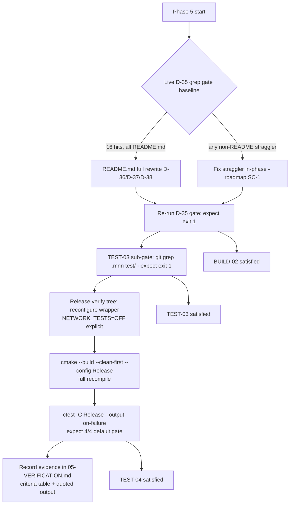

# Phase 5: Zero-MNN Verification & Green Suite - Research

**Researched:** 2026-09-04
**Domain:** MNN-residue grep gates, Windows MSVC/CTest verification loop, consumer-facing README rewrite
**Confidence:** HIGH (nearly every claim verified live in this session against the working tree, build caches, and configured ctest registry)

## Summary

Phase 5 is a verification-and-documentation phase with (expected) exactly one file edit: the full `README.md` rewrite. The live D-35 grep gate scan performed during this research confirms the codebase is already MNN-clean everywhere in gate scope except `README.md` — the gate command `git grep -iI mnn -- include/ src/ test/ example/ CMakeLists.txt '*CMakeLists.txt' '*.cmake' '*.CMake' README.md` returns exactly 16 matches, all in `README.md` (enumerated below with line numbers). TEST-03's sub-gate `git grep -iI '\.mnn' -- test/` already exits 1 (clean). So the phase's real work is: rewrite README (D-36/D-37/D-38), then execute the Release-config reconfigure + `--clean-first` rebuild + full ctest loop (D-39/D-40) and record evidence in VERIFICATION.md mirroring 04-VERIFICATION.md's format.

**Two live-scan discoveries materially refine the plan:**

1. **The prior "9 ctest entries" evidence came from a network-tests-ON configure, NOT from parameterized registration.** The `build/Windows/Debug` cache holds `ASYNC_IO_MANAGER_NETWORK_TESTS:BOOL=ON`, so its ctest registry contains all 9 suites (4 always-on + 5 network-gated); `ctest -N` confirms "Total Tests: 9". D-33's parenthetical ("9 ctest entries counting parameterized registrations") is factually wrong — with the default gate (network OFF), ctest reports **4 tests**, and the expected summary line is "100% tests passed, 0 tests failed out of **4**". The planner must set this expectation explicitly or the executor will misread a legitimate 4/4 pass as a regression against Phase 4's 9/9.
2. **The existing `build/Windows/Release` tree is stale and dangerous-looking but harmless.** It was configured pre-Phase-1: its `test_bin/Release/` still contains `mnn_loader_test.exe` and `mnn_saver_test.exe` binaries, and its cache also has `ASYNC_IO_MANAGER_NETWORK_TESTS:BOOL=ON`. These are untracked build artifacts (git tracks only 6 files under `build/`), invisible to the git-grep gate, and a `--clean-first` rebuild won't remove targets that no longer exist. Per the deferred decision (build-artifact hygiene explicitly skipped), leave them; the VERIFICATION.md should note their presence to preempt false alarms.

**CMake cache stickiness landmine:** re-running the wrapper configure *without* `-DASYNC_IO_MANAGER_NETWORK_TESTS=OFF` keeps the cached `ON` value in either existing tree. To run the D-33 default gate in an existing tree, the flag must be passed explicitly (a fresh empty build dir would get the default OFF, but D-39 chose reconfigure-in-place, not a virgin dir).

**Primary recommendation:** Rewrite README.md (zero `mnn`, ~80–120 lines, D-38 verbatim build commands), then verify in the `build/Windows/Release` sibling tree: `cmake -S build/Windows -B build/Windows/Release -G "Visual Studio 17 2022" -A x64 -DCMAKE_BUILD_TYPE=Release -DTHIRDPARTY_DIR=W:\gnus\GeniusNetwork\thirdparty -DASYNC_IO_MANAGER_NETWORK_TESTS=OFF` → `cmake --build build/Windows/Release --clean-first --parallel 8 --config Release` → `ctest --test-dir build/Windows/Release -C Release --output-on-failure`, expecting 4/4; then re-run the full D-35 grep gate (expect exit 1) and record everything in VERIFICATION.md.

<user_constraints>
## User Constraints (from CONTEXT.md)

### Locked Decisions
- **D-33:** Green-suite gate = **default gate only**: the always-on suites registered when `TESTING=ON`/`BUILD_TESTING=ON` (`localfile_loader_test`, `localfile_saver_test`, `filemanager_test`, `no_ifdef_test` — currently 9 ctest entries counting parameterized registrations per prior-phase evidence). Network-gated suites are NOT verified in this phase and their (non-)execution is not evidence for or against the gate.
- **D-34:** Evidence capture = **live run + doc record**: the agent runs the gate live in-phase (wrapper reconfigure, full rebuild, ctest) and records pass/fail counts + the suite list in the phase VERIFICATION.md. NO new permanent test code, NO runtime mnn-grep guard test.
- **D-35:** Zero-mnn grep gate file set = **roadmap criterion-1 scope + README.md**: `include/`, `src/`, `test/`, `example/`, root `CMakeLists.txt`, all other `CMakeLists.txt` (`src/`, `test/src/`, `test/testutil/`, `example/`, `build/{Windows,Linux,OSX}/`), `cmake/*.cmake`/`.cmake`/`.CMake`, `build/CommonBuildParameters.cmake` — **plus `README.md`**, whose 16 stragglers are fixed by the rewrite (D-36), so it joins the gate.
- **D-35b:** Excluded from the grep gate by design: `.planning/**`, `.claude/CLAUDE.md` + `.planning/codebase/*.md`, `.git/`, and any build output trees.
- **D-36:** README.md gets a **full rewrite** (not a scrub): FileParser/MNNParser class diagram, `parsers` map + `RegisterParser`/`ParseData` entries, MNN GitHub dependency link, fake `MNNExample 1.mnn` build log, "TODO: Need to update" Windows/macOS stubs — all replaced with post-refactor reality.
- **D-37:** Depth = **concise practical (~80–120 lines)**: what the library is, protocol/prefix table (`file://` load+save, `https://` load, `ipfs://` load+save, `sftp://` save; dormant: `sftp://` load, `wss://` load), minimal post-parse API sketch, build+test commands per D-38, FileExample usage.
- **D-38:** Build instructions document the **user's canonical wrapper commands** verbatim:
  - Windows: `cmake .. -G "Visual Studio 17 2022" -A x64 -DCMAKE_BUILD_TYPE=Release -DTHIRDPARTY_DIR=W:\gnus\GeniusNetwork\thirdparty` (add `-DTESTING=ON` for tests — optional), then `cmake --build . --parallel 8 --config Release`
  - POSIX: `cmake .. -DCMAKE_BUILD_TYPE=Debug -DTHIRDPARTY_DIR=/Users/fuu/gnus/thirdparty/`, then `make -j8`
  - **Ninja must be included as a POSIX generator option** (e.g. `cmake .. -G Ninja -DCMAKE_BUILD_TYPE=Release -DTHIRDPARTY_DIR=...` + `ninja -j8`)
  - README makes clear the wrapper lives at `build/<Platform>/` and requires a prebuilt thirdparty tree; root `CMakeLists.txt` is consumed by the super-build's ExternalProject.
- **D-39:** "Fresh out-of-source configure + build + test" = **reconfigure + full rebuild in the existing wrapper tree** with `--clean-first`; NOT a virgin build directory.
- **D-40:** Verification configuration = **Release** (`-DCMAKE_BUILD_TYPE=Release` + `--config Release` + `ctest -C Release`); no Debug verification required.

### Claude's Discretion
- Exact README section ordering/wording; mermaid class diagram (simplified, no parser tier) vs plain table — if ~80–120 lines, zero `mnn`, zero stale parser references.
- Exact grep command variant recorded in VERIFICATION.md — `git grep -iI` with explicit pathspecs preferred.
- Release-verify tree arrangement (reconfigure `build/Windows/Debug` in place vs sibling `build/Windows/Release`) — either allowed if rebuild is `--clean-first` and untracked artifacts stay untracked.
- VERIFICATION.md quotes full ctest output vs summarized table + "100% tests passed" line.
- FileExample usage block details (argument defaults, expected output) as long as they match real `example/FileExample.cpp` behavior.

### Deferred Ideas (OUT OF SCOPE)
- Build-artifact hygiene (untracked `build/Debug` leftovers incl. `hang.dmp`, `.gitignore`) — skipped/deferred by user choice.
- Refreshing `.claude/CLAUDE.md` + `.planning/codebase/*.md` maps (pre-refactor era) — future `/gsd-map-codebase`.
- Network-suite verification (`ASYNC_IO_MANAGER_NETWORK_TESTS=ON` pass) — v2.
- Fresh-directory/virgin-tree configure verification — D-39 chose reconfigure + `--clean-first`.
- README deep-dive (architecture diagrams, threading essays, super-build consumer guide) — rejected for concision.
</user_constraints>

<phase_requirements>
## Phase Requirements

| ID | Description | Research Support |
|----|-------------|------------------|
| TEST-03 | All tests reference generic fixtures, not `.mnn` files | Live `git grep -iI '\.mnn' -- test/` → exit 1 (zero matches) — already clean; verify-only. Generic fixtures verified: `test/fixture.bin` (1024 B), `example/example_data.bin` (1024 B), `test/testutil/temp_file.hpp` self-created temp files. GATE COMMAND + expected exit documented below. |
| TEST-04 | Full test suite builds and passes on Windows (`BUILD_TESTING=ON`) | Verification-loop mechanics fully mapped: wrapper switch is `TESTING` (default ON; `BUILD_TESTING` is the root-standalone name), Release-config command chain verified against live caches, expected ctest count = **4** under D-33 default gate (network OFF must be passed explicitly — cache stickiness pitfall), `--clean-first` + `-C Release` semantics documented. |
| BUILD-02 | Library builds clean on Windows with zero MNN dependency; `grep -ri mnn` over `include/ src/ test/ example/ CMakeLists.txt` returns no matches | Live baseline: full D-35 gate command returns ONLY 16 README.md hits (line-enumerated below); all other pathspecs already clean. Post-rewrite expectation: exit 1 (zero matches). Straggler-fix protocol documented (fix in-phase per roadmap SC-1). |
</phase_requirements>

## Architectural Responsibility Map

| Capability | Primary Tier | Secondary Tier | Rationale |
|------------|-------------|----------------|-----------|
| Zero-MNN residue gate (BUILD-02) | VCS tooling (`git grep` over tracked files) | — | Gate is defined over *tracked content*; `git grep` naturally excludes untracked build trees and `.planning/` via explicit pathspecs [VERIFIED: live run this session] |
| Green-suite gate (TEST-04) | Build system (CMake wrapper → MSVC → ctest) | Test infra (`addtest()` in `cmake/functions.cmake`) | Always-on suite membership is decided by `test/src/CMakeLists.txt` structure + `TESTING` option in `build/CommonBuildParameters.cmake:314` [VERIFIED: file reads] |
| `.mnn` fixture absence (TEST-03) | Repo content (tracked test sources/assets) | — | No runtime component; pure content gate [VERIFIED: live grep exit 1] |
| README rewrite (D-36–D-38) | Consumer documentation | Public API surface (`include/FileManager.hpp`) | README must mirror the live post-refactor API exactly — signatures read from headers, prefixes from `InitializeSingletons()` [VERIFIED: file reads] |
| Evidence record | `.planning/phases/05-*/05-VERIFICATION.md` | Prior format (04-VERIFICATION.md) | D-34: live run + doc record; mirrors criteria-table + quoted-output structure [VERIFIED: file read] |

## Standard Stack

No new libraries. This phase uses the existing toolchain only:

### Core
| Tool | Version | Purpose | Why Standard |
|------|---------|---------|--------------|
| CMake + ctest | 3.29.2 (verified live: `cmake --version`) | Wrapper configure, `--clean-first` build, test run | Project's existing build system; VS 2022 generator cached in both build trees |
| Visual Studio 17 2022 generator | Community 2022 (verified in `CMakeCache.txt: CMAKE_GENERATOR_INSTANCE`) | Multi-config MSVC build | User's canonical D-38 command specifies it |
| git | (repo in active use) | `git grep -iI` gates | Reviewable pathspec-scoped negation gates; exit 1 = pass |
| GTest/GMock | via `GTest::gtest_main` + `GTest::gmock_main` in `addtest()` | The 4 always-on suites | Existing; no changes |

### Supporting
| Item | Purpose | When to Use |
|------|---------|-------------|
| `cmake/functions.cmake addtest()` | Registers each suite as one ctest entry with xunit XML output | Reference only — NO new tests this phase (D-34) |
| Prebuilt thirdparty tree `W:\gnus\GeniusNetwork\thirdparty\build\Windows\Release` | Release-config dependency libs (verified exists) | Required for `--config Release` verification (THIRDPARTY_BUILD_DIR resolution) |

### Alternatives Considered
| Instead of | Could Use | Tradeoff |
|------------|-----------|----------|
| `git grep -iI` gates | PowerShell `Select-String` | Both used in prior phases; `git grep` preferred for reviewability (discretion) — explicit pathspecs auto-exclude `.planning/`, `.claude/`, build trees |
| Reconfigure Release sibling tree | Reconfigure Debug tree in place | Both allowed (D-39 discretion); Release sibling recommended — keeps Debug evidence intact, matches D-40 + user canonical command; NOTE both caches currently hold `ASYNC_IO_MANAGER_NETWORK_TESTS=ON` and need explicit `-D...=OFF` |

## Package Legitimacy Audit

None — this phase installs no external packages. (No new dependencies; documentation + verification only.)

## Architecture Patterns

### System Architecture Diagram — Phase 5 Verification Loop



### Verification Tree Layout (live-verified state)

```
build/Windows/
├── CMakeLists.txt          # the wrapper (tracked)
├── Debug/                  # configured tree: NETWORK_TESTS=ON, 9 ctest entries, Phase 1-4 evidence
└── Release/                # STALE pre-Phase-1 tree: cache NETWORK_TESTS=ON,
                            # test_bin/Release/ still holds mnn_loader_test.exe, mnn_saver_test.exe
                            # (untracked artifacts — leave per deferred hygiene decision)
```

### Pattern 1: Negation grep gate with exit-code semantics
**What:** "Zero matches" gates read `git grep` exit code, not output.
**When to use:** Every gate in this phase.
**Example:**
```powershell
git grep -iI mnn -- include/ src/ test/ example/ CMakeLists.txt '*CMakeLists.txt' '*.cmake' '*.CMake' README.md
# exit 0 + listed matches = FAIL (only README.md hits remain today: 16)
# exit 1 + no output = PASS (expected post-rewrite)
$LASTEXITCODE   # PowerShell: 1 = clean
```

### Pattern 2: Wrapper reconfigure + clean rebuild + config-pinned ctest
**What:** The D-39/D-40 verification loop, proof-tested in Phases 2–4.
**When to use:** Phase-end gate.
**Example:** see Code Examples §1.

### Pattern 3: VERIFICATION.md evidence format (mirrors 04-VERIFICATION.md)
Frontmatter (`phase`, `verified`, `status`, `score`), User Flow Coverage table, Observable Truths table (✓ + evidence quote per criterion), Requirements Coverage per REQ-ID, Roadmap Success-Criteria table (4 rows for this phase). Quote the ctest summary line verbatim.

### Anti-Patterns to Avoid
- **Reading "out of 4" as a regression:** Phase 4's "out of 9" came from a network-ON configure; D-33's default gate is 4 suites. Do not "fix" this by turning network tests on.
- **Omitting `-DASYNC_IO_MANAGER_NETWORK_TESTS=OFF` on reconfigure:** CMake keeps the cached `ON` in both existing trees → 9 entries, wrong gate.
- **Deleting the stale `mnn_*.exe` in `build/Windows/Release`:** build-artifact hygiene is explicitly deferred; they are untracked and gate-invisible. Leave them; note them.
- **Trusting `CMAKE_BUILD_TYPE` to select the binary config:** VS generator is multi-config — only `--config Release` / `ctest -C Release` do that. But configure-time `CMAKE_BUILD_TYPE=Release` DOES steer `THIRDPARTY_BUILD_DIR` to the Release thirdparty libs (`build/CommonCompilerOptions.CMake`), so it must still be passed and must match.

## Don't Hand-Roll

| Problem | Don't Build | Use Instead | Why |
|---------|-------------|-------------|-----|
| Zero-MNN enforcement | Permanent runtime grep-guard test | Live phase-end `git grep` gate + VERIFICATION.md record | D-34 (inherits D-24): acceptance check, not a permanent ctest; mirrors prior phases |
| Test registration | New ctest entries | Existing `addtest()` suites as-is | No new test code this phase |
| Build orchestration | Custom build scripts | `cmake --build ... --clean-first` + `ctest --test-dir` | Proven in Phases 2–4; `--clean-first` satisfies D-39's "clean compile from scratch" |

**Key insight:** Phase 5's value is *evidence and documentation*, not code. Every gate already passes pre-README-rewrite except the README component of D-35.

## Common Pitfalls

### Pitfall 1: The 9-vs-4 ctest count confusion (CRITICAL — discovered this session)
**What goes wrong:** Executor sees "100% tests passed, 0 tests failed out of 4" and believes suites were lost vs Phase 4's "out of 9".
**Why it happens:** `build/Windows/Debug` (and stale `Release`) caches hold `ASYNC_IO_MANAGER_NETWORK_TESTS:BOOL=ON`; their registries contain all 9 suites (verified: `ctest -N` → "Total Tests: 9"). With the flag OFF (the default in `test/src/CMakeLists.txt:34`), only the 4 always-on suites register. D-33's "parameterized registrations" theory is disproven — the per-config `add_test` lines in CTestTestfile.cmake are the VS generator's multi-config emission, collapsing to 9 (or 4) named tests.
**How to avoid:** Plan explicitly states expected count = 4 under the default gate; VERIFICATION.md records both the count and the gate definition.
**Warning signs:** Any "out of 9" expectation in this phase's evidence.

### Pitfall 2: CMake cache stickiness on reconfigure
**What goes wrong:** Re-running the wrapper configure without `-DASYNC_IO_MANAGER_NETWORK_TESTS=OFF` silently keeps `ON` from the existing cache.
**Why it happens:** CMake cache variables persist across reconfigures; `option(... OFF)` defaults apply only to a fresh cache.
**How to avoid:** Pass the flag explicitly in the verification configure command.
**Warning signs:** `ctest -N` showing 9 entries after a "default" reconfigure.

### Pitfall 3: git grep exit-code semantics inverted for negation gates
**What goes wrong:** Treating exit 1 as failure.
**Why it happens:** Habit from positive-command checks.
**How to avoid:** Gate = exit 1 AND empty output. Check `$LASTEXITCODE` in PowerShell.
**Warning signs:** CI-style "command failed" reads of a clean gate.

### Pitfall 4: Stale mnn binaries in the Release tree trigger false alarm
**What goes wrong:** Reviewer/executor sees `mnn_loader_test.exe` on disk and thinks BUILD-02 failed.
**Why it happens:** `build/Windows/Release/test_bin/Release/` predates Phase 1 (verified live: those exes exist); `--clean-first` only rebuilds *registered* targets — deleted targets' outputs linger.
**How to avoid:** VERIFICATION.md explicitly notes these untracked relics and why they're out of gate scope (git grep covers tracked content only; D-35b excludes build trees).
**Warning signs:** Any filesystem-based (rather than git-based) mnn scan.

### Pitfall 5: MSVC multi-config flag mismatches
**What goes wrong:** Configure with `CMAKE_BUILD_TYPE=Release` but build `--config Debug` (or vice versa) → links against wrong thirdparty lib set or /MT vs /MTd mismatch.
**Why it happens:** VS generator ignores `CMAKE_BUILD_TYPE` at build time, but the wrapper used it at configure time to resolve `THIRDPARTY_BUILD_DIR` (`build/CommonCompilerOptions.CMake`: `${THIRDPARTY_DIR}/build/${BUILD_PLATFORM_NAME}/${CMAKE_BUILD_TYPE}`) and to pick `/MT` vs `/MTd` flag strings (`build/Windows/CMakeLists.txt:8-34`).
**How to avoid:** Keep all three aligned: `-DCMAKE_BUILD_TYPE=Release` + `--config Release` + `ctest -C Release` (exactly D-40).
**Warning signs:** Linker LNK errors about runtime library mismatch.

### Pitfall 6: README rewrite drifts from live API
**What goes wrong:** README documents a signature or prefix that doesn't exist.
**Why it happens:** Writing from memory of the old API (parse param, mnn:// prefix, parser registry).
**How to avoid:** Use the verified API surface below (read from headers/source this session); note `outcome::result<T>` default-ctor deletion forces the `std::optional` capture pattern in examples.
**Warning signs:** Any `parse` parameter, `RegisterParser`, `ParseData`, `MNNLoader`, or `mnn://` in the new README.

### Pitfall 7: Gate-scope creep via wrong grep pathspecs
**What goes wrong:** Including `.planning/` or `.claude/CLAUDE.md` in the gate → guaranteed false failures (they legitimately mention MNN per D-35b).
**Why it happens:** Using bare `git grep -i mnn` repo-wide.
**How to avoid:** Explicit pathspec list only (the D-35 command); verified this session — those pathspecs resolve to exactly the intended file set.

## Code Examples

### 1. The D-39/D-40 verification loop (recommended arrangement: Release sibling)
```powershell
# From repo root W:\gnus\GeniusNetwork\thirdparty\AsyncIOManager
# (1) Reconfigure the Release verify tree — explicit NETWORK_TESTS=OFF (cache stickiness!)
cmake -S build/Windows -B build/Windows/Release -G "Visual Studio 17 2022" -A x64 `
  -DCMAKE_BUILD_TYPE=Release `
  -DTHIRDPARTY_DIR=W:\gnus\GeniusNetwork\thirdparty `
  -DASYNC_IO_MANAGER_NETWORK_TESTS=OFF
# (2) Full clean rebuild, Release config
cmake --build build/Windows/Release --clean-first --parallel 8 --config Release
# (3) Full ctest — expect: 4 tests, "100% tests passed, 0 tests failed out of 4"
ctest --test-dir build/Windows/Release -C Release --output-on-failure
```
Equivalent user-canonical form (from inside the tree, matches D-38 README text): `cd build/Windows/Release; cmake .. -G "Visual Studio 17 2022" -A x64 -DCMAKE_BUILD_TYPE=Release -DTHIRDPARTY_DIR=W:\gnus\GeniusNetwork\thirdparty -DTESTING=ON; cmake --build . --parallel 8 --config Release`. (TESTING defaults ON — the flag is optional documentation, per D-38.)

### 2. The gates (expected results post-rewrite)
```powershell
# BUILD-02 / D-35 full gate — expect exit 1, no output
git grep -iI mnn -- include/ src/ test/ example/ CMakeLists.txt '*CMakeLists.txt' '*.cmake' '*.CMake' README.md

# TEST-03 sub-gate — verified THIS session: already exit 1 (clean)
git grep -iI '\.mnn' -- test/

# Ctest enumeration sanity check (before running)
ctest --test-dir build/Windows/Release -N -C Release   # expect "Total Tests: 4"
```

### 3. README API sketch source-of-truth (verified live from include/FileManager.hpp)
```cpp
// Post-parse public surface (NO parse parameter anywhere):
using ResultType = outcome::result<std::shared_ptr<
    std::pair<std::vector<std::string>, std::vector<std::vector<char>>>>>;
using FinalCallback = std::function<void( ResultType buffers )>;

shared_ptr<void> LoadASync( const std::string &url, bool save,
                            std::shared_ptr<boost::asio::io_context> ioc,
                            FinalCallback finalcall, std::string savetype );
void SaveASync( const std::string &url, ResultType data,
                std::shared_ptr<boost::asio::io_context> ioc,
                FinalCallback finalcall,
                std::shared_ptr<std::string> save_location = nullptr );
```

### 4. Protocol/prefix table source-of-truth (verified from src/FileManager.cpp InitializeSingletons + constructor registrations)
| Prefix | Load | Save | Handler(s) |
|--------|------|------|-----------|
| `file://` | ✓ | ✓ | LocalFileLoader / LocalFileSaver |
| `https://` | ✓ | — | HTTPLoader (plain `http://` registration commented out — v2) |
| `ipfs://` | ✓ | ✓ | IPFSLoader / IPFSSaver |
| `sftp://` | — (dormant) | ✓ | SFTPLoader (NOT initialized) / SFTPSaver (initialized) |
| `wss://` | — (dormant) | — | WSLoader (registered but NOT initialized) |

### 5. FileExample usage block facts (verified from example/FileExample.cpp)
- Usage: `FileExample [input-url] [output-dir-url]`; defaults `file://example_data.bin` (relative to CWD — run from `example/`) and `file://example_output/`.
- Prints `Loaded "<path>" (N bytes) from <url>` then `Saved "<path>" (N bytes) to <url>`; exit 0 on success, 1 on failure (via callback, never thrown).
- Uses `std::optional<FileManager::ResultType>` capture (outcome::result has deleted default ctor — 04-VERIFICATION override lineage) and two-phase `ioc->run()` / `ioc->restart()` / `ioc->run()`.

## README.md Rewrite Inventory (live-enumerated, 16 hits)

Old README is ~104 lines titled `# FileLoader` (itself a stale name). Sections and their dispositions:

| Old lines | Content | Disposition |
|-----------|---------|-------------|
| 1–6 | `# FileLoader` title, "Parsing and loading any format file support by Genuis Project" tagline (typo + parse-era), "Current file format support: MNN format / TODO" | Replace: URL-dispatched async I/O tagline; protocol table (D-37) |
| 8–44 | Three mermaid diagrams: FileLoader (MNNLoader), FileParser (MNNParser/IPFSParser), FileManager (loaders/parsers/savers maps, RegisterParser/ParseData) | Replace: simplified registry view (Loaders/Savers only, no parser tier) or plain table — discretion |
| 46–48 | "Design: Singleton pattern" | May survive condensed |
| 50–67 | Dependencies: MNN GitHub link + GTest | Replace: Boost.Asio/Beast/SSL, libp2p, ipfs-lite/bitswap, libssh2, spdlog (via prebuilt thirdparty tree — no direct fetch); keep GTest for TESTING=ON |
| 69–87 | "Build with Linux" + stale MNN build transcript | Replace: D-38 POSIX commands (make + Ninja variants) |
| 89, 93 | "Build with Windows/Mac OS: TODO: Need to update" | Replace: D-38 Windows command; macOS folds into POSIX section |
| 95–102 | "Run the example" fake MNNExample inference log | Replace: real FileExample usage (§5 above) |
| 104 | "Future thinking: flatbuffer" | Drop (stale) |

Exact 16 `mnn` hit lines (for the pre-rewrite record in VERIFICATION.md): 4, 16, 20, 34, 38, 66, 79, 80, 81, 83, 84, 85, 86, 97, 98, 99.

## Runtime State Inventory

Not a rename/refactor/migration phase (verification + docs only) — section omitted per protocol. Runtime-state-relevant findings are covered in Pitfall 4 (stale untracked build trees) and the verification-tree layout above.

## Common Pitfalls (process-level, from prior phase lineage)

### Pitfall 8: CMake Tools extension configure
The VS Code CMake Tools extension fails to configure this super-build project — **terminal cmake only** (carried from prior phases; the D-38 commands are terminal commands).

### Pitfall 9: Build duration
Full `--clean-first` rebuild takes ~10 min (recorded in 04-VERIFICATION) — plan the verification wave with that latency; do not interleave other work that mutates the tree mid-build.

## State of the Art

Not applicable — no evolving external stack this phase. (CMake 3.29.2 + VS 2022 are the fixed environment.)

## Assumptions Log

| # | Claim | Section | Risk if Wrong |
|---|-------|---------|---------------|
| A1 | `cmake --build ... --clean-first --config Release` satisfies D-39's "clean compile from scratch" (recompiles every object) | Verification loop | Low — semantics are standard CMake; D-39 explicitly chose it |
| A2 | `W:\gnus\GeniusNetwork\thirdparty\build\Windows\Release` prebuilt libs are current enough to link the post-refactor library | Environment Availability | Medium — if stale, Release link fails → fall back to reconfiguring Debug tree in place (also D-39-allowed); Phase 4 linked against `thirdparty\build\Windows\Debug` successfully, Release tree existence verified live but its lib currency is unverified |
| A3 | The 4 always-on suites pass in Release config | TEST-04 | Low — they passed in Debug (Phase 4, recorded 9/9 incl. these 4); no config-sensitive code known; `/MT` Release flags were always the wrapper default for Release config |

## Open Questions (RESOLVED)

1. **Which verify-tree arrangement — Release sibling vs Debug in place?** — RESOLVED by D-39 executor discretion, encoded in 05-02-T1 as primary (Release sibling) + fallback (Debug in place).
   - What we know: both allowed by D-39 discretion; both caches hold NETWORK_TESTS=ON (need explicit OFF); Release sibling holds stale pre-rename binaries (Pitfall 4); Debug tree holds the Phase 1–4 evidence state.
   - What's unclear: whether the user prefers preserving the Debug tree untouched as historical evidence.
   - Recommendation: Release sibling (keeps Debug evidence intact, matches D-40's Release emphasis and the user's canonical command). Executor decides per discretion.
2. **Should VERIFICATION.md record the baseline (pre-rewrite) grep too?**
   - What we know: 04-VERIFICATION.md recorded gate results only post-change; this RESEARCH.md holds the live baseline (16 README hits).
   - Recommendation: record post-rewrite exit-1 evidence + cite the 16-hit baseline for the delta narrative.

## Environment Availability

| Dependency | Required By | Available | Version | Fallback |
|------------|------------|-----------|---------|----------|
| CMake + ctest | Verification loop | ✓ | 3.29.2 (verified live) | — |
| Visual Studio 2022 (Community) | VS generator build | ✓ | 17 (verified in CMakeCache `CMAKE_GENERATOR_INSTANCE`) | — |
| Prebuilt thirdparty tree | Wrapper configure | ✓ | `W:\gnus\GeniusNetwork\thirdparty` (+ `build/Windows/Release` subdirs, verified exists) | Debug thirdparty tree (used by Phases 1–4) |
| git | Grep gates | ✓ | in active use | — |
| Node.js + ws | Nothing (network suites out of scope) | ✓ (repo has websocketserver) | — | Not needed |

**Missing dependencies with no fallback:** none.
**Missing dependencies with fallback:** none.

## Validation Architecture

Skipped — `workflow.nyquist_validation: false` in `.planning/config.json` (verified live this session).

## Security Domain

Phase introduces no new code, input surfaces, or crypto. README rewrite must not leak credentials — the canonical D-38 commands contain only local filesystem paths (`W:\gnus\...`, `/Users/fuu/...`), which the user explicitly dictated for documentation. No ASVS category applies beyond documentation hygiene (no secrets in docs — confirmed none in the D-38 command set).

## Sources

### Primary (HIGH confidence — live verification this session)
- Live terminal runs: D-35 grep gate (16 README hits, enumerated), `git grep -iI '\.mnn' -- test/` (exit 1), `ctest -N` on `build/Windows/Debug` (9 tests), cache reads on both build trees (`ASYNC_IO_MANAGER_NETWORK_TESTS`, `CMAKE_BUILD_TYPE`, generator), `git ls-files build/`, fixture listings, tool versions
- File reads: `include/FileManager.hpp`, `src/FileManager.cpp` (InitializeSingletons), `include/LocalFileLoader.hpp`, `example/FileExample.cpp`, `test/src/CMakeLists.txt` (complete), `cmake/functions.cmake`, `build/CommonCompilerOptions.CMake`, `build/Windows/CMakeLists.txt`, `README.md`, `.planning/phases/04-.../04-VERIFICATION.md`, `.planning/REQUIREMENTS.md`, `.planning/STATE.md`, `.planning/config.json`, 05-CONTEXT.md
- Directory probes: `build/Windows/{Debug,Release}` layouts, stale `mnn_*.exe` discovery, thirdparty tree existence

### Secondary (MEDIUM confidence)
- None needed — phase is fully introspectable locally

### Tertiary (LOW confidence)
- None

## Metadata

**Confidence breakdown:**
- Standard stack (existing toolchain): HIGH — all versions verified live
- Verification loop mechanics: HIGH — caches, registries, and tree states inspected; one prior-evidence discrepancy (9-vs-4) discovered and resolved with live proof
- README rewrite inventory: HIGH — all 16 hits line-enumerated; API/prefix/usage facts read from current sources
- Pitfalls: HIGH — each grounded in a live observation or prior-phase recorded evidence

**Research date:** 2026-09-04
**Valid until:** 2026-10-04 (stable; local-environment facts drift only if the build trees are manually mutated)
